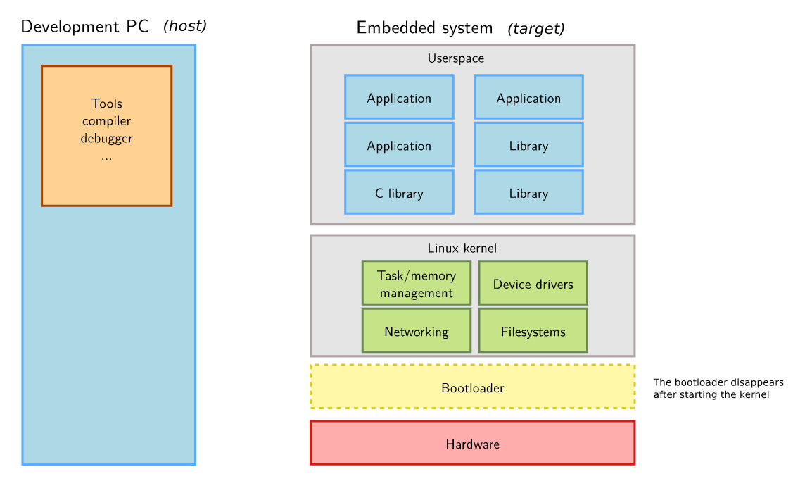

== 01: Introduction to Embedded Linux

=== Introduction

Embedded Linux is the usage of the Linux kernel and various open-source components in embedded systems.

Advantages of Linux and Open source in Embedded systems:

* Reuse of components:
+
You can focus on your application code to add value to your product and simply reuse existing code for middleware and low-level platform

* Low cost
+
Though deploying linux takes time and effort, unlike commercial software it is free and there are no per-unit royalties

* Full control
+
There is no vendor lock-in, you can decide when and how to update the components in your system

* Easy testing
+
You can follow the community whose software you used and explore the new solutions released by them.
There is no need to negotiate with any third-party vendors.

* Quality
+
Your system is built on a proven, well-tested, and high quality foundation(kernel, compiler, C-lib, base utilities etc)

* Community support
+
Open source communities are normally very supportive if you approach them with constructive attitude

* Participation in community work
+
You can collaborate with peers and get opportunities beyond corporate barriers

A few examples of embedded systems running Linux

* Wireless routers
* Video system
* Bike computers
* Robots
* Satellites
* Space rovers

=== Hardware

Few guidelines for choosing hardware

* Make sure that the hardware is already supported by the linux kernel, and has an open-source bootloader

* An official version(maintained by vendor or community) of both the kernel and bootloader is preferable to get new releases and long term support versions
+
[CAUTION]
====
There will be huge differences in development time and cost between a hardware that is officially supported(in the Linux kernel) and poorly supported
====

* Some vendors do not contribute their changes back to the mainline kernel.
+
[TIP]
====
You can check for this by doing a `diff` between their kernel and the official one
====
+
Ask them to contribute their changes back to mainline or use another product if you can.

==== CPU and Architecture

* architecture-dependent components
+
Currently, the linux kernel and most other architecture-dependent components supports a wide range of 32-bit and 64-bit architectures:

** x86, x86-64: PC platforms and multimedia, & industrial embedded systems
** ARM: SoCs(System on Chips) which are microprocessors with a co-microcontroller controlling the peripherals
** RISC-V: rising architecture with a free instruction set
** PowerPC: mainly used in real-time and industrial applications
** MIPS: mainly used in networking applications

+
[NOTE]
====
Linux doesn't support small(8 and 16-bit) microcontrollers
====

* architecture-independent components
+
Other than toolchain, bootloader, and the kernel, all other components are usually architecture-independent

==== Memory

Both MMU and non-MMU architectures are supported though non-MMU architecture have a few limitations.

[TIP]
====
Being not very restrictive on memory(both primary and secondary) opens up interesting avenues as it allows re-use of as many existing components as possible
====

===== Primary memory
A basic system can run on 8 MB of RAM while a realistic system will require 32 MB.
Additionally, depending on the type of the application more might be required.

===== Secondary memory
A basic system can run on 4 MB of storage while a realistic system will require more.

Supported types:

* Raw flash storage: NAND and NOR flash with specific filesystems
* Block storage: SD/MMC/eMMC, USB flash, SATA etc.

==== Communication
Linux kernel has support for many communication buses:
I2C, SPI, 1-wire, SDIO, PCI, USB, CAN

It also has extensive support for networking on: Ethernet, Wi-Fi, Bluetooth, CAN etc. supporting networking protocols such as IPv4, IPv6, TCP, UDP, SCTP, DCCP etc. with features such as firewalling, advanced routing, multicast etc.

==== Hardware platform

* Evaluation platforms:
They can be bought from the SoC vendors.
They are very expensive but will have a diverse range of built-in peripherals.
Hence, they are suitable for development phase not for the production.
Ex: STM32 Discovery boards

* Components on module:
It consists of a small board with just core components such as CPU, RAM, Flash etc.
They will have connectors to access all other peripherals.
It is suitable to build end products for small to medium quantities.
Ex: PocketBeagle, RaspberryPiZero

* Community dev platforms:
In terms of cost and peripherals they are half-way between evaluation platforms and components on module.
They are ready-to-use and usually released to make a particular SoC popular and easily available.
They can be used to make real products to a limited extent.

* Custom platforms:
Tailored solutions for your product built from scratch with the help of common and freely available schematics of evaluation boards or community dev platforms.
They are expensive to develop but cheaper to mass produce.
Hence, they are suitable to build end products in big quantities.

=== System architecture

.Host and Target

Target is the embedded device on which you deploy the application that you developed on the host system(PC).
To make it possible you'll need a cross-compiler which is a compiler that runs on one machine but generates code for another machine.

Bootloader is run by the hardware during booting, and is responsible for basic initialization, loading, and executing the kernel.

The linux kernel layer along with the kernel, contains process and memory management, network stack, device drivers, and services for user space applications.

C library is a library of C functions which can also provide an interface between kernel and the user space applications.

Other libraries and applications used can be built by third party or developed in-house.

The high-level tasks required to build an embedded linux system:

* Board Support Package(BSP) development:
A BSP contains a bootloader and a kernel with suitable device drivers for the target hardware.

* System integration:
Integrating bootloader, kernel, third-party & in-house libraries, and applications to create a working system

* Application development:
Normal linux applications but built using specifically chosen libraries
