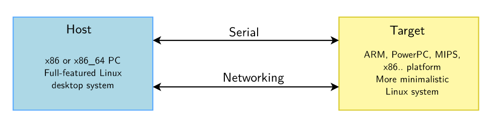
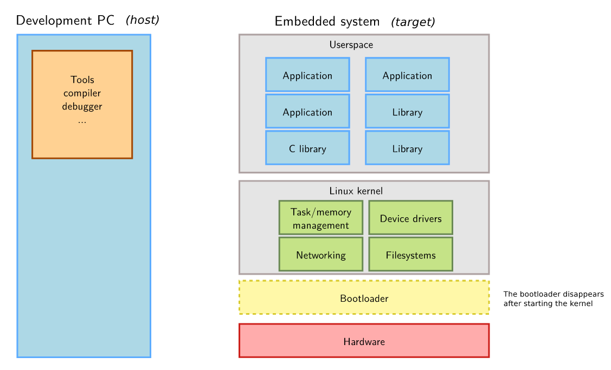
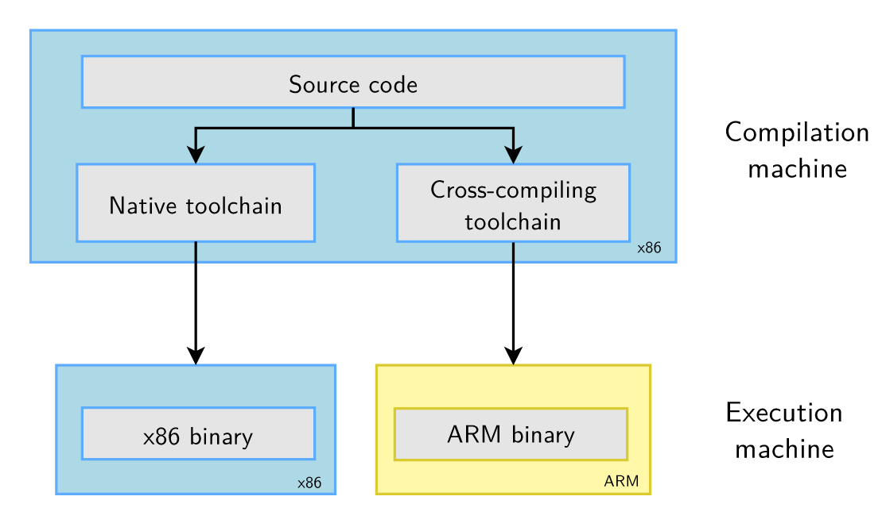
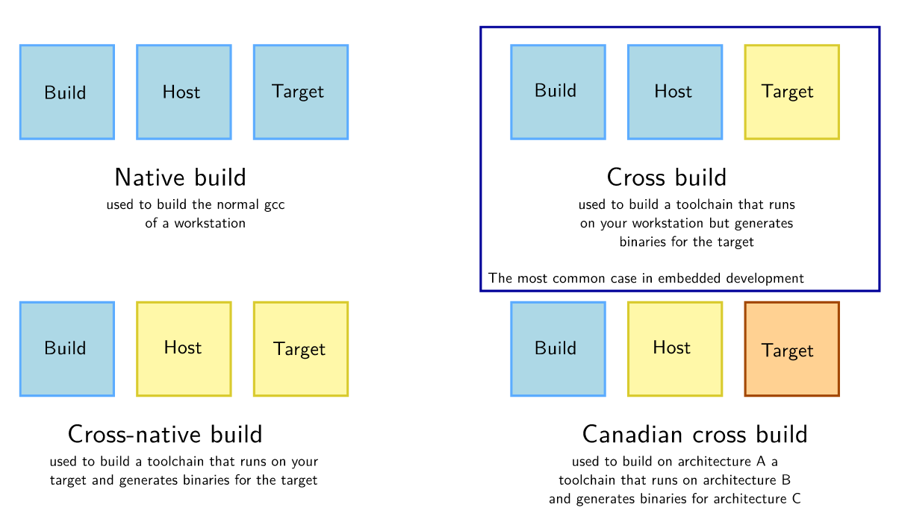
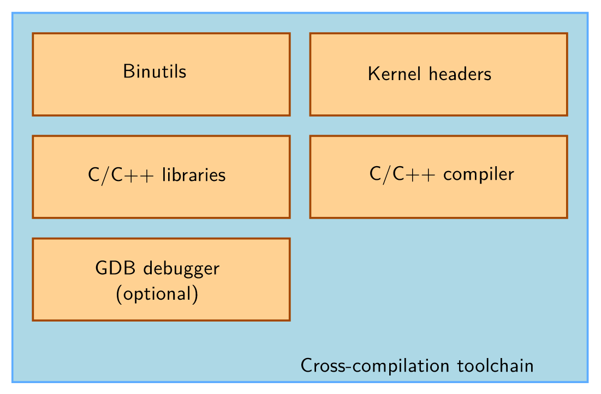

== Lec 01: Introduction to Embedded Linux

=== Introduction

Embedded Linux is the usage of the Linux kernel and various open-source components in embedded systems.

Advantages of Linux and Open source in Embedded systems is same as using FOSS elsewhere.

A few examples of embedded systems running Linux

* Wireless routers
* Video system
* Bike computers
* Robots
* Satellites
* Space rovers

=== Hardware

Few guidelines for choosing hardware

* Make sure that the hardware is already supported by the linux kernel, and has an open-source bootloader

* An official version(maintained by vendor or community) of both the kernel and bootloader is preferable to get new releases and long term support versions
+
[CAUTION]
====
There will be huge differences in development time and cost between a hardware that is officially supported(in the Linux kernel) and poorly supported
====

* Some vendors do not contribute their changes back to the mainline kernel.
+
[TIP]
====
You can check for this by doing a `diff` between their kernel and the official one
====
+
Ask them to contribute their changes back to mainline or use another product if you can.

==== CPU and Architecture

* architecture-dependent components
+
Currently, the linux kernel and most other architecture-dependent components supports a wide range of 32-bit and 64-bit architectures:

** x86, x86-64: PC platforms and multimedia, & industrial embedded systems
** ARM: SoCs(System on Chips) which are microprocessors with a co-microcontroller controlling the peripherals
** RISC-V: rising architecture with a free instruction set
** PowerPC: mainly used in real-time and industrial applications
** MIPS: mainly used in networking applications

+
[NOTE]
====
Linux doesn't support small(8 and 16-bit) microcontrollers
====

* architecture-independent components
+
Other than toolchain, bootloader, and the kernel, all other components are usually architecture-independent

==== Memory

Both MMU and non-MMU architectures are supported though non-MMU architecture have a few limitations.

[TIP]
====
Being not very restrictive on memory(both primary and secondary) opens up interesting avenues as it allows re-use of as many existing components as possible
====

===== Primary memory
A basic system can run on 8 MB of RAM while a realistic system will require 32 MB.
Additionally, depending on the type of the application more might be required.

===== Secondary memory
A basic system can run on 4 MB of storage while a realistic system will require more.

Supported types:

* Raw flash storage: NAND and NOR flash with specific filesystems
* Block storage: SD/MMC/eMMC, USB flash, SATA etc.

==== Communication
Linux kernel has support for many communication buses:
I2C, SPI, 1-wire, SDIO, PCI, USB, CAN

It also has extensive support for networking on: Ethernet, Wi-Fi, Bluetooth, CAN etc. supporting networking protocols such as IPv4, IPv6, TCP, UDP, SCTP, DCCP etc. with features such as firewalling, advanced routing, multicast etc.

==== Hardware platform

* Evaluation platforms:
They can be bought from the SoC vendors.
They are very expensive but will have a diverse range of built-in peripherals.
Hence, they are suitable for development phase not for the production.
Ex: STM32 Discovery boards

* Components on module:
It consists of a small board with just core components such as CPU, RAM, Flash etc.
They will have connectors to access all other peripherals.
It is suitable to build end products for small to medium quantities.
Ex: PocketBeagle, RaspberryPiZero

* Community dev platforms:
In terms of cost and peripherals they are half-way between evaluation platforms and components on module.
They are ready-to-use and usually released to make a particular SoC popular and easily available.
They can be used to make real products to a limited extent.

* Custom platforms:
Tailored solutions for your product built from scratch with the help of common and freely available schematics of evaluation boards or community dev platforms.
They are expensive to develop but cheaper to mass produce.
Hence, they are suitable to build end products in big quantities.

=== System architecture

.Host and Target

Embedded systems will have limited resources, hence it is normally not possible or highly inefficient to build and/or compile applications natively on them.
Hence, the applications are built on a more powerful PC called as a host using a cross-compiler which is a compiler that runs on one machine but generates code for another machine.
Target is the embedded device on which you deploy the application that you developed on the host system(PC).

Depending on the purpose, the host and target are connected by various means:

* Serial line for debugging
* Ethernet for networking
* JTAG for low-level debugging

.System Architecture

Bootloader is run by the hardware during booting, and is responsible for basic initialization, loading, and executing the kernel.

The linux kernel layer along with the kernel, contains process and memory management, network stack, device drivers, and services for user space applications.

C library is a library of C functions which can also provide an interface between kernel and the user space applications.

Other libraries and applications used can be built by third party or developed in-house.

The high-level tasks required to build an embedded linux system:

* Board Support Package(BSP) development:
A BSP contains a bootloader and a kernel with suitable device drivers for the target hardware.

* System integration:
Integrating bootloader, kernel, third-party & in-house libraries, and applications to create a working system

* Application development:
Normal linux applications but built using specifically chosen libraries

== Lec 02: Embedded Linux Development Environment

You can use:

* Vendor solutions:
Tools and environment built and supported by vendors.
They use a mix of both open source and proprietary components.
Ex: MontaVista, Wind River, TimeSys etc.

* Community solutions:
Completely open and supported by the community.
+
[NOTE]
====
If you learn and understand the concepts using community solutions, if required switching to vendor solutions will be easy.
====

=== Preparation

==== OS

GNU/Linux is the recommended OS for development as all the community tool are developed and design to run on it.
[NOTE]
====
Skills acquired from using linux desktop are transferable to embedded linux
====
[TIP]
====
If in case you are stuck with a non-linux machine, use a virtual machine to run linux
====
It is recommended to use a popular distro which are based on Debian(`Ubuntu`, `Debian`), Fedora(`Fedora`, `Redhat`), or SUSE(`openSUSE`).

We will be using `Kubuntu` which is Ubuntu with KDE.

==== Tools

A serial line communication program to connect the host machine with the target device.
There are several programs available: `Minicom`, `Picocom`, `Putty` etc.
Install one that you are comfortable with.

We will be using `Picocom` which is a simple cli program.
To run it:
----
picocom -b <baud_rate> /dev/<serial_device>
----
where `<baud_rate>` is normally 115200 and `<serial_device>` is:

* `ttyUSB<x>` for USB to serial converters
* `ttyS<x>` for a real serial port

==== Training setup
Unzip the lab zip archive `./rsrcs/embedded-linux-qemu-labs.tar.xz` into your workspace `edt`:
----
cp ./rsrcs/embedded-linux-qemu-labs.tar.xz ./edt
cd ./edt
xz -dk embedded-linux-qemu-labs.tar.xz
tar -xf embedded-linux-qemu-labs.tar
rm embedded-linux-qemu-labs.tar embedded-linux-qemu-labs.tar.xz
----

[NOTE]
====
We first start with virtual hardware QEMU, then we can move on to real hardware platforms
====

== Lec 03: Cross-compiling toolchain and C library

.Native toolchain vs Cross compiling toolchain

=== Building Toolchains

With regard to toolchain creation there are 3 machines:

* build machine, where the toolchain is built
* host machine, where the toolchain is executed
* target machine, where the binaries generated by toolchain are executed

.Toolchain build procedures

=== `gcc` toolchain components

.`gcc` toolchain components

==== Binutils
They are set of tools used to generate and manipulate binaries(usually in `.elf` format) for a given CPU architecture.
Some of them are:

* `as`: assembler
* `ld`: linker
* `ar`, `ranlib`: generate static libraries(`.a` archives)
* `objdump`, `readelf`, `size`, `nm`, `strings`: to inspect binaries
* `objcopy`: to modify binaries
* `strip`: to strip away the parts that are just needed for debugging

The popular variants are https://www.gnu.org/software/binutils/[GNU binutils](GPL license), and https://www.llvm.org/docs/CommandGuide/[LLVM binutils].

==== Kernel headers
C library and compiled programs need to interact with the kernel in other words the code from C library and compiled programs will need to call code from kernel.
Kernel headers are header files that the kernel exposes for other code.
Hence, compiling C libraries and applications require them.

Kernel headers available in `<linux/...>`, `<asm/...>` and `<arch/<arch>/include/uapi>`.
They contains:

* Available system calls and their numbers
+
Example:
+
----
#define __NR_exit 1
#define __NR_fork 2
#define __NR_read 3
----
+
system call numbers defined in `<asm/unistd.h>`

* Constant definitions
+
Example:
+
----
#define O_RDWR 00000002
----
+
constant `O_RDWR` constant is defined in `<asm-generic/fcntl.h>` which is included by `<asm/fcntl.h>` which in turn is included by `<linux/fcntl.h>`.

* Data structures
+
Example:
+
----
struct stat {
    unsigned long st_dev;
    unsigned long st_ino;
    ...
};
----
+
structure `stat`(used by the `stat` command) is defined in `<asm/stat.h>`.

To extract them from the kernel source code using the Kernel makefile's `headers_install` target.

The kernel and all the system binaries are compiled with the same ABI(Application Binary Interface).
[NOTE]
====
ABI defines very low-level things such as how arguments are passed to function, how value is returned from function, how system calls are made, and organization of structures in terms of memory alignment etc.
====
Kernel developers do their best to maintain backward compatibility of the kernel to userspace ABI.
This ensures that existing programs do not break when the kernel is upgraded which in turn encourages user to upgrade their kernel.

Due to backward compatibility binaries generated with a toolchain using kernel headers older than the running kernel will work without a problem, but they won't be able to use new system calls, and data structures etc.
Conversely, binaries generated with a toolchain using kernel headers newer than the running kernel will work as long as they do not use new features.

[NOTE]
====
As upgrading kernel doesn't break current programs, it is usually fine to keep your old toolchain.
Upgrading toolchain and getting familiar with the newer toolchain requires time and effort, hence it is rarely during a project lifecycle.
====

==== C/C++ compiler
https://gcc.gnu.org/[GCC](GNU Compiler collection) is the most commonly used compiler.
It is available under GPL license can compile a large number of languages and generate code for a large number of platforms.

Clang/LLVM compiler provided under MIT/BSD license is another popular alternative.

==== C library
C libraries provides:

* an interface between applications and kernel
* apis to ease application development

The most popular is the one provided by gcc is https://www.gnu.org/software/libc/[`glibc`], but its footprint is too big for an embedded system.

Alternatively, several variants are available such as https://uclibc-ng.org/[`uClibc-ng`], https://www.musl-libc.org/[`musl`] etc.
`uClibc-ng` is a small lightweight C library suitable for embedded systems.
Supports a wide range of embedded architectures however doesn't guarantee backward binary compatibility.
It is only library supporting ARM with noMMU.
`musl` is another library well suited for embedded systems with a more permissive MIT license.
It is supported on build systems such as Buildroot and Yocto.

[NOTE]
====
You can compare various libraries https://www.etalabs.net/compare_libcs.html[here]
====

The choice of the C library needs to be made at the time of generation of cross-compiler toolchain.
The cross-compiler compiles using the specified C library.

Guidelines to pick a C library:

* Develop, debug and make sure everything works with `glibc` as it is the most standard, and best supported by debugging tools.
* If you have size constraints, try to compile your app with `uClibc-ng` or `musl`
+
[NOTE]
====
If you compile your application as a static executable, then your application can have a C library different from the one used by filesystem.
====
+
[TIP]
====
If you are compiling your application as a static executable, `musl` is preferable as it has more permissive license and a smaller footprint.
====
* To save more, try to compile your entire filesystem with `uClibc-ng` or `musl`
* If you run into trouble it is because of the missing features of C library

=== Toolchain options
* ABI:
+
The kernel must understand the ABI of the binaries.
All binaries are usually compiled with same ABI as the kernel.
+
For example, on ARM, we have `OABI` and `EABI`(most common).

* Floating point support:
+
Some processors have floating point unit(fpu), while others do not.
For processors with fpu, toolchain should generate `hard float` code in order to use floating point instructions directly.
For processors without fpu:

** You can use `hard float` code to translate floating point instructions from the kernel space.
This makes it very slow.
** You can use `soft float` code that uses a user space library to handle floating point operations

+
It is also possible to configure which fpu should be used.
Both these decisions needs to be made at toolchain configuration time.

* CPU optimization flags:
+
The GNU tools(gcc, binutils etc.) can be compiled(from source) to work with a specific target architecture(ARM, MIPS etc).
+
In addition to this, compiler flags allow further configuration options during compilation:

** `march`: to select a target instruction set(ex: `armv7`)
** `mtune`: to optimize code for a specific CPU(ex: `cortex-a8`)
** `mcpu`: to specify `mtune`, and hence automatically infer `march`

=== Obtaining toolchain
Building a cross-compiling toolchain requires lots of details to learn, many decisions to make, and on top of this one needs to familiar with current issues and patches of tools for your platform.
Hence, it is a complex, tedious, and highly time-consuming task.

Hence, many people choose a pre-compiled toolchain usually provided by hardware vendor.
It is the simplest and most convenient solution, but you cannot fine tune it to your needs.

Another solution is to use utilities that automate the process of building the toolchain.
With this you can tailor a toolchain suited to your needs while evading the complexity involved in manual creation.
They are set of several shell scripts and Makefiles which automatically fetch, extract, configure, compile, and install various components.

`Crosstool-ng`, `Buildroot`, `Yocto`, etc. are few popular examples.
`Crosstool-ng` is the one that we will be using in this course.

==== `Crosstool-ng` installation and usage

* To locally install inside a source directory:
+
----
./configure --enable-local
make
----
+
Dropping `--enable-local` will perform a system-wide installation.

* To list available example/sample configurations:
+
----
./ct-ng list-samples
----

* To load a sample configurations:
+
----
./ct-ng <sample_name>
----

* To adjust the configuration
+
----
./ct-ng menuconfig
----
+
or
+
----
./ct-ng nconfig
----

* To build the toolchain:
+
----
./ct-ng build
----
+
The cross compilation tool binaries are generated in `./bin/` and to ease the use of toolchain you can add this to the `PATH`.
+
One or more `sysroot` s are generated.
A `sysroot` contains:

** C library and related libraries compiled for the target
** C library headers and kernel headers

+
Toolchains can also be `multilib` where they contain one `sysroot` for each variant/configuration of the C library used.
