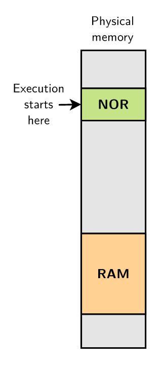
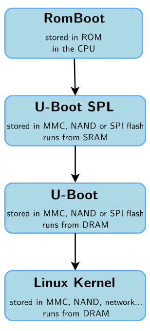
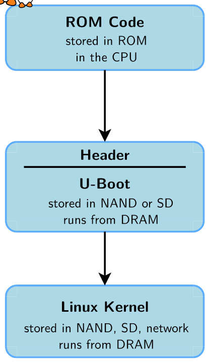

== Lec 04: Bootloaders

Besides, the basic functions required to load a kernel, most bootloaders provide a shell with various commands for loading storage, networking, memory inspection, diagnostics, and testing etc.

=== Booting on embedded CPUs

==== Case 1

.Booting from NOR flash

When device is powered on CPU executes code at a fixed address.
The hardware ensures that a NOR flash is connected to CPU, and accessible at this fixed address.
The first level bootloader is programmed at this address in NOR flash.
[NOTE]
====
Only NOR flash can be used for this coz NOR flash allows direct access from CPU(like RAM) but NAND flash requires the code to be copied into RAM before executing.
====

This method lacks flexibility and makes NOR mandatory, hence it is not very common anymore.

==== Case 2

.Multilevel Booting

Here the CPU has an integrated ROM which contains a boot code.
This boot code loads the first stage bootloader from a storage device(MMC, NAND flash) or a communication interface(UART) into the internal SRAM.

The size of SRAM is limited(and the DRAM has not been initialized yet), so the first stage bootloader is small and hence limited in capabilities.
It initializes DRAM and other hardware devices to load a second stage bootloader into DRAM.
The primary bootloader is normally provided by the hardware vendor or one can also use the one provided by U-Boot, `U-Boot SPL`(Secondary Program Loader).

The second stage bootloader loads the kernel, initializes it and executes the kernel.
`U-Boot`(GPLv2 license) is a popular secondary bootloader.

Once the kernel starts executing it completely takes over the system and effectively the bootloader no longer exists.

==== Case 3

.Booting directly into secondary bootloader

This is same as multilevel booting but here the ROM code itself initializes the DRAM and directly loads the secondary bootloader.
One caveat in this configuration is that the secondary bootloader must be compatible with the CPU-specific headers.

== Lab 04: Bootloader `U-Boot`

=== Setting up to build `u-boot`

* Install package `device-tree-compiler`

* From `https://source.denx.de/u-boot/u-boot.git` clone the `U-Boot` source into `edt/embedded-linux-qemu-labs/bootloader/` and checkout commit `36fec02b`.

* While inside `u-boot` directory, apply the patch `./edt/embedded-linux-qemu-labs/bootloader/data/vexpress_flags_reset.patch`
+
----
cat ../data/vexpress_flags_reset.patch | patch -p1
----
+
[NOTE]
====
This patch fixes the `editenv` command in `U-Boot`
====

=== Configuring to build `u-boot`

[TIP]
====
Read the `Building the Software` section of `README` file to get an overall understanding
====

* As we need to cross-compile, we have to set an environment variable `CROSS_COMPILE` with the cross-compiler prefix i.e. the part before `gcc` in the cross-compiler executable name.
+
Here it will be `arm-linux-`.
+
[CAUTION]
====
Do not forget to make sure that your cross-compilation toolchain binaries path is in the `PATH` variable
====
+
[NOTE]
====
Just like cross-compilation toolchain binaries path, you can temporarily set `CROSS_COMPILE` variable for current session.
====
+
[IMPORTANT]
====
Even if you are temporarily setting `CROSS_COMPILE`, do not forget to export it coz that's what differentiates a regular variable from environment variable.
====

* Find the sample configuration file for your board:
+
The `configs/` directory contains the sample configuration file(s) for each supported board.
Here we emulate ARM Vexpress Cortex A9 board on QEMU, hence `vexpress_ca9x4_defconfig` is our file.
+
The definitions in these configuration files include: CPU type, peripherals & their configuration, memory mapping, `U-Boot` features to be compiled.
An example configuration file:
+
----
CONFIG_ARM=y
...
CONFIG_DRAM_TIMINGS_DDR3_800E_1066G_1333J=y
# CONFIG_MMC is not set
CONFIG_USB0_VBUS_PIN="PB10"
CONFIG_VIDEO_COMPOSITE=y
CONFIG_DEFAULT_DEVICE_TREE="sun5i-r8-chip"
...
CONFIG_G_DNL_VENDOR_NUM=0x1f3a
CONFIG_G_DNL_PRODUCT_NUM=0x1010
CONFIG_USB_EHCI_HCD=y
----

* To load the sample configuration for your board:
+
----
make <config_file_name>
----
+
Here `<config_file_name>` value is `vexpress_ca9x4_defconfig`(no need to use `./configs/vexpress_ca9x4_defconfig`).

* Modify the configuration
** using `menuconfig`
+
----
make menuconfig
----
+
*** `Environment` >
**** disable `Environment in flash memory` as our emulated machine does not have flash storage
**** enable `Environment is in a FAT filesystem` to store the environment in a file `uboot.env` inside a FAT filesystem on an MMC/SD card(that we will simulate).
Enabling this options shows the following options.
**** `Name of the block device for the environment` > enter `mmc`
**** `Device and partition for where to store the environment in FAT` > enter `0:1`

** In the `.config` file:
*** replace line `# CONFIG_CMD_BOOTD is not set` with `CONFIG_CMD_BOOTD=y` to enable `editenv` command
*** replace line `# CONFIG_CMD_EDITENV is not set` with `CONFIG_CMD_EDITENV=y` to enable `bootd`(and its alias `boot`) command.

=== Building `u-boot`
To build `u-boot` for the configured target:
----
make -j<N>
----
where `N` is the number of threads used in parallel compilation.

This generates several binaries including `u-boot`, and `u-boot.bin`.
`u-boot` is the raw executable that can be directly loaded into memory and `u-boot.bin` is the binary image which is loaded into memory via an interface.
Depending on your platform and boot storage device other specialized images with extensions such as `.img`, `.kwb` etc. are generated.

=== Setting up to run `u-boot`

==== Installing `u-boot` on hardware
This varies based on the hardware.

* CPU may provide a boot monitor with which we can communicate over serial port or USB using a specific protocol:
+
We can use this communication interface to load `u-boot`.

* CPU may boot first from removable media such as MMC before booting from fixed media such as NAND flash:
+
We boot from MMC and use that bootloader to re-flash a new version `u-boot`.

* The board may provide a JTAG interface which allows to directly write to the flash memory:
+
We can use this interface to flash `u-boot`.
Very helpful to rescue boards.

* `U-Boot` is already installed on the board:
+
We can use this to flash a new version of `u-boot`.
The board becomes unusable if the new version doesn't work.

* Emulated board may provide an option to directly load a secondary bootloader such as `u-boot` without the need to go through a first-stage/primary bootloader

==== Creating a SD card

* Create a 1 GB file with a block size of 1 MB initialized with all zeroes to act as a container for a loopback filesystem in `./edt/embedded-linux-qemu-labs/bootloader/data`.
This file is used to simulate an SD card.

* Use an interactive tool such as `cfdisk` to set up the container file
** select the `label type` as `dos` as we don't really need a `gpt` partition table for our exercises
** create 3 partitions in the container file:
*** 64 MB, `primary` partition, `FAT16` filesystem, and `bootable`
*** 8 MB, `primary` partition, `Linux` filesystem used for the root filesystem
*** Rest, `primary` partition, `Linux` filesystem used for the data filesystem
** save the partition table by doing `write`

* Load the container file as a block device using loop driver:
+
----
losetup -f --show --partscan <container_file>
----
+
option `f` finds a free loop device, `--show` displays the loop device used, and `--partscan` scans the loop device for partitions and creates additional block devices for each partition `/dev/loop<x>p<y>` where `x` is the number of the loop device and `y` is the partition number

* Format the first partition of the container with the label `boot`:
+
----
mkfs.vfat -F 16 -n boot /dev/loop<x>p1
----
+
[NOTE]
====
Other partitions can be formatted later
====

* To release the container file:
+
----
losetup -d /dev/loop<x>
----

==== Setting up network between host and target

* Setting up ethernet connection
** On host, create a script `qemu-myifup.sh` in `./edt/embedded-linux-qemu-labs/bootloader/data` that will bring the network interface up between host and QEMU by executing the commands:
+
----
/sbin/ip a add <host_ip>/24 dev-$1
/sbin/ip link set $1 up
----
+
here we use 192.168.0.1 as `<host_ip>`

** On target(qemu board) set:
+
|====
|environment variables |value

|`ipaddr`
|`<target_ip>`

|`serverip`
|`<host_ip>`
|====
+
here we use 192.168.0.100 as `<target_ip>`.
+
[NOTE]
====
If 192.168.0.100 is already used, then pick another number between 2-254 that is not used.
====

** Check the connection by pinging the host ip from target

* Setting up TFTP
** Install packages: `tftpd-hpa` (tftp server), and `tftp-hpa` (tftp client)
** Make sure that either one of the folders `/var/lib/tftpboot` or `/srv/tftp` is created.
We will refer to this as tftp export directory.
** Restart target and make sure that the environment variables `ipaddr`, `serverip`, and `ethaddr` are set

=== Testing `u-boot`

==== Running `u-boot` without secondary memory and without networking

* Run QEMU:
+
----
qemu-system-arm -M <board_name> -m <memory> -nographic -kernel u-boot
----
where `<memory>` is the amount of RAM on the machine, and option `kernel` allows to directly load `u-boot` to memory without the need of a primary bootloader.
Here we use `vexpress-a9` as `<board_name>` and `128M` i.e. 128 MB of RAM.

* Press a key before the end of timeout to access `U-Boot` prompt.

* Use `help` command to see the list of available commands.

* To exit QEMU press `Ctrl-a` followed by `x`.

==== Running `u-boot` with secondary memory and without networking

* Run QEMU just as before but this use an option `sd` to specify a `<loopback_container_file>`

* Create an environment variable:
+
Here we don't have `export` command hence:
+
----
setenv <env_var_name> <env_var_value>
----

* Store the environment variable to persistent storage:
+
----
saveenv
----

* Reboot the board
+
----
reset
----

* Print and check the value of the environment variable
+
----
printenv <env_var_name>
----

==== Running `u-boot` with secondary memory and with networking

* Run QEMU with a SD card just as before but this time append `-net tap,script=<qemu-myifup_script> -net nic` where:
** `-net tap` creates a software network interface on host side
+
[NOTE]
====
While QEMU is running if you do `ip a`, you will see a `tap0` network interface with the `<host_ip>` set inside `qemu-myifup.sh` script
====
** `-net nic` creates a network device on the emulated machine1

* Drop a file into tftp export directory(`/var/lib/tftpboot` or `/srv/tftp`)

* On target download the file:
+
----
tftp <memory_addr> <file_name>
----
+
here we use 0x61000000 as the address

* On target verify by dumping few bytes of memory:
+
----
md <memory_addr> 4
----
+
dumps 4 * 16 bytes

=== Exploring `u-boot`

==== Environment variables

`u-boot` environment can be configured to be stored in:

* NAND flash at a fixed offset
* MMC or USB at a fixed offset before the beginning of the first partition
* `uboot.env` file on a `FAT` or `ext4` partition(which can lie on any storage type)
* UBI volume

Here we store it in `uboot.env` file on a `FAT` partition of an MMC device.

The environment variables are loaded into RAM at `U-Boot` startup.

|====
|Env var |Purpose

|`bootcmd`
|specifies the commands that `U-Boot` will automatically execute at boot time, after a configurable delay (`bootdelay`), if the boot process is not interrupted

|`bootargs`
|contains the arguments passed to the Linux kernel

|`serverip`
|IP address of the server that `U-Boot` will contact for network related commands

|`ipaddr`
|the IP address of `U-Boot`

|`netmask`
|the network mask used to contact the server

|`ethaddr`
|the MAC address of the ethernet interface, can only be set once

|`filesize`
|the size of the latest copy to memory (from `tftp`, `fatload`, `nand read` etc.)

|====

The environment variables can contain bash code to run scripts and/or execute several commands, and even test the results of them.

Ex:

----
setenv bootcmd 'tftp 0x21000000 zImage; tftp 0x22000000 dtb; bootz 0x21000000 - 0x22000000'
----
shows chaining of several commands using `;` under environment variable `bootcmd`

Ex:

----
setenv mmc-boot 'if fatload mmc 0 80000000 boot.ini; then source; else if fatload mmc 0 80000000 zImage; then run mmc-do-boot; fi; fi'
----
shows testing the result &, decision-making using `if else` clause, and running another command using `run` under environment variable `mmc-boot`

==== Commands
Now that you have a secondary storage, you can explore a few commands:

* To ger version information:
+
----
version
----

* To get the list of available commands:
+
----
help
----

* To get board info:
+
----
bdinfo
----

* To get info about memory:
+
|====
|command |type of memory

|`flinfo`
|flash memory

|`mmcinfo`
|mmc

|`fatinfo <interface> <device>`
|fat filesystem
|====

* To interact with a memory subsystem run:
+
|====
|command |subsystem

|`mmc`
|MMC controller used for SD and micro-SD cards

|`usb`
|USB controller used for USB keys

|`nand`
|NAND flash
|====
and checkout the command options

* To list files in secondary memory:
+
----
ls <interface> <device_nb>
----
+
for our simulated sd card, the `<interface>` is `mmc`, and the `<device_nb>` is 0

* To load a file from filesystem to RAM:
+
----
load <interface> <device_nb> <RAM_address> <file>
----
+
a valid value for `<RAM_address>` is in the bounds of DRAM bank start and size which can be found via `bdinfo` command.
+
For our exercise with QEMU, you can set `<file>` as `uboot.env` and 0x67000000 as `<RAM_address>`

* To load size of a file in the filesystem to environment variable `filesize`
+
----
load <interface> <device_nb> <file>
----

* `loadb`, `loads`, and `loady` loads a file from serial line to the RAM

* To examine memory contents:
+
----
md <start_addr> <size>
----
+
this can be used to examine contents of RAM, storage and even hardware registers.
+
after loading `uboot.env`, you can use 0x67000000 as `<start_addr>` to see how it sits in the memory.

* To modify memory contents: `mm`.

* To ping a device:
+
----
ping <ip_address>
----
+
here the host machine ip is set to `192.168.0.1`

* To load file from network to RAM:
+
----
tftp <RAM_addr> <file_name>
----
+
the `<file_name>` should already be exported on the server side.

* To boot:
+
----
bootd
----
+
or, alternatively
+
----
boot
----
+
this simply runs the command stored in the `bootcmd` environment variable

* To boot kernel loaded at a RAM address:
+
----
bootz <RAM_address>
----
+
starts a compressed kernel image loaded at `<RAM_address>` on the RAM.

==== File transfer
`U-Boot` can also be used to transfer files between the host and the target.
The interface depends on the drivers that `U-Boot` has been compiled with.

|====
|Medium |Drivers required

|Ethernet
|networking

|USB key
|USB

|SD or MicroSD card
|MMC controller

|Serial port
|Serial
|====

For network transfer we use `tftp`(trivial file transfer protocol) which is similar to `ftp` but without authentication and over UDP.
`U-Boot` comes with `tftp` built in.