== Lec 05: Linux Kernel Introduction

=== Kernel features

.Linux Kernel
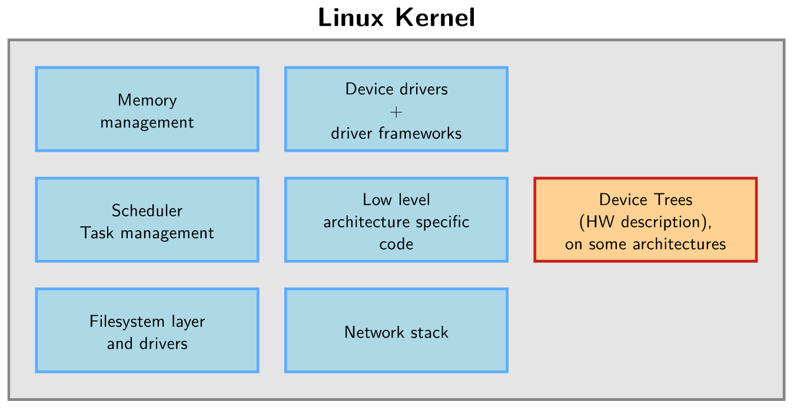

The kernel is the core of the system, but it requires libraries and applications to provide features to end users.
It is highly portable as it can run on most architectures and highly scalable as it can run on everything from super computers to tiny devices(with as little as 4 MB RAM).

==== Supported architectures

The minimum requirement for an architecture to be able to run linux is that it should be 32-bit, and it is supported by `gcc` or `clang`.
It doesn't even matter if it has an MMU or not.
[TIP]
====
Just take a look at `arch/` folder in the kernel source code to see the number of architectures that it supports.
For more details on each of the architectures, go to files `Kconfig`, and `README` under `arch/<arch>/` or `Documentation/<arch>`
====

[NOTE]
====
Unmaintained architectures which causes compiling issues are removed when nobody is willing to fix them.
====

==== Kernel interfaces

.Linux system
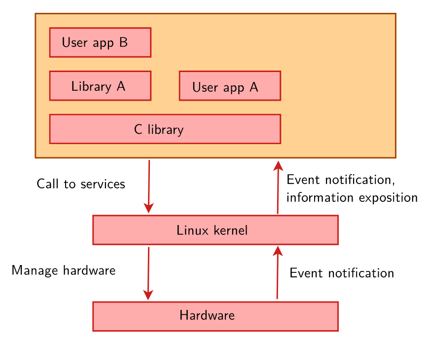

The kernel code provides a set of portable, architecture and hardware independent APIs to allow code from user space to use the hardware resources.

.System Call Interface
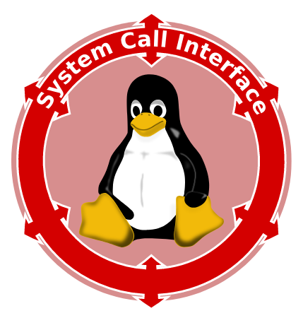

System calls are APIs that act as an interface between kernel and user space.
There are about 400 of them, and they provide kernel services such as file operations, inter-process communication, process management, network operations etc.
They are normally wrapped by a C library and the user space apps make sure of these C library functions.

Linux provides another way for user space apps to access system and kernel info via pseudo filesystems.
`/proc` provides os related info and `/sys` provides system related info as a tree of devices connected by buses.

=== Logistics of choosing a kernel

==== Kernel licensing
The linux kernel is released under GPLv2 license which:

* gives you the right to obtain the linux source of the device you buy/receive
* gives you the right to study, modify, and redistribute the linux source of your device
* requires you to release the linux source to your recipient with the same rights, with no restriction.

==== Picking kernel source
Many chip vendors supply their own kernel source.
They focus on hardware support first which can potentially cause their versions to have important deltas with mainline.
To avoid this, they normally invest in mainline at the same time.

The kernel community has several sub-communities such as architecture communities, device driver communities, and others etc. each maintaining their own kernel.
Their kernels are only meant for sharing work and contributing to the mainline.
They should never be used in products

For embedded linux systems using a `ltr`(or at least a `stable`) kernel is highly recommended.

== Lab 05: Kernel sources

* Create a folder `edt/embedded-linux-qemu-labs/kernel` and navigate to it

* Download https://mirrors.edge.kernel.org/pub/linux/kernel/v5.x/linux-5.8.tar.xz[v5.8]

* Download the patch to move from https://mirrors.edge.kernel.org/pub/linux/kernel/v5.x/patch-5.9.xz[v5.8 to v5.9] and the patch to move from https://mirrors.edge.kernel.org/pub/linux/kernel/v5.x/patch-5.9.16.xz[v5.9 to v5.9.16](the last version of v5.9)

* Decompress all the files

* Apply the both the patches one by one to move from v5.8 to v5.9.16

=== Locating the kernel source

The latest sources of the mainline, stable, longterm, and linux-next can be found at the https://kernel.org/[kernel archives page].
To download a version not on this page, you can go to kernel mirror site or git.

==== Using kernel mirror site

All version of the sources and their patches are available at this https://mirrors.edge.kernel.org/pub/linux/kernel/[mirror site].

Click on the directory `v<maj_ver>.x`.

Click on `linux-<maj_ver>.<min_ver>.<build_ver>.tar.xz` to download the kernel.
[NOTE]
====
Major releases do not have `<build_ver>`.
====

Download `patch-<maj_ver>.<min_ver>.xz` to move from `linux-<maj_ver>.<min_ver-1>` to `linux-<maj_ver>.<min_ver>`.

Download `patch-<maj_ver>.<min_ver>.<build_ver>.xz` to move from `linux-<maj_ver>.<min_ver>` to `linux-<maj_ver>.<min_ver>.<build_ver>`.

==== Using git

If you want to just download a repo's specific version, then you'll need to go to its git tree, identify the tag and download the source from the tag.
If you want the whole history(to incrementally patch etc.), then you'll need to clone its git tree.

To get git trees you can go https://git.kernel.org/[here].
You'll see a huge number of git repos, and they are grouped by their group name and sorted in alphabetical order: `pub/scm/<group_name>`.
Each group has its relevant repositories which is in turn sorted in alphabetical order.

Kernel sources are located under the group name `linux`, hence look for `pub/scm/linux`.
Under this:
|====
|repo |name

|mainline
|`kernel/git/torvalds/linux.git`

|stable and longterm
|`kernel/git/stable/linux.git`

|linux-next
|`kernel/git/next/linux-next.git`
|====

As we can see both stable and longterm releases are maintained in the same repo.
Every longterm release was at one time a stable release, but a stable release may or may not become a longterm release in the future.

Every single stable version(consequently, a longterm version) has its own branch named as `linux-<maj_ver_nb>.<min_ver_nb>.y`.
You can download the latest update of a stable version(consequently, a longterm version) by referring to the tags which are named as `v-<maj_ver_nb>.<min_ver_nb>.<x>`.
The highest `x` for a given `<maj_ver_nb>.<min_ver_nb>` is the latest.

To distinguish between stable and longterm release go to kernel archives page where it lists which `<maj_ver_nb>.<min_ver_nb>` are currently supported stable and, longterm releases.

== Lab 06: Kernel cross compiling

.Kernel cross compilation and deployment
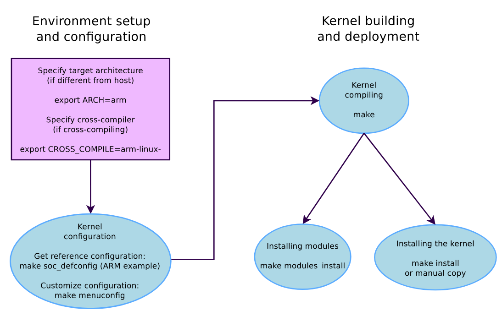

=== Setting up to build kernel

* Make sure that your cross-compiler toolchain binaries location is in `PATH`

* Check if your target architecture is supported by the kernel.
+
Browse the folder `arch` and see if there is a folder with the name of your target architecture

* Create an environment variable `ARCH` for the architecture.
+
By default, `make` assumes native compilation.
Hence, the build system will take the configuration options and headers of the host architecture.
By specifying, `ARCH` we get to tell the build system that we are cross-compiling.
+
We are emulating ARM Vexpress Cortex A9 board on QEMU, hence variable is set to `arm`.

* Create an environment variable `CROSS_COMPILE` that takes in the cross-compiler prefix.
+
The compiler tools are invoked by Makefile as `$(CROSS_COMPILE)<tool>`.
Hence, leaving this variable empty would choose the host's native compiler tools rather than the target's cross-compiler tools.
+
In our case `<tool_chain_prefix>` is `arm-linux-`

* Install package: `libssl-dev`

=== Configuring to build kernel

* List all the available configurations for your architecture by executing at the root of kernel source:
+
----
make help
----
+
[CAUTION]
====
If you execute this command before setting the `ARCH` variable, you'll not see this list.
====
+
From this list, pick the one that is nearest to your board.
+
Normally, for ARM 32-bit(`ARCH=arm`) there is one default configuration per CPU family and for ARM 64-bit(`ARCH=arm64`) there is just one big default configuration file.
+
In our case, we choose `vexpress_defconfig`.

* To create kernel configuration file `.config` from an available configuration:
+
----
make <platform_defconfig>
----

* Use `menuconfig` to make the following modifications:
** `General setup` > `Kernel compression mode` > select `XZ`
** `Device Drivers` > `Generic Driver Options` > enable `Maintain a devtmpfs filesystem to mount at /dev` as built-in module
+
Before linux 2.6.32 the device files(files that represent hardware devices) had to be created manually using `mknod` command.
With the introduction of `devtmpfs`, a virtual filesystem which contains all the devices registered to kernel frameworks, now whenever there is no `initramfs` during boot, you can simply mount this at `/dev` during boot time to be able to access device files.

+
[TIP]
====
If required, you can create a default config from the current config, which will be listed by `make help`, by:

----
make savedefconfig
mv defconfig arch/<arch>/configs/<cfg_name>_defconfig
----

Next time you can simply load this config by doing `make <cfg_name>_defconfig`.
====

+
Whenever you make changes to the configuration, your current configuration is stored as `.config.old` and `.config` is overwritten with new configuration.
Hence, if in case, your kernel was working previously and after your latest configuration changes it doesn't work anymore, you can revert to previous configuration by copying `.config.old` as `.config`.

=== Building kernel

Compile using `make`, and tell it to use parallel jobs to compile.

After the compilation we get:

* `arch/arm/boot/Image`, bootable uncompressed kernel image that can be booted
* `arch/arm/boot/zImage`, bootable compressed kernel image whose name varies based on the architecture.
* `arch/arm/boot/dts/<platform_board>.dtb`, 4 `.dtb` files each for a recognized target board on `vexpress` platform.
+
`vexpress-v2p-ca9.dtb` is the file for the board that we are emulating.
* `vmlinux`

[NOTE]
====
We do not have any `.ko` files as we have not configured any component to compile as a dynamically loadable module
====

=== Setting up to run kernel

For embedded kernels there is no standard way to deploy and use the kernel image.
Moreover, the image is a single file which is easy to handle.

==== Host

Copy to the `tftp` export directory:

* compressed kernel image(`zImage`)
* device tree file(`vexpress-v2p-ca9.dtb`)

[TIP]
====
You can overwrite the script at `arch/<arch>/boot/install.sh` to copy the files mentioned above to the export directory.
Then, whenever you execute `make install` the script gets executed.
====

After this to save space if you want you can delete all generated files and output files created by `make`:
----
make clean
----

==== Target

* Set the environment variable `bootargs` to `console=ttyAMA0` and save it.
+
As we are booting the kernel from the bootloader, we need to set this argument which is required by the command line after the kernel boots.

* Load the files via `tftp`:
+
|====
|file |RAM address

|`zImage`
|0x61000000

|`vexpress-v2p-ca9.dtb`
|0x62000000
|====

=== Testing kernel

On target, boot the kernel with its device tree:
----
bootz <kernel_image_RAM_address> - <device_tree_RAM_address>
----
The `-` in the middle indicates that there is no `initramfs`(initial ram disk).
You should now see linux boot and finally panic.
This is normal as we have not yet provided a working root filesystem yet.

[TIP]
====
You can automate the whole process of setting up and running the kernel on target by using `bootcmd` environment variable:

----
setenv bootcmd '<kernel_image_copy_cmd>; <device_tree_copy_cmd>; <bootz_cmd>'
saveenv
----

After this, whenever you launch the board you'll automatically move from `u-boot` to linux if you don't press any key before `u-boot` timeout.

If in case, you enter into `u-boot` by pressing a key before its timeout, then from `u-boot` to boot linux, you need to just do:

----
boot
----
or
----
bootd
----

You'll execute the commands stored in `bootcmd`, and you'll automatically boot the linux kernel.
====

== Lec 05: Linux Kernel Introduction(Contd.)

=== Device Tree

One does not know ahead of time what devices will be connected, and their details.
Some interfaces or hardware busses to which devices will be connected, provide discoverability mechanisms to enumerate and identify devices at runtime.
Ex: PCI(e), USB etc.
But many interfaces, typically the ones used extensively by embedded systems, does not provide this facility.
Ex: SPI, I2C etc.

To make kernel aware of these devices, there are solutions such as ACPI tables provided by BIOS firmware which is architecture dependent, or mentioning it directly in the kernel's C code which is highly rigid etc.
The most elegant solution is to use a Device Tree(DT) which describe the hardware connected in an OS-agnostic way.

DT Source(DTS) is a file containing DT written by a developer and compiled into Device Tree Blob(DTB) by DT Compiler(DTC).
Various `.dts` files can be found under `arch/<arch>/boot/dts` in kernel source.
To get `.dtb` from `.dts` using `dtc`:
----
dtc -I dtb -O dts <platform_name>.dts
----

It passed to kernel at boot time by the bootloader.
Hence, it is either linked directly inside the bootloader binary or passed to it at runtime.

.DTB and kernel loaded into memory
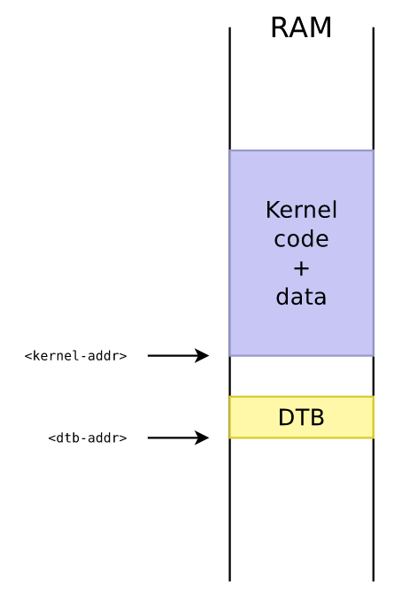

Once loaded into memory, DTB is also called Flattened Device Tree(FDT).
Hence, you have commands like `fdt` in bootloader, the library used to parse DTB is called `libfdt`, and there are APIs starting with `fdt_`.

After booting kernel you can find FDT on pseudo-filesystem `/sys/firmware/devicetree/base`.
To get dts from this:
----
dtc -I fs /sys/firmware/devicetree/base
----

==== DT Principles

Describe hardware not configuration.

Description should not change based on OS.

Describe integration of hardware components, not the internals of them.
In other words, mention how it is connected for example IRQ lines, DMA channels clocks, reset lines etc. but don't mention their internal parameters such as available baud rates etc.

[CAUTION]
====
Just like any design principles, these are sometimes violated.
====

==== DT Syntax

For DT specifications i.e. base syntax, and standard properties, you can go https://www.devicetree.org/specifications/[here].

.Device Tree base syntax
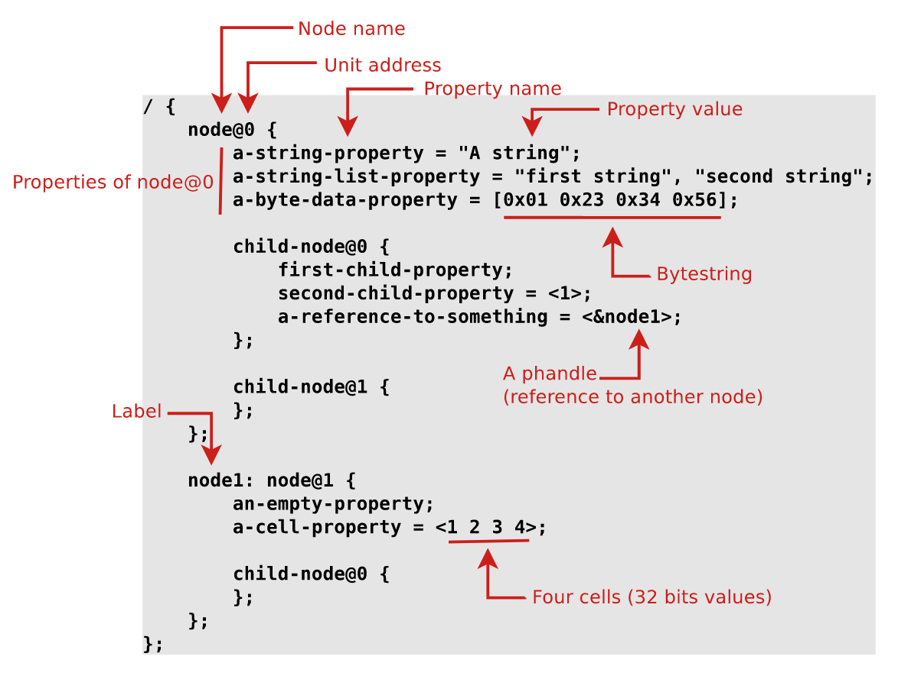

Basically it is a tree of nodes each of which may have other nodes or properties which in turn may have values.
A node is used to represent a device or an IP block and node properties are used to represent device characteristics.
The property values can be a string, a byte, a cell, a list of these or even a reference to another node(called as phandle).

Device Tree files are not monolithic, they can be split into several files and can include each other.
`.dtsi` files are files that are eventually included into a `.dts` file which is the input to `dtc`.

.DT inheritance
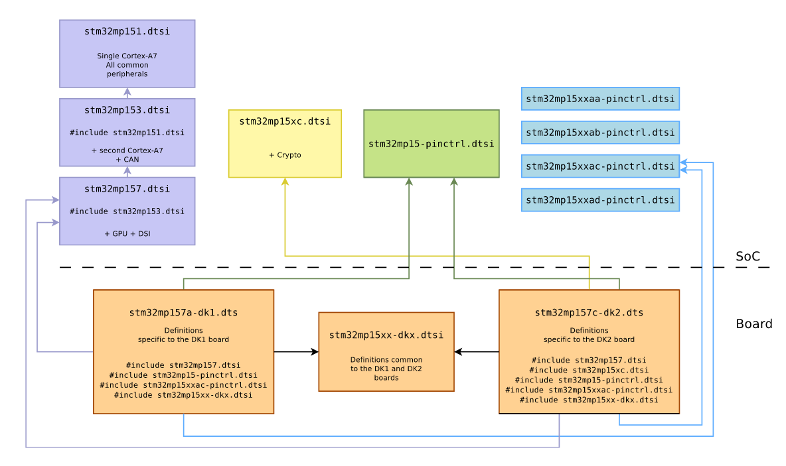

[CAUTION]
====
Note the direction of arrows is as in UML i.e. it is to be understood in reverse direction
====

`.dts` contains the board-level info, `.dtsi` contains: SoC-level info, and other info common across several boards.

.Overriding `.dtsi` value from `.dts`
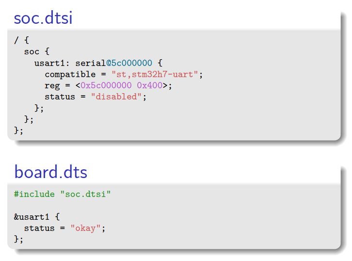

An including file can override the values specified by included file.

===== DT properties

* `compatible`:
+
it is a list of strings in the decreasing order of specificity.
When describing real hardware, each string within the list is of the form `"<vendor,model>"`.
It describes the binding(the YAML semantic specification in `Documentation/devicetree/bindings/`) to which the node complies.
+
[NOTE]
====
An exception is value `simple-bus` which is used to mention a bus where all sub-nodes are memory-mapped devices.
====
+
Kernel uses it to find the appropriate driver for the device.
Each driver has a table of compatible strings it supports `struct of_device_id[]`
+
.Driver Compatibility table
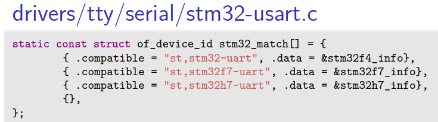
+
When a node's compatible string matches a driver, the hardware described by the node is bound to that driver.
+
Top-level DT nodes with a `compatible` property and nodes that are sub-nodes of `simple-bus` are identified as platform devices.
+
.Platform device identification
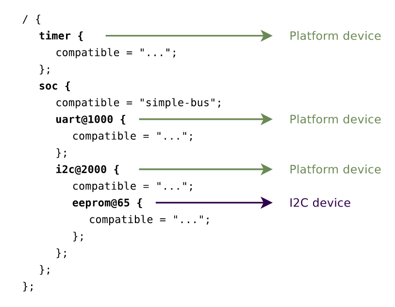
+
These are devices which are instantiated during boot time.

* `reg`:
+
it is used to represent a value(s) which based on the context can mean different things.
In case of:

** memory-mapped registers: base physical address and size of register.
** I2C: address of device on the I2C bus
** SPI: chip select number

* Cells
+
Cells are used to determine how many 32-bit integers are required to represent a property.
+
For example, `#address-cells` and `#size-cells` are used to encode the base address and size in the `reg` property.
`#interrupts-cells` are used to encode the interrupt specifiers of the interrupt controller in `interrupts` property.
Similarly, there are `#clock-cells`, `#gpio-cells`, `#pwm-cells`, `#dma-cells` etc.

* `status`
+
It indicates if the device is in use or not.
Inside the kernel it determines if a device is instantiated or not.
`okay` or `ok` means it is in use, and any other value means otherwise.
By convention, for all devices that interface with outside world, this property is set to `disabled` in `.dtsi` files, and it is only in the `.dts` file that it is individually enabled.

* Hardware blocks with a controller
+
Interrupts, clocks, DMA, reset .etc., all these have their own respective controller.
For these type of hardware blocks, a node is dedicated to describing the controller first.
Then the units that use a particular controller references to it from within their own node.

* Properties ending with `-names`
+
These are optional, and they give human-readable names to the entries of their corresponding properties.
+
.`<prop>-names` properties
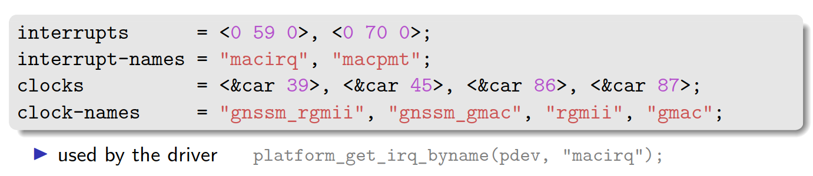
+
Such names are typically used by driver.

* Pin muxing description
Most modern SoCs have more features than they have pins to expose to the outside world.
+
.Pin muxing
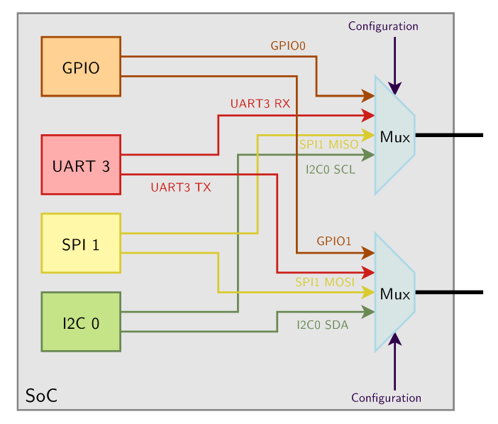
+
Hence, pins are muxed via pinmux controller.
The `.dtsi` describes which pin configurations are possible and `.dts` describes which of these are used by different devices.

==== DT Validation
https://www.devicetree.org/specifications/[This] just gives the syntactic specification which is validated by `dtc`.

For semantic specifications(range of a value, allowed options etc.) of each type of hardware bound to device tree, go to `Documentation/devicetree/bindings/` in kernel source.
This is written in YAML.

These can be validated by kernel `make` rules:

* To check that YAML bindings are valid
+
----
make dt_binding_check
----

* Validate DTs currently enabled against YAML bindings:
+
----
make dtbs_check
----

* Validate DTs currently enabled against a specific YAML binding:
+
----
make DT_SCHEMA_FILES=<YAML_binding> dtbs_check
----

==== DT Example

----
include::rsrcs/refex.dts[]
----

=== Kernel command line

In addition to compile time configuration, kernel behavior can be configured by passing command line arguments to it.
The most important arguments are documented https://www.kernel.org/doc/html/latest/admin-guide/kernel-parameters.html[here].

The string value of environment variable `bootargs` in `U-boot` is passed to the `chosen` section of the DT from where it is passed to kernel upon invocation.

The kernel command line is also used to pass the parameters to modules that are built into kernel.
This is done as:
----
<module_name>.<parmater>=<value>
----
You can pass the parameter `loglevel=<n>` that determines the level of log messages that get logged into the kernel buffer.
You can also simply pass the parameter `quiet` to disable the log messages.
