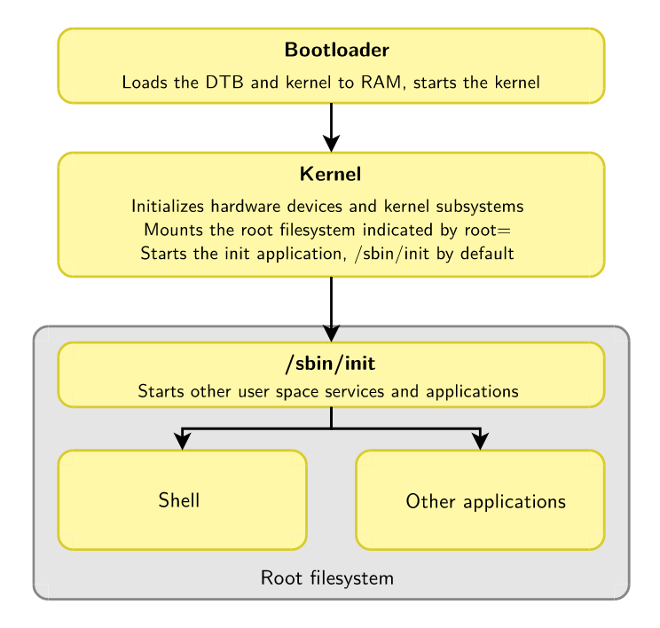

== Lec 06: Linux Root Filesystem

`mount`, and `umount` are programs i.e. executable files residing inside the filesystem.
Hence, they are not available before mounting at least one filesystem that holds them.
That filesystem needs to be mounted directly by the kernel.
And, that filesystem is the root filesystem which is mounted at the root of the hierarchy `/`.

The kernel mounts the root filesystem as per the value in `root=` in kernel option.
When the option is left empty, the kernel panics as there is no root filesystem available.
The root filesystem can reside in a variety of locations from where it can be mounted:

* Partition of a hard disk/USB key
+
----
root=/dev/sd<device_letter><partition_nb>
----
* Partition of SD card
+
----
root=/dev/mmcblk<device_nb>p<partition_nb>
----
* Partition of NAND flash chip
+
----
root=/dev/mtdblock<partition_nb>
----
* Network via NFS
+
.NFS
image::pix/17.05.2022_09.28.12_REC.png[NFS]
+
If networking works in your bootloader, you can have root filesystem on a host and export it to your target via NFS(Network File System).
+
This is very convenient during development coz:

** It makes it very easy to update root filesystem without rebooting
** Can have a big root filesystem even if you don't have support on target for secondary storage yet
*** With a bigger root filesystem, you have a possibility to build applications natively

* RAM
+
[TIP]
====
More details in `Documentation/filesystems/ramfs-rootfs-initramfs` in kernel source
====
+
A RAM based filesystem can be loaded into RAM as an archive via:

** kernel image as a compressed CPIO archive
** Bootloader as a separate file

+
At boot time, this archive can be extracted into file cache, and used from there.
For very small root filesystems, you can completely load it into RAM during boot time and start your application.
Otherwise, you can load an intermediate file system(`initramfs`) into RAM before loading and switching to a real root filesystem.

=== Minimal Filesystem

In order to work, the kernel needs at least a few things:

* a user space `init` application which is a parent to all the other user space applications.
+
It is launched right after mounting the root filesystem by trying one by one the ways described way:

** Without `initramfs`:
+
.Booting without `initramfs`

*** Execute the command `<cmd>` in `init=<md>` passed as the kernel command line parameter
*** `/sbin/init`, `/bin/init`, `/etc/init`, and `/bin/sh`
** With `initramfs`:
+
.Booting with `initramfs`
image::pix/16.05.2022_10.00.11_REC.png[BootWInitramfs]
*** execute `/init`
*** execute `init` at `<path>` in `rdinit=<path>` passed as the kernel command line parameter

* a shell to run the scripts, and allow a user to interact with the system
* executables of programs for use in system scripts or in interactive shell

To put all these requirements together we need a root filesystem.
