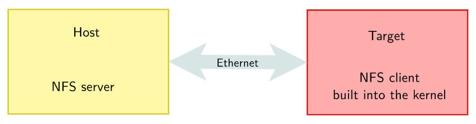
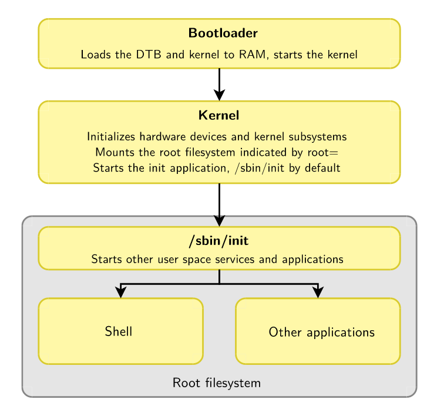
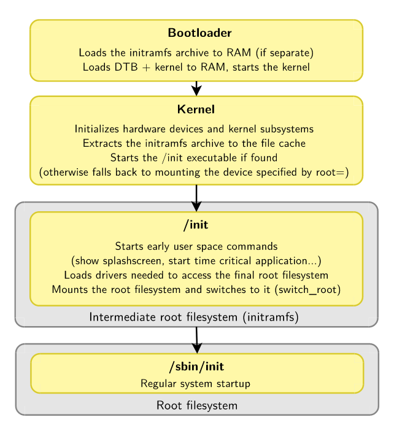
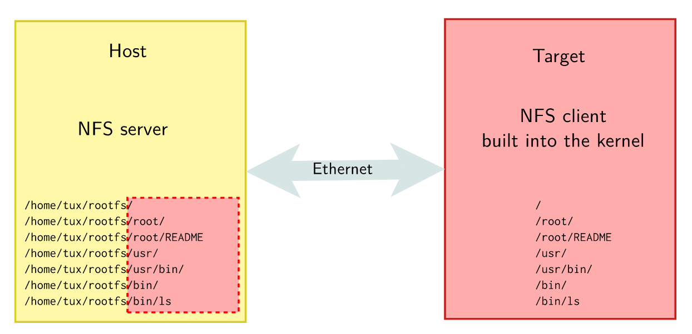

== Lec 06: Linux Root Filesystem

`mount`, and `umount` are programs i.e. executable files residing inside the filesystem.
Hence, they are not available before mounting at least one filesystem that holds them.
That filesystem needs to be mounted directly by the kernel.
And, that filesystem is the root filesystem which is mounted at the root of the hierarchy `/`.

The kernel mounts the root filesystem as per the value in `root=` in kernel option.
When the option is left empty, the kernel panics as there is no root filesystem available.
The root filesystem can reside in a variety of locations from where it can be mounted:

* Partition of a hard disk/USB key
+
----
root=/dev/sd<device_letter><partition_nb>
----
* Partition of SD card
+
----
root=/dev/mmcblk<device_nb>p<partition_nb>
----
* Partition of NAND flash chip
+
----
root=/dev/mtdblock<partition_nb>
----
* Network via NFS
+
.NFS

+
If networking works in your bootloader, you can have root filesystem on a host and export it to your target via NFS(Network File System).
+
This is very convenient during development coz:

** It makes it very easy to update root filesystem.
You need not reboot unless you are testing booting sequence.
** Can have a big root filesystem even if you don't have support on target for secondary storage yet
*** With a bigger root filesystem, you have a possibility to build applications natively

* RAM
+
[TIP]
====
More details in `Documentation/filesystems/ramfs-rootfs-initramfs` in kernel source
====
+
A RAM based filesystem can be loaded into RAM as an archive via:

** kernel image as a compressed CPIO archive
** Bootloader as a separate file

+
At boot time, this archive can be extracted into file cache, and used from there.
For very small root filesystems, you can completely load it into RAM during boot time and start your application.
Otherwise, you can load an intermediate file system(`initramfs`) into RAM before loading and switching to a real root filesystem.

=== Minimal Filesystem

In order to work, the kernel needs at least a few things:

* a user space `init` application which is a parent to all the other user space applications.
+
It is launched right after mounting the root filesystem by trying one by one the ways described way:

** Without `initramfs`:
+
.Booting without `initramfs`

*** Execute the command `<cmd>` in `init=<md>` passed as the kernel command line parameter
*** `/sbin/init`, `/bin/init`, `/etc/init`, and `/bin/sh`
** With `initramfs`:
+
.Booting with `initramfs`

*** execute `/init`
*** execute `init` at `<path>` in `rdinit=<path>` passed as the kernel command line parameter

* a shell to run the scripts, and allow a user to interact with the system
* executables of programs for use in system scripts or in interactive shell

To put all these requirements together we need a root filesystem.

== Lec 07: BusyBox

Many linux components are not designed with the constraints of embedded systems
 in mind.
Busybox(GPLv2), the swiss army knife of embedded linux, is designed to be a single, and highly configurable project which compiles into a single executable.

It rewrites many useful UNIX command line utilities and implements only what is necessary.
All utilities integrated into BusyBox spread across `/bin`, `/sbin`, and `/usr/sbin` as symbolic links pointing to the single executable residing at `/bin/busybox`,

Busybox also provides a way simpler implementation of an `init` program with a single configuration file `/etc/inittab` which allows controlling system services at system startup, shutdown, and run.
For configuration details, you can refer `examples/inittab` in BusyBox source.

== Lab 07: Tiny embedded system with BusyBox

=== Mounting rootfs over NFS

==== Setting up and configuring NFS

.Mounting rootfs over the network

===== Host

* Install package: `nfs-kernel-server`

* Create directory `./edt/embedded-linux-qemu-labs/tinysystem/nfsroot/dev`

* Add the exported directory to file `/etc/exports`:
+
----
<exported_dir> <client_ip>(<server_options>)
----
Here:

** `<exported_dir>` is full path of `./edt/embedded-linux-qemu-labs/tinysystem/nfsroot/`
** `<client_ip>` is target's ip, 192.168.0.100, as set before
** `<server_options>` are `rw`, `no_root_squash`, `no_subtree_check`
+
[IMPORTANT]
====
NFS option are written together as a comma-seperated list with no whitespaces between them.
====
+
*** `no_root_squash` allows accessing files as root from client

* Reload the export file:
+
----
exportfs -r
----

* Compile kernel with following options:

** `CONFIG_NFS_FS=y` to provide NFS client support
** `CONFIG_IP_PNP=y` to configure IP at boot time
** `CONFIG_ROOT_NFS=y` to have support for NFS as rootfs.
** `CONFIG_DEVTMPFS_MOUNT=y`

+
[NOTE]
====
You can do a string search of the option names in the config files and find the relevant line in the config file and edit it, or you can use `menuconfig` and then use the search option and enter the above option name to find its corresponding menu item and navigate to it, and modify it.
====

===== Target

* The environment variable `bootargs` is set as:
+
----
setenv bootargs ${bootargs} root=<mount_point> ip=<client_ip>:::::eth0 nfsroot=<server_ip>:<exported_dir>,nfsvers=3,tcp rw
saveenv
----
+
This boots kernel with the following parameters command line arguments:

** `root=<mount_point>` which is where we mount rootfs over NFS on target.
+
Here, our target `<mount_point>` is `/dev/nfs`.
** `ip=<client_ip>` which will be the target's IP.
** `nfsroot=<server_ip>:<exported_dir>,nfsvers=3,tcp` which are the server details
+
Here, `<server_ip>` is host ip 192.168.0.1, as set while launching QEMU.

==== Testing NFS

Run the QEMU emulator to emulate vexpress board with network and secondary storage capabilities.

As you have already set up in the previous exercise to automatically load kernel and device tree (via `tftp`), and boot it, there is nothing more to do.
You can just reboot anytime using:
----
reset
----

Now you'll see kernel panicking that there is no `init` application.

=== Basic Root filesystem with BusyBox

==== Setting up and configuring to build BusyBox

* Download BusyBox 1.35.0 from https://busybox.net/downloads/busybox-1.35.0.tar.bz2[here] and extract it.

* Make sure environment variables:
** `PATH` contains Cross-compiler toolchain path
** `ARCH`, and `CROSS_COMPILE` are same as kernel compilation

* You have two options to configure busybox:
** Create a new configuration
*** Use:
+
----
make defconfig
----
to start with all options for regular usage
+
or
+
alternatively to unselect all options:
+
----
make allnoconfig
----

** Use existing configuration given in `./edt/embedded-linux-qemu-labs/tinysystem/data/busybox-1.35.config`
*** run `make menuconfig` > navigate to `Load an Alternate Configuration File` > enter `../data/busybox-1.35.config`

* If needed, use `menuconfig` to configure further, as per your liking but make sure that:
** `Settings` >
*** `Destination path for 'make install'` > is set to `../nfsroot`
*** `Cross-compiler prefix` > is set to `arm-linux-`
*** `Build Static binary (no shared libs)` is enabled
** `Init Utilities` >
*** `init` is enabled
*** `Support reading an inittab file` is enabled
*** `linuxrc: support running init from initrd (not initramfs)` is disabled

==== Compiling BusyBox and setting up root filesystem

* Compile using `make`

* Install:
+
----
make install
----
+
Now you'll see all the files installed in `./edt/embedded-linux-qemu-labs/tinysystem/nfsroot` as that was the installation directory configured in the configuration file provided

* Set up character devices at `./edt/embedded-linux-qemu-labs/tinysystem/nfsroot/dev/tty<n>`, where `n` will be 2, 3, and 4, for use by target to create its console.

** Create the device
+
----
mknod dev/tty<n> c 4 <n>
----
+
where 4 is major number indicating the type of the device and `n` is the minor number used to distinguish between devices within this category.

** Give regular user, the ownership of the device
+
----
chown <usr_uid>:<usr_gid> "dev/tty<n>"
----
+
Creating a device requires elevated privileges.
Hence, when the device was created, the device will be owned by superuser.
But, for our emulator to access this device, it is better if the ownership is changed to current user by setting the `<usr_id>` and `<usr_gid>` values corresponding to that of the current user.

==== Testing BusyBox RFS over NFS

Run QEMU as before with SD card and networking.
You'll see:
----
can't run '/etc/init.d/rcS': No such file or directory

Please press Enter to activate this console.
----
But, upon pressing ENTER
You'll see another message:
----
-/bin/sh: can't access tty; job control turned off----
----
All these errors are seen coz `inittab` is not yet set.

Then you'll see a command prompt where you can execute commands.