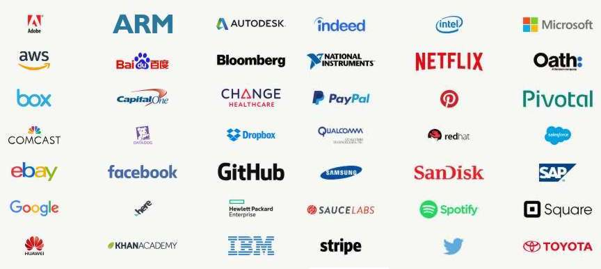
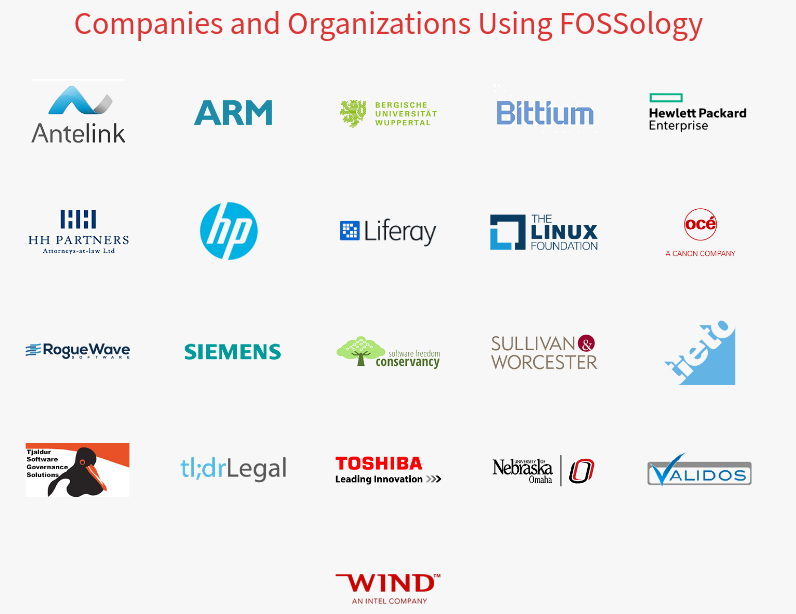
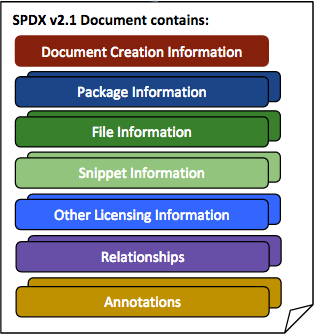
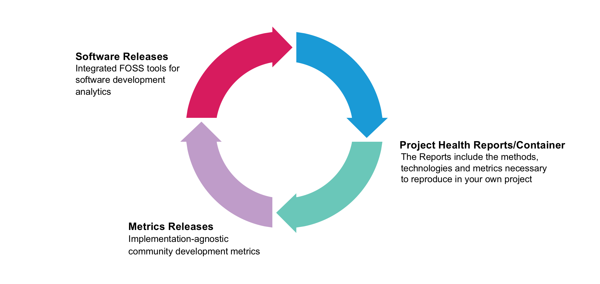

= Notes
CSK
:toc: left
:sectnums:

== 05. Developing an OSS Strategy

Use of OSS has become ubiquitous, and a well-thought-out and implemented strategy for OSS use and adoption is not a luxury, but a basic building block for success.

The key steps to integrate OSS into organizational, and business framework:

* Establishing an OSS office
+
who is in charge and responsible for:

** Choosing OSS code to be used
** Keeping track of usage
** Auditing license, and compliance
** Providing proper information, and training

+
Ideally OSS office should be relatively high in the organizational structure in R&D or under legal department.
* Formulating an OSS policy depending on current needs, and future plans.

** The amount of OSS code to be adopted in the product
** Fate of current closed source after OSS code is adopted
** Licenses that are good fit for the needs, and how well it allows adopting OSS with existing products
** Legal know-how to manage both OSS and closed source in a product without violating each other's licenses.
** Technical know-how to ensure compliance, and prevention of license violation.
* Implementing an OSS policy which requires good planning.

** Deploying training and encourage participation

== 06. The TODO Group

It was founded in 2014 to fostering the adoption and spread of OSS in the corporate business community.

[NOTE]
====
Most TODO Group members do not have OSS as their central mission(like companies such as Red Hat, or GitHub), but they employ OSS in the essential parts of their products as well as their infrastructure.
====

They focus on:

* Sharing best practices for running large open source programs
* Codifying goals for successfully managed projects
* Spreading knowledge about helpful tooling and instrumentation
* Listing and describing member projects that are successful examples

The group has https://todogroup.org/guides/[guides] culminating all their experiences and knowledge on incorporating OSS

== 07. The OpenChain Project

The OpenChain Project is tasked with identifying and sharing the components of high quality open source compliance programs

The OpenChain Project was established to set requirements for effective management of free and open source software (FOSS).
If an organization meets this specification, it can be certified as OpenChain Conforming and receive the right to display the logo indicating that it is fully compliant.

There are six main categories required for a compliance program:

* Knowing Free and Open Source (FOSS) Policy and providing Training
* Assign Responsibility for Achieving Compliance
* Deliver FOSS Content Documentation and Artifacts
* Review and approve FOSS content
* Understand FOSS Community Engagement
* Certify Adherence to OpenChain Requirements

The artifacts that will need to comply are:

* Source code
* Build scripts
* License copies
* Attribution notices
* Modification notices
* SPDX data
* Any other materials licenses may require in a deliverable.

OpenChain Conformance can be established online through a self-certification process.
There is a detailed https://www.openchainproject.org/get-started/conformance[guide] available on how to achieve conformance.

== 11. Compliance Projects: FOSSology, SPDX, CHAOSS

=== FOSSology

`FOSSology` was started in 2007 by Hewlett-Packard and since 2015 it is under the Linux Foundation.
It is part of the Automated Compliance Tooling (`ACT`) project.

It is a system for measuring and documenting open source license compliance via a toolkit that scans files, and projects, to identify licenses, copyrights etc., and document the results, and help identify where information is lacking or is poorly documented.

There are several types of scans that can be done, each of which has an associated scanner application.

* `Nomos`
+
Can search for licenses using regular expression matching, combining with context identification
But generally it cannot give the specific version of a license.
It can also detect an unknown license and report that.

* `Monk`
+
Does text-based searching, and can report back on license versions too.
Hence, it is complementary to `Nomos`.
It cannot recognize unknown licenses, as it works off of a stored table in the server.

* `Copyrights`
+
It investigates copyrights by searching for *copyright*, *(C)* and also phrases such as *written by* in the text.

* Export Control Codes(`ECC`)
+
Determines export control and customs codes by regular expression searching.

The `FOSSology` interface is designed to let the user evaluate all the results found, and correct or investigate further.
If the software is well-designed with respect to explicit statements of copyrights, licenses, authorship, export controls, etc., then the tools will have a much easier time.
Thus, software design that considers these issues from the start will breeze through a `FOSSology` scan.

=== Software Package Data Exchange(SPDX)

The `SPDX` open standard provides a common format for sharing data about software copyrights, licenses, security information, etc.

This open standard is used to communicate software bill of material information.
By its very nature, this avoids repetition of work and streamlines compliance.

The SPDX workgroup was found in 2010 and hosted by the Linux Foundation maintains the specification.

A copy of the latest standard can be found on the project's https://spdx.org[website].

Please take a look at the diagram to learn what the contents of an SPDX document are.

==== SPDX File

A project will include an SPDX file that consists of a series of tags and values, separated by a colon and space (there are other possible formats but this is the simplest one).

Here is an example:
----
SPDXVersion: SPDX-2.1
DataLicense: CC0-1.0
PackageName: FooPackage
Originator: David A. Wheeler
PackageHomePage: https://github.com/david-a-wheeler/spdx-tutorial/
PackageLicenseDeclared: MIT

The full list of possible tags can be found here.

The list of possible licenses has “short form”, such as Apache-2.0, or GPL-2.0-only or GPL-3.0-or-later. These are convenient for inclusion in source files, without a rather long list of lines describing the license.

For example, source files in the Linux kernel will have at the top lines like:

// SPDX-License-Identifier: GPL-2.0
/*
* linux/kernel/sys.c
*
* Copyright (C) 1991, 1992 Linus Torvalds
*/
#include <linux/export.h>
#include <linux/mm.h>
----

=== Community Health Analytics Open Source Software (CHAOSS)

The Community Health Analytics Open Source Software (`CHAOSS`) project was launched in 2017 under the umbrella of the Linux Foundation.

It develops tools and metrics for evaluation of the health of open source projects and ecosystems, to increasing sustainability over time.
This is important for stakeholders making good, informed decisions about how to be involved.

The goals are:

* Establish excellent metrics for measuring community activity, contributions, and health
* Produce software tooling or doing the analysis
* Build project health reports.

=== Others

`ACT` 's goal is to have a smooth automated workflow with compliance evaluation built-in for speedier and more confident development and deployment, and integration with CI/CD methods.
Other than `FOSSology` and `SPDX`, there are other projects under `ACT`:

* Quartermaster (`QMSTR`) which is integrated into the product build system, rather than being a separate “final” step.
Thus, it is DevOps-oriented, and facilitates Continuous Integration and Development methods.
`QMSTR` was contributed by its initiator, Endocode.
* `TERN` inspects package metadata in container images, and elucidates the bill of materials.
With the growing adoption of containerized deployments, examining their compliance become increasingly important.
`TERN` was created and contributed by VMware.

