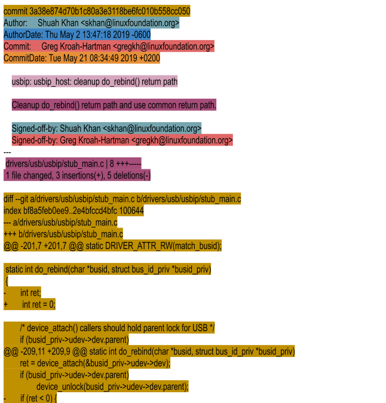

== 02. Linux Kernel Development Process

It occurs 24/7 365 days across the globe.
There is no set date for a release.
A new release comes out once every 10-11 weeks.
Releases are time-based rather than feature-based.
Hence, releases don't get held up for features.

New development, and current release integration cycles run in parallel.

=== Release Cycle

.An example of a release cycle
image::pix/LinuxDevelopmentCycle.jpg[release cycle]

When a new set of features and bug fixes are ready, Linus Torvalds makes a new kernel release.
Post this he opens a 2-week merge window during which he pulls code for next release from subsystem maintainers.
A week before merge window to the end of merge window, Maintainers and key contributors are busy getting their trees ready to send pull requests to Linus.
[NOTE]
====
These 3 weeks are an informal quiet period where new developers might see a slow response from the community.
====

All major new development is added to the kernel during the merge window.
During these 2-weeks about 10k+ patches get pulled into Linus's tree and afterwards he releases the first release candidate called as `rc1`.

At this point, the release cycle moves into a bug fixes-only mode.
Every week a new `rc` is released from Linus, until all major bug fixes and regressions are resolved.

==== Active Kernel Releases

* `rc`
+
These releases are pre-releases that are used for testing new features in the mainline.
These releases must be compiled from source.
Kernel developers test these releases for bugs and regressions.

* `stable`
+
After Linus releases a mainline kernel, it moves into stable mode.
Bug fixes from the mainline kernel are back-ported and applied to stable git by a designated stable kernel release maintainer.
Stable kernel updates are released on average, once a week, or on an as needed basis.

* Long-term(`ltr`)
+
These releases are stable releases selected for long-term maintenance to provide critical bug fixes for older kernel trees.

The main difference between `stable` and `ltr` is that `stable` is maintained only for a few mainline release cycles while a `ltr` is maintained for a long time.

=== Kernel Trees
The kernel code is organized in several main and subsystem git repositories called trees.

* Mainline
+
Maintained by Linus Torvalds.
This is where he releases mainline kernels and RC releases.

* Stable
+
Maintained by Greg Kroah-Hartman.
It consists of stable release branches upon which stable releases are based.

* Linux-next
+
Maintained by Stephen Rothwell.
Code from a large number of subsystem trees gets pulled and integrated into this tree periodically and then released for integration testing.

==== Subsystem Maintainers
Each major subsystem has its own tree and designated maintainer(s).
List of subsystems and their maintainers is in the `MAINTAINERS` file in the kernel source.

Almost every kernel subsystem has a mailing list.
Contributors send patches to mailing list through email and contributions are then discussed through emails.

[Quote, New developer]
____
"It is extremely amazing how the Linux community, which is worldwide, does all its work in email."
____

.Patch Flow

== 03. Patches
Changes to the kernel are normally called a "patch", named after a tool that works with incremental changes to a text file.

Developers send their patches to the kernel mailing lists through email.
In order to make it easier to isolate regressions, changes to kernel are split into smaller chunks.
[IMPORTANT]
====
Each patch must contain one independent modification that stands on its own.
For example, if your code change introduces a compilation warning, you'll fix it independently in a separate patch instead of combining it with your code change.
====

Obviously, a patch cannot break the kernel build.

=== Patch components

* Commit ID:
+
40-character SHA1 string generated from patch contents.
Changing patch contents will change the string, making the patch tamper-proof.
* Commit header
+
----
<major_subsystem>: <minor_area>: <short_change_description>
----
* Commit log
+
A detailed description of the change and why it was made.
Details about testing done.
* Author
+
Author info(name and email) drawn from whatever you set during initializing your repository using `git config` or in the global configuration file.
+
[CAUTION]
====
The email id here must match the one in which you send your patch.
====
* AuthorDate
+
Autogenerated commit time and date.
* Commit
+
Name and email of the Committer who is the maintainer or the developer who will apply the patch to the kernel tree.
* CommitDate
+
Autogenerated time and date when the patch was applied.
* Signed-off-by
+
Author DCO

=== More about Tags

* `Acked-by`: Maintainer of the affected code who neither contributed to nor forwarded the patch.
* `Reviewed-by`: Reviewer
* `Reported-by`: Credits people who find bugs and report them
* `Tested-by`: Tester
* `Suggested-by`: Credit whoever proposed the patch idea
* `Fixes`: The commit id whose bug this patch addresses

=== Patch Email Subject Line Conventions
* `[PATCH]`: the email consists of a patch.
* `[PATCH RFC]` or `[RFC PATCH]`: author is requesting comments on the patch.
* `[PATCH v<N>]`: nth time/version that the patch is being submitted
+
[IMPORTANT]
====
When a patch is reworked, it is important to include patch history showing changes between `---` and the `start of the diff` lines of the patch file.
This doesn't get added to the commit, but it helps the reviewer and saves his time.
====
+
[CAUTION]
====
Don't send new version of patch as a reply to an older version.
Start a new thread for each version.
====

== 04. Working with the Linux Kernel Community

The kernel community abides by the *Linux Kernel Contributor Covenant Code of Conduct*.
There are two documents related to this:

* https://www.kernel.org/doc/html/latest/process/code-of-conduct.html[Contributor Covenant Code of Conduct]
* https://www.kernel.org/doc/html/latest/process/code-of-conduct-interpretation.html[Linux Kernel Contributor Covenant Code of Conduct Interpretation]

[NOTE]
====
When you send a patch with your sign-off you are agreeing to abide by the code of conduct outlined in these two documents
====

=== Linux Enforcement Statement
https://www.kernel.org/doc/html/latest/process/kernel-enforcement-statement.html[Linux Enforcement Statement] conveys how the kernel developers would like to see their software being used and how the license for their software is enforced.

[NOTE]
====
Linux Kernel is provided under `GPL-2.0` license.
====
