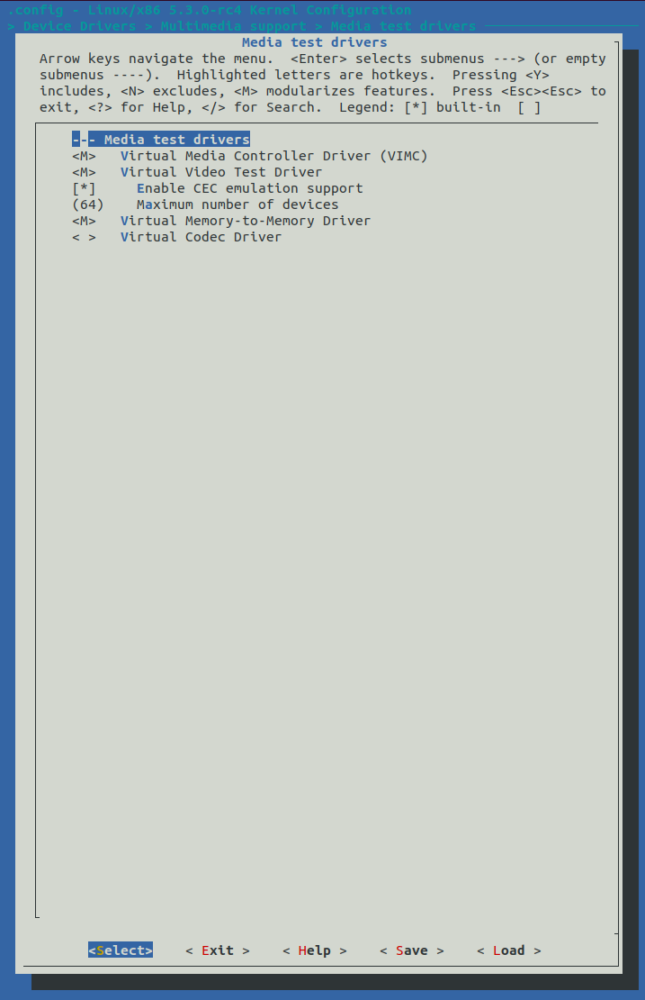
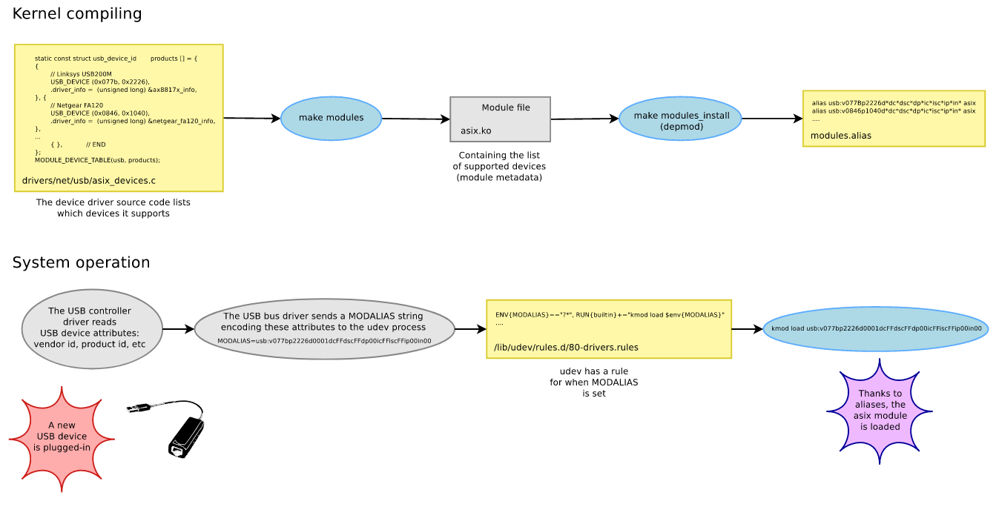

== 05. Configuring your Development system

=== Setting up system packages

Install the following packages: `build-essential`, `vim`, `git`, `cscope`, `libncurses-dev`, `libssl-dev`, `bison`, `flex`, `dwarves`.

Additionally, if you did a minimal installation of your linux, you may need: `libelf-dev`, `psmisc`, `man-db`, `locate`, `bc`, `mokutil`, `python3`

=== Setting up `git email`

To configuring `git email` to send patches:
----
git config sendemail.smtpserver <url>
git config sendemail.smtpserverport <port_nb>
git config sendemail.smtpencryption <encryption_type>
git config sendemail.smtpuser <username>
git config sendemail.smtppass <password>
----
Few common values are:

* `<url>`: smtp.gmail.com
* `<port_nb>`: 587
* `<encryption_type>`: tls

To send patch via email:
----
git send-email <patch_file>
----
[CAUTION]
====
If you have enabled 2-factor authentication on your email account, you may see a failure:

----
ERROR: STARTTLS failed! SSL connect attempt failed error:1416F086:SSL
----

Whenever 2-factor authentication is enabled, you'll need to generate an app specific password for authentication.
Hence, to generate a password for using git, you can refer to *EXAMPLES* section https://git-scm.com/docs/git-send-email[here].
====

[IMPORTANT]
====
Instead of git, if you are using your email client to send the patches, make sure that in your mailing process to:

* Turn off html encoding and send plain ASCII text
* Turn off any line-wrapping or flowing
* Send your patch directly in the email message instead of as an attachment
* Don't write your signature or any other personal information
====

=== Setting up email client

Even if you use `git` to send patches, you'll still have to configure your email client to communicate with community.

Configuring email client:

* Disable HTML format, don't use it for any communication
+
[CAUTION]
====
Messages with html in it are automatically discarded
====
* Disable signature
* Never write your message above the original text while responding to an email.
Always write it at the bottom of the original text, in other words configure your client to 'bottom post'.

[IMPORTANT]
====

* Other than sharing kernel logs, and configuration files while reporting bugs, don't send any attachments in any communications.

* Follow inline posting i.e. when reviewing or responding to a patch, delete the parts of the message that you are not replying to.
====

== 06. Exploring Linux Kernel sources

It is recommended that you create a separate folder for downloading and working on kernel code instead of doing it at the root of the `HOME`.

All latest stable and mainline releases are on the https://www.kernel.org/[kernel archives] page

You can clone Linus's tree at:
`git://git.kernel.org/pub/scm/linux/kernel/git/torvalds/linux.git`

Take a look at the files, and directories.
You'll notice that:

* bulk of code(around 60 %) lives in `drivers` subdirectory.
* about 13 % lies in `arch` subdirectory
* the actual kernel code in `kernel` subdirectory constitutes about a minor 1.3 % of the codebase

Take a look at the `Makefile` and `MAINTAINERS` files at the root of the directory.
Take a look at the scripts that you'll be using every day as kernel developer: `scripts/get_maintainer.pl`, and `scripts/checkpatch.pl`.

Use `git log` to see the history.
Note down an individual commit, and generate a patch to reach this commit from the previous one using:
----
git format-patch -1 <commit_id>
----

Clone the `linux-kselftest` repository at:
`git://git.kernel.org/pub/scm/linux/kernel/git/shuah/linux-kselftest.git`

Check the branches underneath it and checkout the `next` branch.

== 07. Building and Installing your first kernel

[IMPORTANT]
====
The following steps are not specific to `stable` kernel release.
You can play with any kernel release in the kernel tree using the same procedure.
Here, `stable` is chosen just to make sure that you don't face any unforeseen issues.
====

* Clone the stable kernel git at:
`git://git.kernel.org/pub/scm/linux/kernel/git/stable/linux-stable.git`

* Find the branch corresponding to the latest version and switch to it.

* Copy the latest kernel configuration file at `/boot/config-x.y.z-N-generic` of your system as `.config` at the root of your branch to either use it as it is or as a starting point to generate a new configuration file to compile the new kernel.
Configuring kernel from scratch is a lengthy, and complex task.
So we normally base the configuration on an existing kernel configuration that works.
+
[NOTE]
====
Linux kernel though monolithic is highly modular.
We can tailor the kernel to our need by selecting the specific components that we require and compiling the kernel with them.
The kernel configuration determines what components get included into our kernel and how.
====

* Sometimes new releases of kernel introduce new configuration variables, and in some cases, rename the configuration symbols(which can cause compilation errors).
To see the list of new configuration symbols which are not present in the kernel configuration that you copied:
+
----
make listnewconfig
----

* Now to get a configuration file for your kernel compilation, there are three approaches:

** Simply use the current configuration file that you copied as the configuration file

** Generate a new config file based on the current configuration file that you copied:

*** By CLI:
+
----
make oldconfig
----
+
The values for all the configuration options in the kernel source which are also present in the copied kernel configuration file will be taken from the copied kernel configuration file.
But, you'll be prompted with `[Y/N]` options for:

**** the new parameters that appeared due to dependency changes
**** new features and drivers that are not listed in the copied kernel configuration
+
You can just press `Enter` to select the default values for all of them.

*** By GUI:
+
----
make menuconfig
----
+
You'll get a menu which you can navigate and modify the configuration.
The values for all the configuration options in the kernel source which are also present in the copied kernel configuration file will be taken from the copied kernel configuration file.
But, unlike `oldconfig` which prompts user to enter the values for the new configuration variables, `menuconfig` simply writes the default values and expects the users to navigate, and make changes if necessary.
Here you can also do a search of a particular variable, and use gui menu options such as `Help` to know more about the variable.

** To create a new config file that will trim down the kernel and tailor it to your system:
+
----
lsmod > /tmp/my-lsmod
make LSMOD=/tmp/my-lsmod localmodconfig
----
+
This will create a configuration file based on modules that are currently loaded on your system.
Hence, the generated kernel will be trimmed down and tailored to your system.

* To compile the kernel, you can just do:
+
----
make all
----
+
Option `j<N>` can be used to specify the `<N>` number of `make` jobs to run simultaneously to compile the kernel faster.
+
[TIP]
====
After compilation do:

----
make all
----
again just to see if there is still some errors or not.
====
+
[NOTE]
====
If you see this error:

----
No rule to make target 'debian/certs/debian-uefi-certs.pem', needed by 'certs/x509_certificate_list'. Stop
----
or similar.

In config file `.config` change:
----
CONFIG_SYSTEM_TRUSTED_KEYS="debian/certs/debian-uefi-certs.pem"
----
to
----
CONFIG_SYSTEM_TRUSTED_KEYS=""
----
====

* Install new kernel:
+
----
su -c "make modules_install install"
----
+
this will install the new kernel and run `update-grub` to add the new kernel to the grub menu.

* Collect some data on current kernel to compare with new kernel
** Save logs from current kernel to compare and look for regression and new errors.
+
----
dmesg -t > dmesg_current
dmesg -t -k > dmesg_kernel
dmesg -t -l <level> > dmesg_current_<level>
----
+
|====
|Option |Argument |Usage

|`t`
|
|generate logs without timestamps to it easier to compare the old, and the new

|`k`
|
|outputs only kernel messages

|`l`
| `<level>` which can be `emerg`, `alert`, `crit`, `err`, `warn`, and `info`.
|generate logs of a particular level
|====
+
Files `dmesg_current_<level>` should be empty, otherwise it can indicate some hardware/kernel problem.

** Stress test
*** Download 3-4 kernel
*** run timed compilation using `time make all` of all in parallel
*** note down the time related information
* Check for secure boot.
+
If it is enabled, then you cannot boot the new kernel as it is unsigned.
+
[NOTE]
====
If `dmesg_current` is empty, secure boot might be enabled in your system.
====
+
You can temporarily disable secure boot with MOK manager using `mokutil`.
+
** To check secure boot status:
+
----
mokutil --sb-state
----

** If you see:
+
----
SecureBoot disabled
Platform is in Setup Mode
----
+
you are all set to boot up.
Otherwise, if you see:
+
----
SecureBoot enabled
SecureBoot validation is disabled in shim
----
+
Then you'll need to disable it:
+
----
mokutil --disable-validation
----
+
When prompted enter mok password which normally is `12345678` and answer `Yes` to disable the secure boot
+
[NOTE]
====
After finishing everything and when you no longer want to boot the installed kernel.
You can re-enable secure boot:

----
mokutil --enable-validation
----
then do as before with the prompt.

For more https://askubuntu.com/questions/1119734/how-to-replace-or-remove-kernel-with-signed-kernels[info].
====

* Before booting, lets me sure that we have the option to boot into something if in case the new kernel doesn't boot.
+
The `GRUB` automatically takes the newly installed kernel as the default, hence, we will need to change that to a prompt which provide us an option to select the kernel.
+
To change grub configuration:

** go to the file `/etc/default/grub`:
*** Uncomment `GRUB_TIMEOUT` and set it to 10: `GRUB_TIMEOUT=10`
*** Comment out `GRUB_TIMEOUT_STYLE=hidden`
*** Enable `GRUB_CMDLINE_LINUX="earlyprintk=vga"` to print early boot messages to figure out why the kernel failed to boot.
** update grub configuration:
+
----
update-grub
----

* You can reboot the system:
+
----
reboot
----

* On the prompt choose the new kernel

* If it doesn't boot, reboot and go back to old kernel to investigate.
If it boots well, verify the new installation:
** Collect the same data as before
** Do a diff to see if there are any regressions

== 08. Writing your First Kernel patch

* Configure your git:
Use the command in the following format
+
----
git config.<section> <option> <value>
----
+
To configure:

** `user` section with fields `name` and `email`
** `format` section with field `signoff=true`
** `sendemail` section with email configuration

* Clone the mainline kernel again or do a rebase to pick up new changes since the last time you cloned the repository
** Add a remote repo, setting it to name `linux`, to say where to take the changes from
+
----
git remote add linux git://git.kernel.org/pub/scm/linux/kernel/git/torvalds/linux.git
----
** Pick up the changes:
+
----
git fetch linux
----

* Create a new branch and switch to it

* Make your changes

* Compile the code:
+
To compile the whole kernel it takes a lot of time.
Instead, you first try to compile a single file or a directory:
+
----
make <path>
----
+
Then you can compile the module related to the file/directory:
+
----
make M=<module_path>
----
+
Then you can compile the whole kernel
+
----
make -j<N> all
----
+
After compilation, fix errors, if any and recompile

* Check if your changes match the https://www.kernel.org/doc/html/latest/process/coding-style.html[linux kernel coding style]:
+
----
git diff > temp
scripts/checkpatch.pl temp
rm temp
----
+
Fix errors, if any and recompile

* Commit with a sign-off, and a message.
+
[NOTE]
====
Guidelines to write a proper commit message:

* Separate subject from body with a blank line
* Limit the subject line to 50 characters
* Capitalize the subject line
* Do not end the subject line with a period
* In the subject line, use the imperative mood(meaning spoken or written as if giving a command or instruction)
* Wrap the body at 72 characters
* Use the body to explain what and why vs. how
====
+
[TIP]
====
Hooks are actions that are performed before and/or after a command is executed.
Git has both pre- and post-commit hooks.
You can set it up to automate the process of checking the patch.
If you see any errors, you can fix it, and then you can amend the commit:

----
git commit --amend
----
====

* Generate a patch file

=== Workflow to patch a driver

* Pick a driver to change:
+
pick one from the list the current drivers/modules loaded on your system:
+
----
lsmod
----

* Find all the relevant files for the driver in the repository:
+
search in `Makefiles` using:
+
----
git grep <module_name> -- '*Makefile'
----
+
here you'll see output along the lines of:
+
----
...
<path>/Makefile:...
...
----
+
The `<path>` contains the relevant files for the driver.

* Now navigate to the driver folder, and find a file with probe function which has a name that ends with string `_probe`:
+
----
grep -n -e ".*_probe" <driver_folder>/* | less
----

* In the probe function add:
+
----
pr_info("<op_message>")
----
+
This `<op_message>` string will be visible in `dmesg`.

* To test the change:
** Configure in the makefile `CONFIG_<name>=y`
** Recompile your kernel and install.
** Load your module
*** To test as a loadable module
**** Load the module
+
----
modprobe <module_name>
----
*** To test as built-in module:
+
----
reboot
----
** Check the kernel buffer message
+
----
dmesg | grep <op_message>
----
** Unload your module
+
----
modprobe <module_name>
----

Lets pick USB Video Class(UVC) media driver as an example.
Then, its `Makefile` is `drivers/media/usb/uvc/Makefile`.
Code is at `drivers/media/usb/uvc/`.
Its modprobe function is name `uvc_probe` located in `drivers/media/usb/uvc/uvc_driver.c`.
Its configuration option is `CONFIG_USB_VIDEO_CLASS`.
Its module name is `uvcvideo`.

== 09. Getting your patch ready to send

To know who to send the patch to:
----
get_maintainer.pl <changed_source_code_file>
----
Do this to all your files to get the list of maintainers, commit signers, supporters and all the mailing list to which you'll need to send your patch to.

Now generate a patch with email encoded in it:
----
git format-patch -1 <commit_id> --to=<email_id_x> --to=<email_id_y> --cc=<email_id_p> --cc=<email_id_q>
----
The mailing lists should be on the `cc` and the rest are on `to`.

Now, to send the generated patch:
----
git send-email <patch_with_email_encoded_in_it>
----

[NOTE]
====
Sometimes you need to send multiple related patches.
In such a case you can create a threaded patch series that includes the top `<N>` commits and generated cover letter template:

----
git format-patch -<N> -s --cover-letter --thread --subject-prefix="PATCH v<N>" --to=<email_id> --cc=<email_id>
----
It is a good practice to send a cover letter when sending a patch series.
====

=== Review process
Patches will get comments from reviewers with suggestions for improvements.
Always thank the reviewers and don't hesitate to ask a clarifying question about their comments.

[NOTE]
====
Be patient and wait for a week before requesting a response.
During merge windows it may take more time.
After which you can send a gentle message.
====

When a patch is reworked, it is important to include patch history showing changes between `---` and the `start of the diff` lines of the patch file.
This doesn't get added to the commit, but it helps the reviewer and saves his time.

[IMPORTANT]
====
Don't include the patch history in the commit messages
====

Don't send new version of patch as a reply to an older version.
Start a new thread for each version.

=== Additional guidelines for sending patches
* While documenting your change, include the tests you executed and their results
* `Signed-off` should be the last tag
* Don't forget to use the right tags to credit people: `Suggested-by`, `Reported-by`, and `Tested-by` etc.
* If you disagree with a review, respectfully state the reasons for it, along with the supporting technical data.
* You may get comments any time during the review process
* After the patch gets accepted into `linux-next` for integration into the mainline, Kernel build and Continuous Integration (CI) bots are used to test.
Stay engaged and be ready to fix problems, if any.
* Including patch series version history in the cover letter will help reviewers get a quick snapshot of changes

== 10. Compiling a kernel source

The kernel image is a single file(`vmlinuz`) which is loaded by the bootloader.
The object files of all the necessary features are compiled to produce the kernel image.
Kernel configuration is used to configure what goes inside the kernel image.

The options configured depend upon:

* target architecture
* devices connected
* kernel capabilities

Makefiles are used for both kernel configuration and compilation.
Hence, all configuration and interaction is done via `make`.

As described in detail in the previous sections, kernel configuration is a lengthy and complex task, hence we take a configuration that works and use tools such as `oldconfig` or `menuconfig` to modify them.

=== Kernel configuration

Kernel configuration is a bunch of variables defined in `Kconfig` files.

==== Types

|====
|variable type |possible values

|bool
a|
* `y` to include the feature in the kernel
* `n` for vice-versa.

|tristate
a|
* `y` and `n` same as bool
* `m` to include the feature as a dynamically loadable module

|int, hex, string
|corresponding values
|====

Modules that are built into the kernel image can be loaded at boot time.
Dynamically loadable modules can be loaded when needed(for example, when a matching hardware is detected) using `modprobe`.
This is a better approach to keep the size of the kernel small.
But, these modules are stored as separate file in the filesystem and hence, access to filesystem is mandatory.
If you need a module during boot time, as there is no filesystem during boot time, you have no other option but to compile it as built-in module.

==== Dependencies

Until all dependencies are enabled, a module will not compile/enable.
To manage dependencies:

* By hand:

** Find the dependencies, read the `<module_path>/Kconfig` file to identify the line:
+
----
config <module_var_name>
...
depends on <variables>
select <variables>
...
----
+
variables in the line with text `depends on`, are dependencies that need to be enabled.
variables in `select` lines are auto-selected.

** To enable one, you'll need to do:
+
----
CONFIG_<variable_name>=<value>
----
+
in the `Makefile`.

* using `menuconfig`:
+
Navigate to a particular configuration variable and select the `Help` option to list it dependencies, and do the necessary by navigating through menus and modifying the options.

===== Example

Let us consider, `vimc` module's directory `drivers/media/test-drivers/vimc/` which can be used as a `<path>` or `<module_path>` in the `make` commands.

To modify by hand:

* Its dependencies can be found at `drivers/media/test-drivers/vimc/Kconfig`.
* `VIDEO_DEV`, `VIDEO_V4L2`, `VIDEO_V4L2_SUBDEV_API` are its dependencies while `VIDEOBUF2_VMALLOC` and `VIDEO_V4L2_TPG` get auto-selected.
* `CONFIG_VIDEO_VIMC` is a tristate driver.

If modify using `menuconfig` tool, go to `/Device Drivers/Multimedia support/Media test drivers/vimc` in the hierarchy and follow the instructions displayed to modify the variables as shown in the figure:

.Configuring `vimc` using `menuconfig`

=== Kernel compilation and installation

You can compile using `make` as described in previous sections.

After the compilation we get:

* `arch/<arch>/boot/Image`, bootable uncompressed kernel image that can be booted
* `arch/<arch>/boot/<arch_Image_name>`, bootable compressed kernel image whose name varies based on the architecture.
+
For example, `bzImage` for x86, `zImage` for ARM, `Image.gz` for RISC-V etc.
* `arch/<arch>/boot/dts/<platform_board>.dtb`, one or several compiled Device Tree Blobs each supporting a particular target board.
* `.ko` (Kernel Object) files spread over the kernel source tree.
* `vmlinux`, a raw uncompressed kernel image in the ELF format which is useful for
debugging purposes but generally not used for booting purposes

In the previous section for installation we did:
----
su -c "make modules_install install"
----

`make install` invokes the kernel installation process which:

* copies compressed kernel image from kernel source directory `arch/<arch>/boot` to system's `/boot/` directory as `vmlinuz-<version>`
* stores kernel symbol addresses for debugging purposes as `/boot/System.map-<version>`
* stores the kernel configuration of the installed kernel as `/boot/config-<version>`
* re-runs bootloader `grub` configuration utility to make the new kernel available at next boot

`make modules_install`, installs all the modules which involves:

* the `.ko` files are under `/lib/modules/<kernel_ver>/kernel`
* under `/lib/modules/<kernel_ver>/`
** aliases used by module loading utilities, `modules.alias`, `modules.alias.bin`
** module dependencies, `modules.dep`, `modules.dep.bin`
** `modules.symbols`, `modules.symbols.bin` which tells which module that a given symbol belongs to.

.Automatic loading of modules with module aliases

