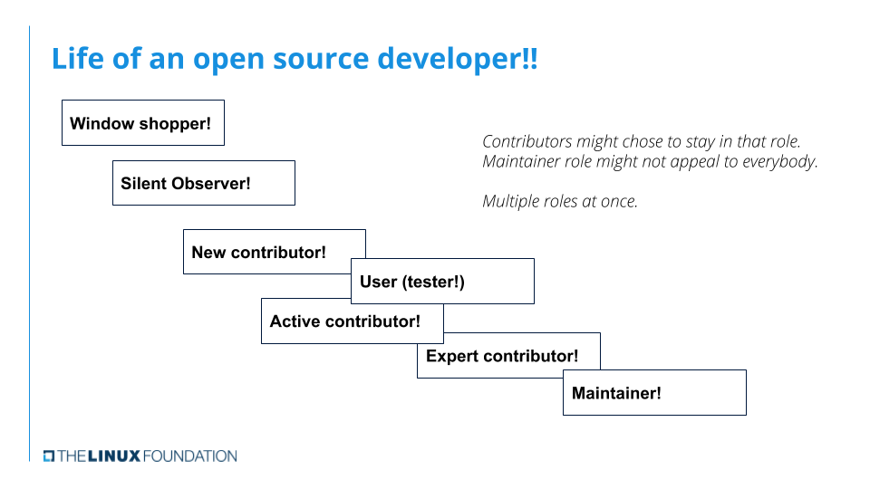

== 13. Tips to continue your Kernel Journey

.Life of an open source developer

[NOTE]
====
One can be simultaneously playing multiple roles to various code.
====

The kernel development is a living process.
Primary work is done remotely, and over emails.
https://events.linuxfoundation.org/about/calendar/[Linux Foundation Events Calendar] lists the few times during the year, people meet face to face over conferences.

[IMPORTANT]
====
https://events.linuxfoundation.org/lf-live-mentorship-series/[LF Live: Mentorship Series] is a virtual mentorship series hosted by Open Source Maintainers and community leaders to provide expert knowledge and valuable interactive discussion across a range of topics related to the Linux Kernel and other OS projects, primarily around development.
====

=== To become a maintainer
A few paths that lead you there:

* Write a new driver.
* Adopt an orphaned driver or a module
+
[TIP]
====
Check the `MAINTAINERS` file to find one.
====
* Clean up a staging area driver to add it to the mainline.
* Work towards becoming an expert in your area of interest, by fixing bugs, doing reviews, and making contributions.
* Find a new feature or an enhancement to an existing feature that is important to the kernel and its ecosystem.

[TIP]
====
Participating in the `stable` release can help understand kernel development process.
====

=== To become a contributor

To contribute you can:

* participate in `stable` release process
* enhance and improve Kernel documentation
* contribute to the kernel itself

==== Participate in `stable` release

* Subscribe to http://vger.kernel.org/vger-lists.html#stable[`stable` release mailing list].
* When you receive a mail, about a new patch, from the maintainers:
** Work with the stable release `rc` git and install
+
[source, bash]
----
include::rsrcs/refex/stable_rc_checkout.sh[]
----

** Alternatively, you can work with `stable` repo, and apply the patch downloaded from the location mentioned in the email
*** Download the stable branch
+
[source, bash]
----
include::rsrcs/refex/stable_checkout.sh[]
----
*** Apply the patch and install
+
[source, bash]
----
include::rsrcs/refex/pre_compile_setup.sh[]
----
* Save the logs:
+
[source, bash]
----
include::rsrcs/refex/dmesg_cur.sh[]
----

* Configure the `GRUB` to make sure you get a boot option to choose the kernel to boot, reboot, and boot to the new kernel

* Save the logs, and check with the old one for regressions
+
[source, bash]
----
include::rsrcs/refex/dmesg_checks.sh[]
----

* Run https://www.kernel.org/doc/html/latest/dev-tools/kselftest.html[`Kernel Selftests`] and check the results:
+
----
make kselftest
----

==== Enhance and Improve Kernel Documentation
This is a good way to engage with the community and learn different areas of the kernel.

Check for all dependencies required to build the documentation:
----
./scripts/sphinx-pre-install
----

Build the documents:
----
make htmldocs > doc_make.log 2>&1
----
[NOTE]
====
This command internally calls the script to check for dependencies.
====

==== Contribute to the Kernel
* Subscribe to the http://vger.kernel.org/vger-lists.html[Linux Kernel mailing list] for the area of your interest.
* Follow the development activity reading the Linux Kernel Mailing List Archives.
* Join the `#kernelnewbies` IRC channel on the https://www.oftc.net/[OFTC IRC network].
This server is home to `#mm`, `#linux-rt`, and several other Linux channels.
* Join the `#linux-kselftest`, `#linuxtv`, `#kernelci`, or `#v4l` IRC channels on https://freenode.net/[freenode].
** This server recommends Nick registration.
+
Server Name: `irc.freenode.net/6667`.
+
You can register your Nick in the server tab with the command:
+
----
identify /msg NickServ identify <password>
----
** You can configure your chat client to auto-identify using the
`NickServ(/MSG NickServ+password)` option - works on hexchat.
* Find spelling errors in kernel messages.
* Static code analysis error fixing
** Invoke the `Makefile` with options to enable to run the https://www.kernel.org/doc/html/latest/dev-tools/sparse.html[Sparse source code checker] on all source files, or only on the re-compiled files.
** Find errors
** Fix as needed
* Fix the https://syzkaller.appspot.com/upstream[`Syzbot`] null pointer dereference and `WARN` bug reports:
** Run the reproducer included with bug report, to see if you can reproduce the problem
** Look at the crash report
** Walk through sources for a possible cause.
** You might be able to fix problems.
* Look for opportunities to add/update `.gitignore` files for tools and `Kselftest`
** Build tools and `Kselftest`
** Run `git status`.
** If there are binaries, then it is time to add a new `.gitignore` file and/or an entry to an existing `.gitignore` file.
* Run mainline kernels built with the `CONFIG_KASAN`, lock debug options, and report problems if you see any.
