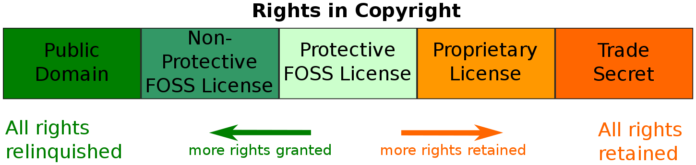

== Chapter 1: Introduction to Open Source Software

=== Open Source Software(OSS)
Proprietary software or closed source software are software projects where only the owners have full legal access to the source code involved.
They may grant inspection rights to trusted partners who have signed NDAs(Non-Disclosure Agreements).
The end users will have to accept a license that generally restricts their rights of re-distribution, indemnify the product from damages due to either malfunction or misuse, and prohibit trying to reconstruct source code or use inside another product.
Additionally, they may also restrict how a product is used.

OSS means source code is made available with a license that provides rights to examine, modify and redistribute, without restriction on the user's identity or purpose.
Such a licensing allows for faster and better development involving more contributors and review, easier debugging, etc.

[IMPORTANT]
====
The difference between OSS and Proprietary models has nothing to do with price.
One can charge as much as one wants for an open product and one can provide a proprietary product for free.
The main difference has to do with the licensing rights for redistribution, modification, and reuse of code, etc.
====

Based on the scale, purpose, desired quality, speed of evolution etc. different governance models are employed for OSS.
They may be led by company(Android by Google), or a benevolent dictatorship(Linux by Linus Torvalds), or a governing board(OpenBSD).

== Chapter 2: Why use OSS?
[NOTE]
====
This doesn't kill the competition.
Competitors can still compete on user-facing interfaces so that end users still see plenty of product differentiation and have varying experiences.
====

* Collaborative development
** Progress can be faster and at a lower cost.
** When code is shared, not everyone has to solve the same problems and make the same mistakes.

* Better Security
** Having more people viewing code makes it easy to find security weaknesses before they are discovered by bad actors
** No "security through obscurity" and no, "just trust me"
** More groups testing it leads to stronger and more secure code

* Better Quality
** There is more input in original design to avoid bad ideas
** Cleaner code because:
*** It is embarrassing to show ugly, sloppy code
*** Coding standards and styles are adopted for consistency on community projects
*** More people have to understand and work on the code
** Potentially faster bug repair

* Better development
** Can mix and match code from various sources
** Save money
** Faster time to market
** Users can know what they are getting

== Chapter 3: Examples of successful OSS projects
* Linux kernel
* Git
* Apache HTTP web server
* Programming languages: Perl, Python, Ruby, Rust
* Utilities: Tex and Latex
* GNU: gcc, gdb, glibc, bash, coreutils
* X Window system, Desktop managers: GNOME, KDE, XFCE
* Openstack, Kubernetes etc

== Chapter 4: OSS Licensing and Legal Issues
There are multiple licenses which can be broadly classified as:

* Permissive (such as BSD-licensed software)
+
Do not require sharing modifications and enhancements to the code
* Restrictive (such as GPL-licensed software)
+
Demands the software to remain open and requires any changes made to the code to be made available to future users

=== Fear, Uncertainty, and Doubt
In the 90s companies like Microsoft were spreading misinformation about OSS to avoid competition by appealing to fear.

Some FUD statements are:

[quote]
____
If you include it in your product, all your sources must be made available to everyone.
____
[quote]
____
OSS infringes on software patents and the related claim that it forces you to grant patent rights to others.
____
[quote]
____
OSS requires a lot of legal help to avoid the above pitfalls and is thus very expensive.
____
Wrong, even proprietary software requires significant legal analysis to properly avoid copyright and patent infringement, etc.
OSS is same in the above respect, everything depends on the license of the OSS that is being used.
But, it is considerably cheaper.

[NOTE]
====
All you need to do is establish proper procedure within your organisation for your developers to follow while working with various licenses.
====

[quote]
____
OSS products leave nowhere to turn when they break, or to get technical help.
____
Wrong, many OSS are supported by both serious, long-living companies(such as Red Hat Enterprise Linux), and smaller organizations.
In addition, there is a lot of freely available help online, and there are many consultants that can be hired.
In fact, there is more competition available for such help than there would be with vendor lock-in on a product.

=== Software Patents
A software patent gives exclusionary rights to program, library, interfaces, techniques, and algorithms.
Just like any patent it needs to be filled in each nation where coverage is desired.
What is patentable depends on jurisdiction.

In 2005, the *Open Invention Network*(OIN) was created as a global patent pool, where its members get free access to each other's patents for agreeing to not sue each other over patent issues within the Linux-based ecosystem.

In any software the patent rights depends upon its license.
For example, MIT, GPL 2.0, LGPL 2.1 does not provide patent rights while Apache 2.0, GPL 3.0, and, LGPL 3.0 does.

=== Choosing a license
Some factors to consider are:

* restrictive or permissive
* Patent policy on your patents
* Crediting original authors and can their names be used to promote product/service?
* Must source be shared or not?

[TIP]
====
You can use free interactive website of http://oss-watch.ac.uk/apps/licdiff/[OSS Watch], a UK-based advisory service to pick appropriate license for your project.
====

You can even combine licenses for whole project or certain section of the code, though this makes things more complicated.

[WARNING]
====
Always check with your legal counsel before contributing to a project with a different license than your project which plans to use it.
====

== Chapter 5: How to work in OSS projects
[IMPORTANT]
====
* Identify how project communicates
* Join the communication network and read few existing archives
* Understand how contributions are submitted
** Identify maintainers, their workflows and methods
* Before proposing an idea, check if your idea has been previously considered and rejected or if someone is already working on it, if that's the case, join them rather than starting over
* Check if the project offer mentors
====

[TIP]
====
* Big projects normally have "janitorial" tasks in their list of things to do, these can help you get your feet wet
* Testing, debugging and bug fixing are good ways to get familiar with code and to start making valuable contribution
* Offer to review others code
* Find right balance between asking for reviews and suggestions too early and too late
** Contribute incremental bits, not large code dumps
* Make sure you are competent with whatever language that the project uses
====

[NOTE]
====
* Leave your ego at the door: Take a deep breath if someone is being nasty and don't be nasty in return
* Respect other opinions: Be polite and respectful with criticisms
====

=== Study and understand the project
* Purpose at the start, and has it still remained true to it or has it diverged?
* Size and frequency of contributing community
* Governance structure: company-led, benevolent dictator, or governing board
* License, and any CLA/DCOs used

=== DCO and CLA
It is important to know who/where a particular code is coming from to know who:

* To ask the related questions or request review to accept modifications
* Caused license issues by using another code whose license doesn't work well with project's license

Contributor License Agreement(CLA) and Developer Certificate of Origin(DCO) is used to handle these issues.

CLA, currently obsolete, is a one-time operation while DCO requires a signing-off each contribution.
Automated checks on version control systems can be used to enforce them(often with a switch).

== Chapter 6: Leadership
Leadership depends on the project's governance structure which influences operating methods.
A capable leadership empowers participants to contribute higher quality and more imaginative work.
A good leader:

* listens
* makes sure to give back by mentoring and moderating
* builds trust by ensuring that contributors are treated with respect and subsystem maintainers are qualified enough to do their job

Reasons for failure of OSS project:

* Insufficient interest
* Competition
* Poor leadership
* Lack of developers
* Insufficient funding
* Licensing issues

== Chapter 7: Diversity
While it is just the right thing to do to accept contributors and reviewers from divergent backgrounds, diversity also leads to a better project due to unleashing more sources of new ideas, approaches, and contributions.
