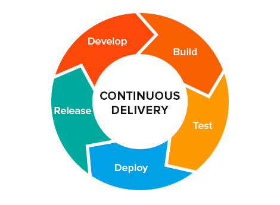

== Chapter 8: Continuous Integration

=== Why CI?
As the software projects grew larger with several number of developers working from different locations on different subsystems, distributed development needed to be harmonized.
Revision control systems or version control systems(vcs) were used for this purpose.

However, a vcs doesn't guarantee:

* that project code compiles
* code runs well on all target platforms
* whatever code contributed works
* new code or bug fixes doesn't conflict with other code

All this can only be checked by testing.

Continuous integration(CI) techniques allows a project to absorb changes rapidly in real-time and run automated tests to ensure that any problems are caught very early and addressed.

[Quote]
____
an ounce of prevention is worth a pound of cure
____
Setting up a CI pipeline is not trivial however it is worth the time and effort.

=== CI/CD

Normally CI techniques involve:

* Continuous Integration
** Refers to merging code changes to main branch as often as possible
** Automatically generating builds for all target platforms
** Running automated builds on as many variations of software and hardware as possible
** Resolving conflicts as soon as they arise
* Continuous Delivery(CD)
** Automating release process
** Thorough testing performed on all platforms

+
[NOTE]
====
Check-out CD Foundation(https://cd.foundation/[CDF]), a vendor-neutral home for significant CI/CD projects.
It documents and establishes best practices to spread CI/CD and DevOps practices and improve product release processes.
====
* Continuous Deployment
** Automated product delivery to customers

=== Examples
Some main ones are: Jenkins, Travis CI, GoCD, Gitlab CI etc.
In fact, Linux kernel employs its own CI project called https://kernelci.org[kernelCI] whose goal is to ensure long-term quality control, stability and facilitate maintenance of the Linux kernel.

== Chapter 9: GitHub and Other Hosting Providers
Git is a vcs technology which is provided by a number of hosting providers such as GitHub, GitLab, GitKraken etc.
The repositories maybe:

* Public
+
Anyone with the link can copy, clone or fork the repository, or download its contents.
But, to make modifications, one requires authorization from the owner.
* Private
+
Only selected people authorized by the owner can view the repository or clone or download it

[NOTE]
====
Normally, public repositories are free of charge and private ones cost money.
====

[TIP]
====
There are GUI tools for Git supporting a host of providers.
====

