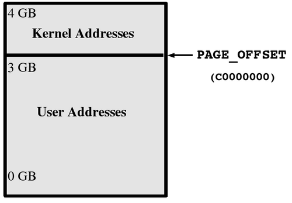

== Chapter 18: Memory

=== Overview
In linux the physical memory is virtualized.

Each process is allocated a fair share of memory by the kernel.
This memory has its own address space where all the addresses are virtual and must be translated into a physical address by the kernel whenever a process needs memory access.
Any invalid virtual address causes the process to crash.
This and without having knowledge of physical addresses, a process cannot accidentally write into memory of another process.
Hence, virtualization provides process isolation and any sharing of memory between the processes needs to be facilitated by the kernel.

[NOTE]
====
Even kernel processes uses virtual addresses.
Here, when we say physical memory we refer to the primary memory i.e. RAM and swap(if the RAM is exhausted).
====

For example, as shown in the fig, in a 32-bit system the upper 1 GB is used for kernel processes and the first 3 GB is used for user processes.

As a 32-bit system has an address bus size of 32 bits, the maximum memory size that it can address is 4 GB.
Hence, physical memory is restricted at 4 GB.
However, using complex techniques upto 64 GB of physical memory can be supported but even in this case, a process cannot have more than 4 GB.

A 64-bit system can easily support 1 TB of physical memory and each process can have more than 4 GB.

Applications do not write directly to secondary memory such as hard disk.
They interface with the virtual memory system, and data blocks written are generally first placed into cache or buffers, and then are flushed to disk when it is either convenient or necessary.
Thus, in most systems, more memory is used in this buffering/caching layer than for direct use by applications for other purposes.

[TIP]
====
Reading/Writing from/to secondary memory is the largest performance bottleneck.
Hence, it is highly recommended that your applications keep this to a minimum.
====

=== Swap
The size of virtual memory can be larger than primary memory.
When the primary memory is about to run out, a part of secondary memory is used as a primary memory.

Most processes do not use all the memory that they are allocated either coz they don't need as much or coz they are a child process who inherit a copy of the parent's address space which is updated using Copy On Write(COW) technique(here a unique copy is made on a page-by-page basis whenever there is a change in the corresponding page's data in the parent process).
Hence, some regions are more active than others.
Whenever there is a strain on the memory, the less accessed memory regions/pages in the primary memory get swapped out to make space of new more active pages.

You can see what partitions of your hard disk is used as swap:
----
cat /proc/swaps
----
There are additional commands:
|====
|Command |Function

|mkswap
|formatting a swap file/partition

|swapon
|Enabling a swap area

|swapoff
|Disabling a swap area
|====

[NOTE]
====
It is recommended to have a swap the size of primary memory.
Different swap regions can have different priorities which determine the order in which they are accessed.
====

At any given time, to reduce the disk writes/reads most of the data(that would finally go to disk) are cached in primary memory.
There is no point of caching them on swap as swap itself uses secondary memory and the whole point of caching it is to reduce secondary memory writes/reads.
Instead, they are heuristically flushed out to secondary memory.

=== Memory usage
To get overall info:
----
free -mt
----

[TIP]
====
A lot of memory gets used for page cache which mostly includes contents of files that have been recently accessed.
To free up memory, you can clear this by:
----
sudo echo 1 > /proc/sys/vm/drop_caches
----
You can free more memory by dropping dentry and inode caches while dropping page cache, by echoing 3 instead of 1.
====

For more detailed info:
----
cat /proc/meminfo
----

When you run out of the memory, the Out Of Memory killer(OOM) is triggerred by the kernel to kill the application that is exhausting the memory.
OOM invocation is logged in kernel's `dmesg` buffer.

=== Threading models
A process is a running instance of a program which contains information about environment variables, file descriptors, current directory, etc.
It can contain one or more threads, each of which has the same process ID and shares the same environment, and memory regions(except for stack), etc.

Each OS has its own low-level calls for threads.
However, for the sake of portability, it is recommended to use `pthreads` library.
It is very much recommended that library's guidelines be followed to the tee coz some implementations of library are more forgiving than others which can impact portability across OSes.
