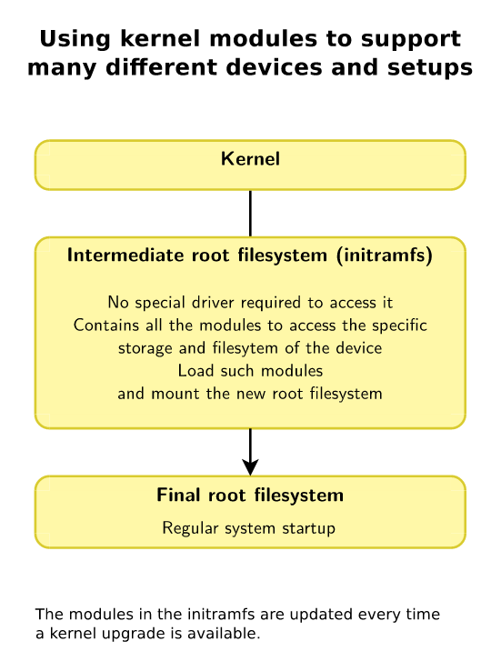

== Chapter 19: Command Details

=== System Monitoring Tools
Many of the system monitoring tools gather their information from primarily, `proc` (mounted on `/proc`) and secondarily `sysfs`(mounted on `/sys`) pseudo-filesystems which exist purely in primary memory.
The information in these files is gathered only when it is viewed i.e. there is no periodic polling done to update these pseudo-files.

Process & load, memory, and network monitoring utilities have been discussed in their respective sections.

Command to mount `proc` and `sysfs` type filesystem:
----
mount -t <type> nodev <mount_point>
----

==== I/O Monitoring Utilities
Apart from already mentioned `vmstat`, few other interesting tools are:

|====
|Utility |Purpose |Package

|`iostat`
|CPU utilization and I/O statistics
|`sysstat`

|`iotop`
|I/O statistics including per process
|`iotop`

|`sar`
|Display and collect information about system activity
|`sysstat`
|====

==== Log files
System log files appear under `/var/log/`.
Important log messages are copied to `/var/log/messages` or `/var/log/syslog`.
If you are not running `X` or virtual terminal, these msgs will be directly displayed on the screen otherwise you can use command line utilities or graphical tools to view them.

To prevent log files from growing infinitely, `logrotate` program is run periodically which keeps last 4(default) copies of the log files(which can optionally be compressed as well).
`logrotate` can be configured via `/etc/logrotate.conf`.

Some important system log files found under `/var/log/`:
|====
|File |Properties

|`boot.log`
|System boot messages

|`dmesg`
|Stands for Diagnostic MESsaGe, is used to read kernel messages saved after boot

|`messages` or `syslog`
|All important system messages

|`secure`
|Security-related messages
|====

[TIP]
====
To view the latest messages in a log file in a live update manner, open it in `tail` with `f` option.

Specifically, for live kernel buffer messages:

----
dmesg -w
----
====

You can even write to the kernel log from user-space by writing to `/dev/kmsg` file as:
----
su -c 'echo "<log_level><message>" > /dev/kmsg'
----

=== Kernel Modules
Many functions of the Linux kernel can either be built-in, or dynamically loaded(or unloaded) as modules during runtime on need basis.
In fact, except few, almost all central kernel components are designed to be modular.

Kernel modules can be device drivers or, implementation of a network protocol or filesystem etc.

.Using kernel modules

Ability to load and unload as a module facilitates development, as kernel reboots are not required to test changes.

Even with the widespread usage of kernel modules, Linux still remains a monolithic kernel architecture, rather than a microkernel one.
This is because once a module is loaded, it becomes a fully functional part of the kernel, with few restrictions.
It communicates with all kernel sub-systems primarily through shared resources, such as memory and locks, rather than through message passing as might a microkernel.

[IMPORTANT]
====
* It is impossible to unload a module that is being used by another module or process.
* Modules such as network device driver modules do not always keep track of who is using them, as it would make it too difficult to temporarily replace it without shutting down and restarting much of the network stack.
====

[CAUTION]
====
A module once loaded, has full control, and privileges.
Hence, only the superuser can load/unload it.
Also, for better security allow only the signed modules.
====

* To load a kernel module:
+
----
/sbin/modprobe <module_name>
----
+
[IMPORTANT]
====
`modprobe` is the preferred method.
When a module is loaded with `modprobe`, the system will automatically load any other modules that are required to be loaded first.
Similarly, when a module is unloaded, `modprobe` can automatically unload any other modules being used by the module, if they are not being simultaneously used by any other loaded modules or processes.
====
+
[NOTE]
====
The module dependencies are described in: `/lib/modules/$(uname -r)/modules.dep`, and `/lib/modules/$(uname -r)/modules.dep.bin`(binary hashed format) where `$(uname -r)` is the kernel version.
These files are generated when you run `make modules_install`.

Files under `/etc/modprobe.d/` control some parameters such as module name aliases and automatically supplied options.
It also contains information about modules which should never be located and loaded.
====
+
[WARNING]
====
For `modprobe` to work without specifying the path of the kernel modules, they must be installed under `/lib/modules/$(uname -r)`
====
+
otherwise, you'll need to do:
+
----
/sbin/modprobe <path>/<module_name>.ko <param=value>
----
+
or
+
----
/sbin/insmod <path>/<module_name>.ko <param=value>
----
* To remove a kernel module:
+
----
/sbin/modprobe -r <module_name>
----
+
option `r` makes sure that all the dependencies that are no longer needed are removed.
+
or
+
----
/sbin/rmmod <module_name>
----
* Info
** To check status of a particular kernel module
*** Command:
+
----
/sbin/modinfo <module_name>
----
+
or
+
----
/sbin/modinfo <path>/<module_name>.ko
----
+
Along with the current status, by checking into `/lib/modules/<kernel_ver>/` this gives a lot of info such as description, license, parameters that can be passed, dependencies, etc.
It does all these without actually loading the module.

*** Pseudo-filesystem:
+
If the module is loaded, you can check `/sys/module/<module_name>/parameters`, which contains one pseudo-file per parameter.
Some of them are writable(to root), and their values can be changed by writing new value to them just like we would write a file.
** To list all loaded kernel modules:
*** Command:
+
----
lsmod
----
+
`lsmod` also shows other modules that are dependent on a particular module.
Hence, before removing a module check its dependencies here.
+
[TIP]
====
Recently loaded kernel modules appear at the top, hence, to check the module you loaded, you can do:

----
lsmod | head
----
====

*** Pseudo-filesystem:
+
You can also find the loaded modules under `/proc/modules`.

[NOTE]
====
Set up a terminal to watch kernel buffer messages from `dmesg` in live mode before the loading or unloading of kernel modules to continuously observe changes.
====

=== Device Management

Internally, the kernel identifies each device using:

* Type: a character or block device etc.
* Major: it is the number associated with the device driver, in other words it identifies the category of the device.
* Minor: it is the number used by device driver to differentiate between different devices(or its instances such as disk partition etc.) that it controls, in other words it acts as the identifier of the device.

Since "everything in linux is a file", devices are exposed to the applications by means of a device file which is a special type of file which associates a file name visible to the user space applications with the above-mentioned triplet used by the kernel to identify the device.

For general device-related information, you can go to `/proc/interrupts`, `/proc/devices` and `/proc/iomem`.

==== Types
There are three main types of devices.

===== Character Device
It is a sequential stream of bytes which has an associated filesystem node under `/dev`.
It mainly implements `open`, `close`, `read`, and `write` functions.
Serial port(for example, `/dev/ttyS0`) and parallel ports(for example, `/dev/lp1`), sound cards (for example, `/dev/dsp0`), etc. are some examples.

===== Block Device
It is mounted as a filesystem node under `/dev`.
It is randomly accessed but only in block-size multiples.
To reduce performance overhead, I/O operations to a block device are usually cached.
Hard drive partitions (for example, `/dev/sda1`), CD-ROMs, etc. are some examples.

===== Network Device
It transfers packets of data, not blocks or streams, and usually employ a socket interface.
Packet reception/transmission functions replace `read`/`write` operations, and there are no corresponding filesystem nodes; instead, the interfaces are identified by a name, such as `eth0` or `wlan0`.

Another way of classification can be done based on the type of controller bus that a device is attached to irrespective of its function.
For example, Small Computers Systems Interconnect(SCSI) and Universal Serial Bus(USB).
Drivers are needed not just for the device but also the controller bus that it connects to.
[NOTE]
====
Despite popular belief, drivers can operate entirely in user-space by requesting hardware access through kernel calls.
These are not very efficient in terms of performance, but they are less likely to crash the whole system.
====

==== `udev`
During 2.4 kernel series, the number of device nodes under `/dev` reached 15-20K in most installations.
As linux distributors can never be exactly sure which hardware will be used, even nodes for devices which is never used on most installations were created by default.
Trimming them down to what is actually needed is a laborious and error-prone task.

Though they didn't take too much space, they slow down the access to device nodes especially on first usage.
Moreover, driver major and minor numbers were exhausted.
Hence, a modern and dynamic approach of creating, modifying, and removing device nodes on the fly was very much needed.
This is done by `udev`(Unified DEVice model), and most of the work is done in userspace.

`udev` makes previous approaches such as `devfs` and `hotplug` obsolete.
Based on few rules it allows for persistent device naming i.e. names need not depend on the order of device connection or plugging in.

It consists of 3 parts:

* `libudev`, library that allows to access device information
* `udevd`, a daemon
* `udevadm`, utility for control, and diagnostics.

`udev` runs a daemon `udevd` which manages `/dev`.
It uses a hot-plug subsystem to detect connection/removal of a device.
Then it uses `uevent` kernel facility to send a message to `udevd` via a `netlink` socket to take appropriate action.

The information required to create nodes with right names, major & minor numbers, and permissions etc. are obtained from `/sys` and a set of configuration files.
The main configuration file is `/etc/udev/udev.conf` which contains node mount location, permissions, etc. and the device naming rules are located under `/etc/udev/rules.d/`.

[NOTE]
====
Set up a terminal to watch kernel buffer messages from `dmesg` in live mode before you connect/disconnect the device to watch device node being created and deleted dynamically.
====

[TIP]
====
As usual for more do:
----
man udev
----
====

==== Commands
To create a new node:
----
mknod -m <file_permission_octal_number> /dev/<name> <dev_type> <dev_major> <dev_minor>
----
`<type>` can be `c` for character and `b` for block etc.

[NOTE]
====
With `udev` we could have registered devices by name and eliminate, major and minor numbers.
But as POSIX requires them, they have been retained.
====
