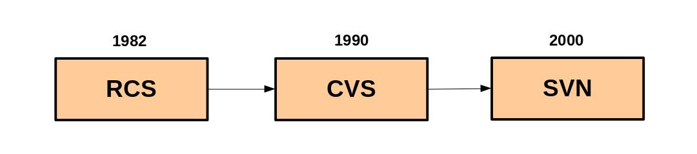

== Chapter 1: Introduction to Git

Git ia a revision control system which has the following features:

* Facilitate distributed development
+
Developers can work in parallel without constant re-synchronization via a central repository.
* Scale
+
Can handle large numbers of developers efficiently and reliably.
* High speed and maximal efficiency
+
It avoids copying unnecessary information, uses compression, and does not bottle up networks, and is able to handle varying network latencies.
* Strong integrity and trust
+
Cryptographic hash functions are used to meet security demands.
No unauthorized alterations can be inserted, and repositories are authentic, not impostors.
* Accountability
+
All changes are documented and ascribed to whomever did them.
There is always a trail left behind that can be displayed.
* Immutable repository data
+
Information, such as the history of the project, cannot be changed.
* Atomic transactions
+
When changes are committed, there are no partial synchronization i.e. all go through, or none do.
This avoids leaving the repository in an uncertain or corrupted state.
* Supports branching and merging
+
Allows parallel branches of development, and has very robust methods for merging them.
* Independent repository
+
Each repository has all the history in it.
There is never a need to consult a central repository.
* Free, and unencumbered license
+
It is covered by the GPLv2.

There are several GUIs for Git: git-gui, gitk, cgit, gitweb.

== Chapter 2: Git Installation

Check if `git` is installed:
----
which git
----
or
----
apt policy git
----

=== Binary Install
To do a full install of `git`:
----
apt install git
----

=== From source
* After downloading and extracting the archive from git https://github.com/git/git.git[repo]:
+
----
cd git
./configure
----

* Compilation and installation:
+
----
make prefix=<dir_name>
make prefix=<dir_name> install
----
+
By default, dropping `prefix` will compile and install in the `HOME` directory.
To compile and install in a different directory, you can set `<dir_name>`.
For example, `/usr` or `/usr/local` can be used install in system directory.
+
[NOTE]
====
To compile from source you may need additional libraries already installed in your system such as `libcurl4-gnutls-dev`, `libexpat1-dev`, `libssl-dev`.
You may choose to omit using these libraries to compile a git with lesser functionality by doing `make NO_CURL=1 NO_EXPAT=1 NO_SSL=1`.
====

== Chapter 3: Git and Revision Control Systems

.Evolution of Revision Control Systems

There are several alternatives to Git: Revision Control System(RCS), Concurrent Versions System(CVS), Subversion, Bazaar, Mercurial etc.

=== Git and other systems

Most revision control systems use files as the basic units to track.
But, Git uses two important data structures object store and index.
By moving away from a file-based system, Git is better able to handle change-sets which involve many files.
[NOTE]
====
That's why unlike other systems, we can't really recognize the contents of `.git` folder in the local repo.
====

Unlike other systems, where developers work with a central authoritative repository, git is a peer-to-peer framework where developers work with each other, and the central role played by one particular location is sociological or political, not technical.
Hence, in git every repository is authoritative, there is nothing akin to server/client as everyone contains the entire code base, not just a part of it.
Still, git can be used to organize the hierarchy of development community in any way, top-down or flat manner.

Unlike other systems, git follows a three-step process: committing, pushing and then publishing to share the code.
Committing refers to saving the current snapshot in local repository.
Hence, it requires no network access, and you are free to reorganize.
Pushing refers to updating the remote repository with your changes.
Publishing refers to sharing these changes by making them public which effectively freezes your repository history.

=== Migration

It is possible to migrate between different systems.
While simplest way would be to download the working copy from one to your local machine and load it another, this would lose all the history, and ability to revert to an earlier state.
There are several tools for migration without losing history and other features.
