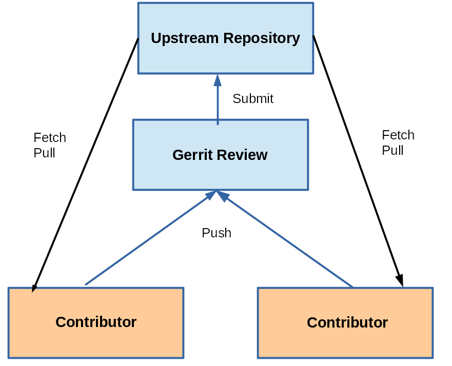

== Chapter 5: Git Concepts and Architecture

A Repository is a database that contains not just the project's contents but also every bit of information required to store, manage revisions, history .etc.

Each repository has a set of configuration parameters.
The configuration can vary based on site, user, repository etc.
You can find it in `.git/config`.
[NOTE]
====
When you clone a repo, configuration is not copied
====

=== Repository

Repositories maintain two data structures to track project content:

==== Object store

It is composed of:

* Blobs
* Tress
* Commits
* Tags

===== Blobs

When a file is added, new blobs(chunks of binary data) containing file contents are added.
A blob doesn't contain file name or metadata, just the content.

The binary blob content is used to generate a unique hexadecimal string.
When a file is modified, its binary blob changes, and hence the hexadecimal string.
The strings from modified file's blob is compared to the string from the blob in the last commit.
If the strings are different, then a change is considered yet to be staged.
This type of change detection is very fast.

===== Trees

Sets of blobs that records file names and metadata related to files and directories, giving the directory structure.

When a directory is added, a tree is created.
When a file is added to that directory, the tree is updated with file's name and other metadata.

===== Commits

Object describing change-sets composed of a tree object that gives a complete snapshot of the project.

When files are staged their blob are already created, and they are added to index.
So commit can just read this index and blobs to create a commit object.

New files result in new blobs and new directories result in new trees.
Any unchanged object is simply re-used(meaning referenced).
Hence, minimal new storage is required for a commit.

Every commit is assigned a unique 160-bit 40-character hexadecimal sha1 hash value.

===== Tags

Human-friendly names

==== Index
It contains the state of the directory tree at a given time.
It is temporary and, it maintains any changes such as adding, deleting, renaming or moving files until the changes are committed into the repository.
It plays a vital role during merging branches.

The parent repository to which you send your changes is called upstream and the repository that you are working on is called downstream.
A repository can be both, for example, a repository of a sub-system.

Forking is when someone takes the entire project and goes off in another direction.
The act of merging forked repositories is called healing.
Git has robust capabilities for both.

== Chapter 6: Managing Files and the Index

Git categorizes project files into 3 categories:

* Tracked
+
All files that were passed to `git add` command.
They may or may not be committed yet.

* Ignored
+
They are invisible to git.
`.gitignore` file contains the rules that determine the files ignored by git.
The rules are simple strings for file and directory name(s) with wildcards for globbing.
This file can be present in project root and/or any project directory.
It will cause git to apply the rules recursively from that directory.
+
Exceptions to rules originating from the same directory or an ancestral directory can be made in the `.gitignore` file of the directory.
+
For example:
+
----
*.ko
!my_drive.ko
----
+
`*.ko` causes git to ignore all the files with extension `ko`.
But, `!my_drive.ko` overrides the rule defined in the line above it, hence, git will ignore all the files with extension `ko` except `my_drive.ko`

* Untracked
+
Untracked files are all files that are neither tracked nor ignored.

=== Impact of various commands
|====
|Command |Source Files |Index |Commit Chain |References

|`git add`
|Unchanged
|Updated with new file
|Unchanged
|Unchanged

|`git rm`
|File removed
|File removed
|Unchanged
|Unchanged

|`git mv`
|File moved/renamed
|Updates file name/location
|Unchanged
|Unchanged

|`git commit`
|Unchanged
|Unchanged
|A new commit object is created from the index and added to the top of the commit chain
|`HEAD` in the current branch points to new commit object

|`git tag`
|Unchanged
|Unchanged
|Unchanged
|A new tag is created

|`git revert`
|Changed to reflect reversion
|Uncommitted changes discarded
|New commit created(No actual commits removed)
|`HEAD` of current branch points to new commit

|`git reset`
|Unchanged
|Discard uncommitted changes
|Unchanged
|Unchanged(unless `--hard` is used)

|`git branch`
|Unchanged
|Unchanged
|Unchanged
|A new branch ic created in `git/refs/heads`.
`HEAD` for the new branch points to `HEAD` of the current branch.
The current branch is set to the new branch.

|`git checkout`
|Modified to match commit tree specified by branch or commit ID; untracked files not deleted
|Unchanged
|Unchanged
|Current branch reset to that checked out
`HEAD` (in `.git/HEAD`) now refers to last commit in branch.

|`git am`
|Modified by patch
|Updated to reflect patch
|New commit object created and added to top of commit chain
|`HEAD`: points to new commit object

|`git apply`
|Modified by patch (unless the `--check` specified)
|Modified by patch (unless the `--index` option specified)
|Unchanged
|Unchanged

|====

== Chapter 8: Branches

At some point it becomes necessary to move off the main line of development and create an independent branch by creating a copy of the code base at the current state.
Git makes branching and its inverse operation merging very easy.

No branch is technically a central authority.
It's the developers who decide to use one of the branches as the collection point, normally named as a `master` or `main`.

One branch can be active at any given time.
The files in your project directory will be from the active branch.
If you switch the branch, the files will change.

=== Branches vs Tags
Unlike other version control systems, in git a branch is a whole line of development while a tag is just a user-defined string for a particular commit i.e. a particular stage in a particular branch.
Any branch can have any number of tags.
[WARNING]
====
A branch and a tag can have a same name, but it is usually not recommended.
====

If two branches share a common ancestor they will share any tags that predate the separation.
Two branches can have the same tag name post separation.
But, it can be a headache when merging them together.
So, make sure you have unique tag names everywhere in the project.

== Chapter 10: Merges

Merging is the opposite of branching, it allows bringing the changes of one code base into another.
If the changes are on different files or on different parts of the same, then there is no conflict between changes, it is easy to merge .
However, if the changes conflict each other, they need to be resolved before they are merged.
Git has a strong set of tools for such conflict resolution.

== Chapter 11: Managing Local and Remote Repositories

Some essential operations involved in handling remote repositories:

* Cloning
* Pulling
* Pushing
* Publish

[NOTE]
====
Whatever repositories that we work on locally are development repositories.
There is a special kind of repository called bare repository.
It has no working directories or current branch.
It is used only as an authoritative place to clone and fetch from and push to.
Hence, all remote repositories are set as bare repositories.
====

=== Cloning

Establish an initial copy of a remote repository and place in your own object database.
Cloning brings down not just source files but the entire repository with all history and other metadata.

The repositories end with `.git` in their url and can be accessed using various protocols: `git`, `ftp`, `ssh`, `nfs`, `http(s)`, `rsync`.
[NOTE]
====
The fastest, cleanest and recommended protocol to clone is `git`.
====

=== Pulling

Update your branch by downloading changes from remote repository to your local repository.

=== Pushing

Update remote repository by uploading change from local repository to your remote repository.

=== Publish

Make your repository available for others to use as remote repository.

To publish your project:

* Make a bare version of the repository:
+
----
git clone --bare <devel_repo> <bare_repo>
----

* Make it available to other users:

** For local users, you need to do nothing more.

** For remote users

*** To make repository available via `git` protocol.

**** Create an empty file `git-daemon-export-ok` for git daemon inside `<bare_repo>`

**** To allow remote users to, not just clone and fetch but also, push:
+
----
git config daemon.receivepack "true"
----
+
run this while inside `<bare_repo>`

**** Run git daemon
+
----
git daemon &
----
+
To launch this in the background everytime during boot, configure `xinetd` or `inetd` in your system.

*** To make repository available via `http` protocol

**** Install `apache2`

**** To make sure it is running:
+
----
systemctl status apache2
----

**** To make your repository visible to http server, place your project directory or symlink to your project directory in `/var/www/html`

**** Update server info
+
----
git --bare update-server-info
----

*** To make repository available via `ssh` protocol

**** Install `openssh-server`:
**** Make sure it is running:
+
----
systemctl status ssh
----

To clone a bare repository as a personal development repository:

* Local user:
+
----
git clone <bare-repo> <dst_folder>
----

* A remote user:
+
----
git clone <url> <dst_folder>
----
+
`<url>` might be `<ip>:<bare_repo_loc>` or `\https://<ip>/<username>/<bare_repo_loc>`

== Chapter 12: Using Patches

Contributions from a developer can be taken in two ways:

* Arrange his branch in such a way that it can be easily merged into the `master`.
+
[NOTE]
====
This is the recommended way of contributing.
====
* Produce patches which the maintainer can apply to the source.

=== Why use patches?
* More people can review the changes without requiring the access to the contributor's branch or to git itself

* Sometimes corporate firewalls block from connecting to remote repository.
In such a case, patches can be submitted via email.

Git has tools to handle every scenario from generating a patch to sharing it via email.

[IMPORTANT]
====
Instead of git, if you are using your email client to send the patches, make sure that in your mailing process to:

* Turn off html encoding and send plain ASCII text
* Turn off any line-wrapping or flowing
* Send your patch directly in the email message instead of as an attachment
====

== Chapter 13: Advanced Git Interfaces: Gerrit

.Gerrit

Gerrit introduces a reviewing layer between the contributors and the upstream repository.

* Contributors submit their work(one change per submission is recommended) to the reviewing layer.
* Contributors pull the latest upstream changes from the upstream layer.
* Reviewers are the ones who submit work to the upstream layer.

The reviewers evaluate pending changes and discuss them.
According to project governing procedures they can grant approval and submit upstream, or they can reject or request modifications.

Gerrit also records comments about each pending request and preserve them in a record which can be consulted at any time to provide documentation about why and how modifications were made.
