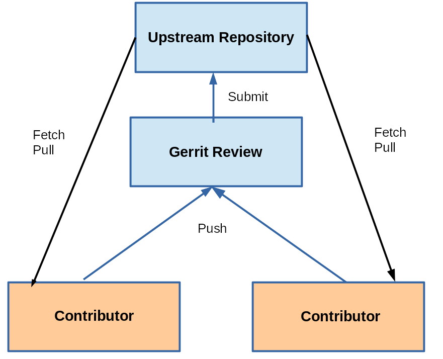

== Chapter 13: Advanced Git Interfaces: Gerrit

.Gerrit

Gerrit introduces a reviewing layer between the contributors and the upstream repository.

* Contributors submit their work(one change per submission is recommended) to the reviewing layer.
* Contributors pull the latest upstream changes from the upstream layer.
* Reviewers are the ones who submit work to the upstream layer.

The reviewers evaluate pending changes and discuss them.
According to project governing procedures they can grant approval and submit upstream, or they can reject or request modifications.

Gerrit also records comments about each pending request and preserve them in a record which can be consulted at any time to provide documentation about why and how modifications were made.
