= Notes

== Chapter 3: Linux Basics and System Startup

=== The Boot Process

Boot process is the procedure for initializing the system.
It is everything that happens from the power on to the time when the user interface is fully operational.

.Linux Boot Process
image::pix/chapter03_flowchart_scr15_1.jpg[Linux Boot Process]

==== BIOS
The Basic Input Output System(BIOS) is a program stored on a ROM chip on the motherboard which initializes the hardware and performs a Power On Self Test(POST) where it tests the main memory(RAM).

.BIOS
image::pix/LFS01_ch03_screen16.jpg[BIOS]

==== Locating the Boot loader
After POST, the BIOS needs to run and pass control to a program called the Bootloader.
Depending on the system, the way BIOS locates Bootloader is different.

In traditional systems, the BIOS looks in the first sector of the hard disks for a 512 byte Master Boot Record.
The bootloader at the MBR examines the partition table of the hard disks and finds a partition that contains a (second stage) bootloader and loads it into RAM.

.Master Boot Record
image::pix/LFS01_ch03_screen20.jpg[BIOS]

In modern (Unified) Extensible Firmware Interface(EFI/UEFI) systems the BIOS launches the UEFI firmware.
UEFI firmware reads its boot manager's boot entry to locate the EFI partition i.e. the partition that contains the bootloader.
Then from UEFI partition the bootloader is loaded into RAM.

[NOTE]
====
Most common bootloaders are GRand Unified Bootloader(GRUB), ISOLINUX(for booting from removable media) and DAS U-Boot(for booting on embedded systems).
====

==== Bootloader
Bootloader loads an initial RAM disk, and it resides under `/boot`.
The initial RAM disk which is a RAM based filesystem also known as `initramfs` contains programs and binary files to perform all actions required to mount the root filesystem.

It shows a splash screen to choose boot options and available OS.
Once the OS is chosen it loads the corresponding kernel image, and passes control to it.

.Bootloader
image::pix/LFS01_ch03_screen18.jpg[Bootloader]

==== Kernel
Kernels are normally compressed, hence the first thing it does is uncompress itself.
Kernel uses program `udev`(user device) from `initramfs` to list all the devices that are present, locate respective device drivers and loading them.
Then kernel locates the root file system and checks it for errors.
After that kernel uses program `mount` from `initramfs` to mount the root file system, and associate it with a particular point in the overall hierarchy of the file system.

.Initial RAM Disk
image::pix/LFS01_ch03_screen22.jpg[initramfs]

After file system in mounted, `initramfs` is cleared from memory and the `init` program at `/sbin/init` of the root filesystem is executed.

==== `/sbin/init`
`init` becomes the initial process which then starts other process to get the system running.
It mounts the final real root filesystem, and starts a number of text-mode login prompts.
// why a number of them? why not just one?
[NOTE]
====
One most distributions, `init` starts 6 text terminals and 1 graphics terminal to show the login interface.
====
[IMPORTANT]
====
If there is a graphical login interface, you will not see text-mode login prompts at first.
====

After providing the right username and password, in a non-GUI i.e. CLI system, the command shell is displayed and in a GUI system desktop is displayed.

.Text-mode Logins
image::pix/LFS01_ch03_screen26.jpg[initramfs]

[NOTE]
====
The command default shell is bash(the GNU Bourne Again Shell) but your distribution may choose to use a different (normally more advanced) shell.
====

==== `X System`

When you install a desktop environment(`GNOME`, `KDE`, `XFCE`), the display manager(`gdm`, `kdm`, `xdm`) gets launched at the end.
[NOTE]
====
If the display manager(gdm, lightdm, kdm, xdm, etc.) is not started by default in the default runlevel, you can manually start it after logging on to a text-mode console by running:
----
startx
----
====

.Display Manager
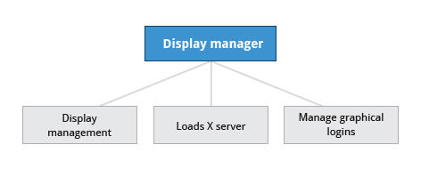

The display manager launches the `X server`.
[NOTE]
====
Though there is no web involved, it is called server because it provides graphical services to applications, sometimes called `X clients`.
====
`X` is responsible for starting the graphics system, logging in the user, and starting the user’s desktop environment.

[NOTE]
====
`X server` is often called as just `X`
====
You can often select from a choice of desktop environments when logging in to the system.

[NOTE]
====
`X` uses `/etc/X11/xorg.conf` as its configuration file if it exists.
In modern Linux distributions, this file is usually present only in unusual circumstances, such as when certain less common graphic drivers are in use.
====

[IMPORTANT]
====
`X` is legacy software dating back to the mid 1980s which has been stretched rather far from its original purposes.
It has certain deficiencies on modern systems(for example, with security).
A newer system, known as `Wayland`, is gradually superseding it and is the default display system for Fedora, RHEL 8, and other recent distributions.
To the user, it looks similar to `X`, but under the hood it is quite different.
====

===== Desktop Environment

.Desktop Environment
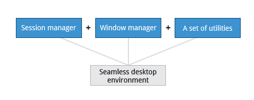

A desktop environment consists of:

* a session manager, which starts and maintains the components of the graphical session
* the window manager, which controls the placement and movement of windows, window title-bars, and controls.
* a set of utilities

=== Kernel, Init and Services

==== `/sbin/init` and Services
`init` is the parent process and except kernel processes, all the processes on the system ultimately trace their origin to it.
[NOTE]
====
Kernel processes are directly started by kernel to manage internal OS details.
====
`init` is also responsible to keep the system running and for shutting it down cleanly.
To do this it starts background system services, user login services when necessary, and it also cleans up after processes upon their completion.

Traditionally, process startup was done using `SystemV` which used a series of runlevels each of which contained a collection of scripts that start and stop services.
Each runlevel was a different mode of running the system where individual services can be set to run or shutdown if running.

Not all process needs to be started one after the other.
For example, two unrelated processes can be started simultaneously.
Hence, `SystemV` fails to take advantage of parallelization, and therefore it is slower.

Modern systems use `systemd` to startup all the system process.
[IMPORTANT]
====
For compatibility purposes modern systems emulate `SystemV`
====

==== `systemd`
On modern systems `systemd` is used to startup all the system process.
It uses simpler configuration files in place of complex start-up shell scripts.
These configuration files lists:

* what has to be done before starting a service
* how to execute service startup
* what conditions the service needs to indicate when the startup is finished

In modern systems `/sbin/init` points to `/lib/systemd/systemd`.
`systemd` uses `systemctl` command to:

* start/stop/restart a service:
----
sudo systemctl start|stop|restart <service_name>.service
----

* enable/disable a service from startup during system boot:
----
sudo systemctl enable|disable <service_name>.service
----

[NOTE]
====
In most cases `.service` can be omitted
====

=== Filesystem Basics

A filesystem is a method of storing and organizing files on a storage.

There are different types of filesystems supported by Linux:

* Conventional disk filesystems: `ext3`, `ext4`, `xfs`, `btrfs`, `jfs`, `ntfs`, `vfat`, `exfat`, `hfs`, `hfs+` etc.
+
[NOTE]
====
|====
|Filesystem |Origin OS

|`ntfs`, `vfat`
|Windows

|`xfs`
|SGI

|`jfs`
|IBM

|`hfs`, `hfs+`
|MacOS
|====
`ext4`, `xfs`, `btrfs` and `jfs` are journaling filesystems with advanced features, high performance and resistance to accidental corruption.
====
* Flash storage filesystems: `ubifs`, `jffs2`, `yaffs`, etc.
* Database filesystems
* Special purpose filesystems: `procfs`, `sysfs`, `tmpfs`, `squashfs`, `debugfs`, `fuse`, etc.

==== Partition

A partition is a physical or logical contiguous section of a disk or disk(s) respectively.
It is a container where the filesystem resides and is used to organize the disks based on the kind of data and its usage.

Unlike Windows, Linux does not have drive letters and multiple partitions and/or drives are mounted as directories in the single filesystem.

==== Filesystem Hierarchy Standard
Linux systems store their important files as per a standard layout defined by the Linux Foundation called Filesystem Hierarchy Standard(FHS).

.Linux FHS
image::pix/dirtree.jpg[FHS]

Linux uses `/` to build the hierarchy of the filesystem.
Filesystem names are case-sensitive.

=== Choosing a distribution
Different distros cater to different purposes.

.Choosing Linux Distribution
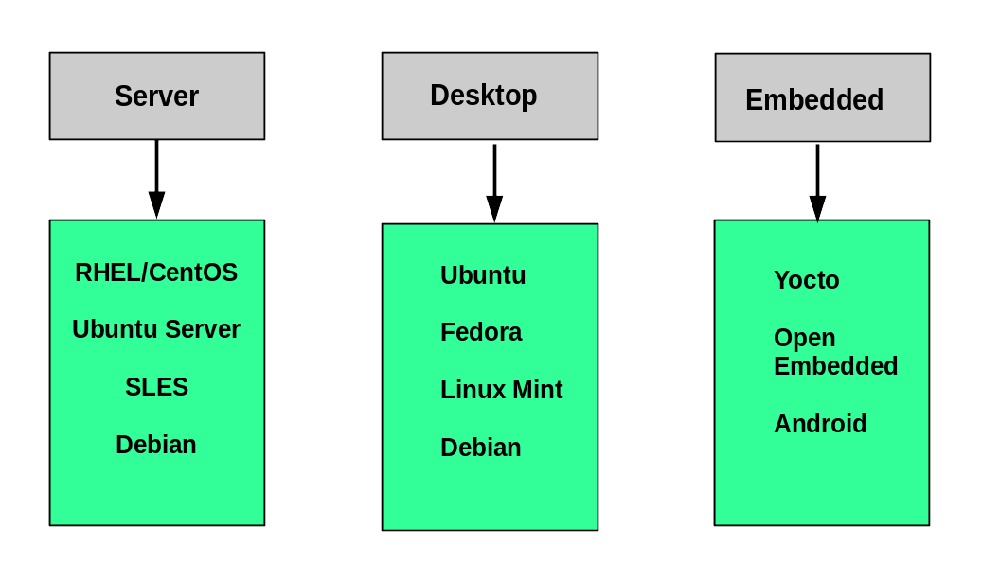

Hence, you'll need to consider various factors such as:

* Function of the system:
+
Server, desktop or Embedded device

* Types of packages that are important:
+
Web server, word processing etc

* Memory size

* Hardware architecture
+
x86, ARM, PPC etc

* Kernel customization
+
Yes or No; if yes, from vendor or 3rd party

* Support cycle for each release

=== Some notes

* Many installers can do an installation completely automatically, using a configuration file to specify installation options.
This file is called a `Kickstart` file for Red Hat-based systems, an `AutoYAST` profile for SUSE-based systems, and a `Preseed` file for Debian-based systems.

* Different states:
** Lock: keeps everything still running
** Suspend/Sleep: saves everything to RAM so that it can be restored when Wakes up again and turns of all the hardware
** Power-off/Shutdown: Shutdown system

== Chapter 5: System Configuration

=== Installing and updating software

`dpkg` is the underlying package manager for Debian based systems.
It can install, remove, and build packages.
Unlike higher-level package management systems, it does not automatically download and install packages and satisfy their dependencies.

.Debian Package Management
image::pix/LFS01_ch05_screen34.jpg[Debian Package Management]

The higher-level package management system is the Advanced Package Tool (`APT`).
Each distribution creates its own user interface on top of `APT`(for example, `synaptic`, `gnome-software`, `Ubuntu Software Center`, etc).
[WARNING]
====
Although `apt` repositories are generally compatible with each other, the software they contain generally is not.
Therefore, most repositories target a particular distribution (like Ubuntu), and often software distributors ship with multiple repositories to support multiple distributions.
====

=== Some notes

Linux always uses Coordinated Universal Time (UTC) for its own internal time-keeping.

== Chapter 6: Common Applications

=== Text Editors
* Basic:
** Command line: `nano`
** GUI: `Kate`
* Advanced:
** Command line: `vi`, `emacs`

[TIP]
====
Use `vimtutor` utility to learn `vi`.
To learn emacs, open it and type `Ctl-h` and then `t`.
====

=== Some notes

Most email clients use the Internet Message Access Protocol (`IMAP`) or the older Post Office Protocol (`POP`) to access emails stored on a remote mail server.

== Chapter 7: Command Line operations

=== Command-Line Mode Options

==== Introduction to the command line

[quote]
____
graphical user interfaces make easy tasks easier, while command line interfaces make difficult tasks possible
____

Linux has an abundance of command line tools.
Advantages of CLI:

* No overhead of a GUI
* Virtually any and every task can be accomplished from the CLI without switching windows
* Possible to automate tasks and series of procedures using scripts
* Can sign-in to remote machines anywhere on the internet
* Can run graphical applications directly from the cli instead of hunting through menus
* While graphical tools may vary among distributions, the CLI does not

==== Text Terminal on the Graphical Desktop
A terminal emulator program emulates (simulates) a standalone terminal within a window on the desktop behaving like a machine with a pure text terminal with no running graphical interface.
Most terminal emulator programs support multiple terminal sessions by opening additional tabs or windows.

==== The Command Line

Most input lines entered at the shell prompt have three basic elements:

* Command, it is the name of the program you are executing
* Options, these follow the command and one or more of these can be used to modify the command's behavior
+
[NOTE]
====
In order to differentiate options from arguments, options start with one or two dashes, for example, `-p` or `--print`
====
* Arguments, these are what the command operates on

Options, and arguments are optional.
In addition to options and arguments, other elements (such as setting environment variables) can also appear on the command line when launching a task.

==== `sudo`

`sudo` allows users to run programs using the security privileges of another user, generally root (superuser).

===== Setting Up and Running `sudo`
In some systems you'll need to set up and enable `sudo`.
You can do that by:

* Login to `root` using `su` and entering root password when prompted

* In `/etc/sudoers.d/` create a configuration file having the filename same as your username with the content:
+
----
<username> ALL=(ALL) ALL
----
by doing:
+
----
echo "<username> ALL=(ALL) ALL" > /etc/sudoers.d/<username>
----

* Change the permissions of this configuration file by doing:
+
----
chmod 440 /etc/sudoers.d/<username>
----

After doing this you can execute a command that requires superuser privileges while being a normal user by prefixing it with `sudo` and entering superuser password on prompt.
Once you do that for a time interval you won't be required to give the superuser password again, you can just execute privileged commands by prefixing it with `sudo`.

[WARNING]
====
It is possible to configure `sudo` to not ask for a superuser password or change the time window in which the password does not have to be re-entered.
But, it is very insecure and highly not recommended.
====

==== Switching Between the GUI and the Command Line

Linux allows users to drop the graphical interface(temporarily or permanently) or to start it up after the system has been running.

Most Linux distributions can be installed with or without a graphical desktop.
Desktops are normally installed with GUI while production servers are usually installed without the GUI, and even if it is installed, usually do not launch it during system startup.
Removing GUI from a production server keeps the system lean, secure and easier to support.

==== Virtual Terminals
Virtual Terminals(VT) are console sessions that use the entire display and keyboard outside a graphical environment.
Such terminals are considered "virtual" because, although there can be multiple active terminals, only one terminal remains visible at a time.
A VT is not quite the same as a command line terminal window; you can have many of those visible at once on a graphical desktop.
// still don't get difference between VT and terminal emulator

One of the virtual terminals (usually number one or seven) is reserved for the graphical environment, and text logins are enabled on the unused VTs.

VTs can be helpful especially when you run into problems with the graphical desktop(coz now you can't run your terminal emulator program given by your desktop environment anyway).
In this situation, you can switch to one of the text VTs and troubleshoot.

.Virtual terminals
image::pix/LFS01_ch06_screen07.jpg[Virtual terminals]

To switch between VTs, press CTRL-ALT-function key for the VT.
For example, press CTRL-ALT-F6 for VT 6.

==== Turning Off the Graphical Desktop
For the newer `systemd`-based distributions, the display manager is run as a service.
Hence, you can use the `systemctl` utility and most distributions will also work with the `telinit` command too.
To stop the GUI:
----
sudo systemctl stop <display_manager>
----
or
----
sudo telinit 3
----

Restart it (after logging into the console) with:
----
sudo systemctl start <display_manager>
----
or
----
sudo telinit 5
----

=== Basic Operations

==== Logging in and out
On a local system, you can just enter the login username and password when prompted to log in.

You can also log in to a remote system using Secure SHell(SSH) by:
----
ssh <username_on_remote_server>@<remote_server_domain_name>.<top_level_domain_name>
----
During remote login, you may enter password, or you can auto-verify your identity using cryptographic key

==== Rebooting and Shutting Down
To shut down you can do:
----
shutdown -h
----
or
----
poweroff
----

To reboot you can do:
----
shutdown -r
----
or
----
reboot
----

These commands send a warning message and prevents further users from logging in.
The `init` process will then control shutdown/reboot.
Failure to do a proper shutdown can cause system damage and/or data loss.

==== Locating Applications
To find the location of an executable binary or script you can do:
----
which <executable>
----
or
----
whereis <executable>
----
compared to `which`, `whereis` searches a broader range of system directories and also locates the source and the man files packaged with the executable

[NOTE]
====
In general, executable programs and scripts reside in the `/bin`, `/usr/bin`, `/sbin`, `/usr/sbin` directories, or somewhere under `/opt` or `/usr/local/bin`, `/usr/local/sbin`, or in a directory in a user's account space, such as `/home/<username>/bin`.
====

==== Accessing Directories

|===
|Command |Result

|`pwd`
|Displays present working directory

|`cd $HOME` or `cd ~/` or `cd ~` or just `cd`
|Change to home directory of current user

|`cd..`
|Change to parent directory

|`cd -`
|Change to previous directory

|`pushd <path>`
|Change to directory `<path>` and push the path to the history

|`popd`
|Change to directory `<path>` present at the top of the history
|===

==== Absolute and relative paths
Absolute path name starts at the root `/` and follows the filesystem tree branch by branch until it reaches the desired directory or file.
Relative path name starts in relation to the present working directory with either `.` or `..` meaning pwd or its parent respectively.
[TIP]
====
Relative paths never start with `/` and absolute paths never start with `.` or `..`
====
[NOTE]
====
Multiple slashes `/` between elements are allowed while writing the path but all but one slash between elements are ignored.
For example:
----
////usr//bin
----
is as seen as:
----
/usr/bin
----
====

==== Exploring the Filesystem
|===
|Command |Result

|`ls`
|List the contents of the pwd

|`ls -a`
|List all files, and directories including the hidden ones in the pwd

|`ls -R`
|List all files, and directories but while showing directories, list the files and directories inside them too

|`tree`
|Get a tree view of the pwd

|`tree -d`
|Get a tree view of just the directories in the pwd

|===

[NOTE]
====
For all the commands above you can optionally pass as an argument, an absolute/relative path that you'd like to explore
====

==== Hard link
A hard link is used to associate more than one file name to a file.

Hard links are created using `ln` utility as:
----
ln <file_name1> <file_name2>
----
where `<file_name1>` is the name of the already existing file and `<file_name2>` is the another file name that will be associated with it.

If you check the inode number of the file associated with `<file_name1>`, and `<file_name2>` using `ls` utility with option `i` as:
----
ls -li <file_name1> <file_name2>
----
[NOTE]
====
Inode number is a unique number for each file object
====
you'll see that the inode numbers of the file associated with both `<file_name1>`, and `<file_name2>` are the same.
In other words, one file has two names.

Hard links are very useful, and they save space, but you have to be careful with their use.
For example, when you do:
----
rm `<file_name1>`
----
The file still exists and is still accessible via `<file_name2>`.
// What is the "subtle error" in "when For one thing, if you remove either file1 or file2 in the example, the inode object (and the remaining file name) will remain, which might be undesirable, as it may lead to subtle errors later if you recreate a file of that name."?

[WARNING]
====
If you open the file in a text editor using both the file names and edit and save on one of them, then the text editor may break the link and create two file objects saving the updated version as a new file object
====

==== Soft link
A soft (or symbolic) links is more like a shortcut on a Windows system.
It can ve created with the `ln` utility with option `s` as:
----
ln -s <file_name1> <file_name2>
----
`<file_name2>` is a short-cut for `<file_name1>` and when you do:
----
ls -li <file_name1> <file_name2>
----
You'll see that `<file_name2>` is not a regular file, and it points to `<file_name1>`.
It has a different inode number, and it takes no extra space on the filesystem (unless their names are very long).

[TIP]
====
An easy way to create a shortcut from your home directory to long pathname is to create a symbolic link.
====

Symbolic links are extremely convenient, as they can easily be modified to point to different places.
Moreover, unlike hard links, soft links can point to object even on different filesystems, partitions, and/or disks and other media, which may or may not be currently available or even exist.

[WARNING]
====
In the case where the link does not point to a currently available or existing object, you obtain a dangling link.
====

=== Working with Files

==== Viewing Files
|===
|Command |Result

|`cat`
|Just output file on stdout/output stream; hence there is no scroll-back and is used to view not very long files

|`tac`
|Same as `cat` but in the reverse direction(printing the last line first)

|`less`
|A paging program; hence it provides scroll-back and is used to view larger files

|`tail`
|Same as `cat` but used to print last `<k>` lines of the file(default: 10 lines) specified by an option and an argument as `-n <k>`

|`head`
|Opposite of `tail`

|`wc`
|get word count in a file
|===

==== Creating a file or a directory
===== File
If a file by name <filename> doesn't exist `touch` can be used to create it:
----
touch <filename>
----
[WARNING]
====
If it does exist, the above command just changes the access time of the file to current time.
====
[NOTE]
====
To set a specific access time of an already existing file:
----
touch -t <time_in_yyyymmddhhmm_format> <filename>
----
====
Alternatively, `echo` can be used to create a file with some content:
----
echo <file_content> > <filename>
----

To delete a file:
----
rm <file>
----
Additionally, you can use option `i` to get prompts before deleting the file and `f` to force delete a file

===== Directory
To create directory:
----
mkdir -p <dirname>
----
[NOTE]
====
Option `p` tells to create all the parent directories in the path of `<dirname>` if any of them doesn't exist.
Without this option you can create the directory iff all the parent directories in the path `<dirname>` exists
====

To delete directory and all its contents:
----
rm -rf <dirname>
----
[WARNING]
====
`rm` with `rf` is extremely dangerous and use it with cation
====
[NOTE]
====
There is a command `rmdir`, but it can only delete empty directories
====

==== Move, or Rename a file or directory
`mv` can be used to both move and rename a file or a directory:
----
mv <src_path> <dst_path>
----
In the paths `<src_path>` and `<dst_path>`:
* If dir/file names are different, dir/file is renamed
* If dir/file paths are different, dir/file is moved

=== Streams and Pipes
==== Standard File Streams
By default, three std file streams(or descriptors) are always open for use:
|===
|File stream |Name |Descriptor no |Example

|standard input
|`stdin`
|0
|keyboard

|standard output
|`stdout`
|1
|Terminal

|standard error
|`stderr`
|2
|Log file
|===

Any file that is opened will take file descriptors numbers starting from 3.

==== I/O Redirection
The std file streams can be used on the terminal to redirect output of one program to another program/a file

Symbol `>` can be used as:
----
<src_prog> > <dst_prog_or_file>
----
directs output stream of `<src_prog>` to input stream of `<dst_prog_or_file>`.
[IMPORTANT]
====
Using file descriptor number of the stream with `>` can redirect output to specific stream
----
<src_prog> 2> <dst_prog_or_file>
----
directs error stream of `<src_prog>` to input stream of `<dst_prog_or_file>`.
====
[NOTE]
====
To send both output and error stream to input stream of another program or a file:
----
<src_prog> > <dst_prog_or_file> 2>&1
----
or its shorthand:
----
<src_prog> >& <dst_prog_or_file>
----
====
[WARNING]
====
When outputting to a file using `>` will overwrite all the contents of the file.
To append the contents at the bottom of the file use `>>`
====
Similarly, symbol `<` can be used as:
----
<src_prog> < <ip_file>
----
directs contents of `<ip_file>` to input stream of `<src_prog>`

==== Pipes
We can use pipes to create a chain where each program sends its output to the next one in the chain as:

.Pipeline
image::pix/pipeline.png[Pipeline]
we can do:
----
<cmd1> | <cmd2> | <cmd3> | <cmd4>
----
[IMPORTANT]
====
All the commands/programs in the pipeline run at the same time(concurrent/parallel) and don't wait for the previous one to complete to start execution of the new one.

When a program that writes output something encounters write call, it blocks until there is a program that reads something using a read call and vice-versa.
====

This way there is no need to create intermediate files to write output into it and read from it.
Using intermediate files are bad strategy coz apart from the obvious disk space consumption, file read and write from/to disk is the slowest operation and causes performance bottlenecks.

=== Searching for files
`locate` and `find` are two important commands to search for files

==== `locate`
To search for a file/director or a list of files/directories that match a particular pattern:
----
locate <path_or_pattern>
----
`locate` searches all matching entries in a database of files and directories created by a utility called `updatedb`.

===== `updatedb`
This database is automatically updated once a day.
[WARNING]
====
This is the fastest way to search files/directories but the database may not be up-to-date which can cause you problems if files/dirs you are looking for were related to file system hierarchy changes that you made in the last 24 hours.
====
To manually update the database:
----
updatedb
----
The configuration of `updatedb` is defined in `/etc/updatedb.conf`.
By modifying the options in this file you can for example exclude a particular file extension or directory(and its files) or pseudo-filesystems(such as `proc` etc.) from being added to the database

==== `find`
`find` recurses down the file system tree from the given `src_path` to find all the files and directories that matches a pattern.
----
find <src_path> -name <pattern>
----

==== Advanced options
You can even narrow down the search to a particular type such as a directory or file etc. by:
----
find <src_path> -type <type_char> -name <pattern>
----
where `<type_char>` can be `d` for directory, `f` for regular file and `l` for symbolic link.

You can search for files of a based on file sizes:
----
find <src_path> -size <+n_-n_n>
----
where `<+n>` searches for files/dirs of size greater than `n` bytes, `-n` for less than `n` bytes and `n` for size `n` bytes.

You can search based on how long ago file was created
----
find <src_path> -ctime <+n_-n_n>
----
where `n` is the number of days.
Alternatively, you can use options `atime` for last access time and `mtime` for last modification time
[NOTE]
====
For time in minutes instead of days options `cmin`, `amin` and `mmin` are available
====

===== Advanced operations
You can execute operations on each of the path in the output of `find` operation by doing:
----
find <cmd_opt_arg> -exec <cmd> {} "\;"
----
here, `{}` is the placeholder for the output of `find` and `"\;"`(or `’;’`) is a must to end the command.
Alternatively, you can also do:
----
find <cmd_opt_arg> -ok <cmd> {} ’;’
----
in this case you'll receive a prompt before executing the command

.Advanced operation using `find` command
image::pix/LFS01_ch06_screen41.jpg[Adv find cmd]

=== Wildcards and Matching
For almost all the commands the file name or the directory name can be an absolute or relative path.
Moreover, these paths can be `glob`-ed using wildcards
|===
|Wildcard |Result |Example

|`?`
|Match any single character in pattern string
|`ls ba?.out` lists files(in current directory) with three letter filename where the first two letters are `ba` and ends with an extension `.out`

|`*`
|Match any string of characters in pattern string
|`ls ba*.out`  lists files(in current directory) with filename where the first two letters are `ba` and ends with an extension `.out`

|`[<character_set>]`
|Match any one of the character in the character set in `<character_set>` in pattern string
|`ls ba[x2].out`  lists files(in current directory) with filename `bax.out` and `ba2.out` if they exist

|`[!<character_set>]`
|Match any character not in the character set in pattern string
|`ls ba[!p-r].out` prints `ls ba?.out` output except `bap.out`, `baq.out` and `bar.out`
|===

[IMPORTANT]
====
If you just do:
----
<cmd> <opt> <argument_w_wildcards>
----
the argument with wildcards pattern matches for files and dirs.
But if you do:
----
<cmd> <opt> "<argument_w_wildcards>"
----
the argument with wildcards is a pattern matching string not a file or a dir.
====

=== Package Mgmt

|===
|operation |Command

|Install package
|`dpkg --install <pkg_name>.deb`

|Install package, dependencies
|`apt-get install <pkg_name>`

|Remove package
|`dpkg --remove <pkg_name>.deb`

|Remove a package, and its dependencies(which are not used by other packages)
|`apt-get autoremove <pkg_name>`

|Update package
|`dpkg --install <pkg_name>.deb`

|Update a package, and its dependencies
|`apt-get install <pkg_name>`

|Update entire system
|`apt-get dist-upgrade`

|Show all installed packages
|`dpkg --list`

|List all files related to a package
|`dpkg --listfiles <pkg_name>`

|List packages named `foo`
|`apt-cache search foo`

|List and show details of packages named `foo`
|`apt-cache dumpavail foo`

|What package is a particular file part of?
|`dpkg --search <file_name>`
|===

[TIP]
====
When you use commands to list packages they all get printed on terminal in one go, and you may not be able to see the whole output.
You can redirect the output to `less` command to page it or `grep` to filter it.
====

=== Some notes
* To filter output of any command you can use `grep`:
+
----
<cmd> | grep <pattern>
----

* Keyboard shortcuts
+
|====
|Keyboard Shortcut |Task

|`Ctrl-L`
|Clear the screen

|`Ctrl-D`
|Exit the current shell

|`Ctrl-Z`
|Put the current process into suspended background

|`Ctrl-C`
|Kill the current process

|`Ctrl-H`
|Same as `backspace` key

|`Ctrl-A`
|Same as `home` key

|`Ctrl-W`
|Delete the word before the cursor

|`Ctrl-U`
|Delete from the beginning of line to the current cursor position

|`Ctrl-E`
|Same as `end` key

|`Tab`
|Auto-completes files, directories, and binaries
|====

== Chapter 8: Finding Linux Documentation

Linux is very vast, and we may not always know or remember the proper use of commands and utilities.
Hence, we will need to consult help documentation regularly.

=== Sources
Linux draws from various sources and hence there are various sources for documentation as well.

.Documentation sources
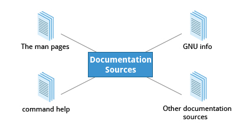

=== The `man` pages
The manual pages present in all linux distributions provide in-depth documentation about programs, utilities, configuration files, system call APIs, library routines, and the kernel.
They can be accessed using `man` command:
----
man <topic_name>
----
But, any given topic might have multiple pages associated with it.
To see available pages specific to the topic:
----
man -f <topic_name>
----
or
----
whatis <topic_name>
----

To list all pages that have a particular topic name in their name/description:
----
man -k <topic_name>
----
or
----
apropos <topic_name>
----

Each man page can have multiple chapters numbered 1-9, and a specific chapter can be accessed by:
----
man <ch_nb> <topic_name>
----
|===
|Chapter number |Contents

|1
|User Commands

|2
|System Calls

|3
|C Library Functions

|4
|Devices and Special Files

|5
|File Formats and Conventions

|6
|Games et. al.

|7
|Miscellanea

|8
|System Administration tools and Daemons

|9
|Kernel routines
|===
[NOTE]
====
Doing:
----
man <topic_name>
----
will open the first available chapter.
====

To see all the chapters, one after the other
----
man -a <topic_name>
----

=== The GNU Info System
Documentation in GNU project's standard documentation format which is basically `man` with topics connected using links which can be viewed via CLI, GUI app or online etc.

Can be accessed using:
----
info <topic_name>
----
All the links are organized like hierarchical tree.
They are prefixed by `*`, you can move your cursor to the link and press enter to access it.
You can press `n` to go to next link which can be a sibling or a child if it exists, `p` to the previous one and `u` to the upper/parent link in tree.
[NOTE]
====
At the top of each page its next, previous and upper links are listed
====
To search for a particular word, you can do `/` and then on prompt type the word you are searching for.
[TIP]
====
Press `h` to get a help, listing all the keystroke bindings
====

=== `--help` option
Most commands have a `-h` or `--help` option which can be used to get command usage info.
----
<cmd> -h
----
[NOTE]
====
Simply doing:
----
help
----
displays synopsis of all available built-in commands
====

=== Other sources
.Other sources
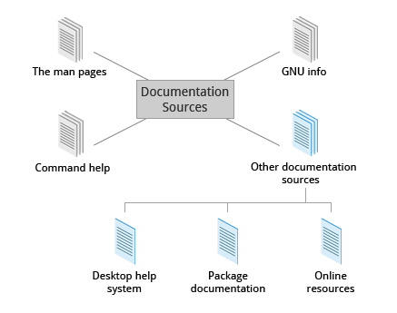

==== Desktop help system
Distribution's GUI help systems, for example `khelpcenter` for kde.

==== Package documentation
Found in `/usr/share/doc`

==== Online resources
* https://linuxcommand.org/tlcl.php[Good book]
* https://help.ubuntu.com/[Distribution help]
* https://www.google.com[Duh!]

== Chapter 9: Processes

=== Intro to processes and its attributes

A process is an instance of one or more related tasks.
A process uses memory, CPU and may also use resources such as hard disk, printers etc.

.Processes
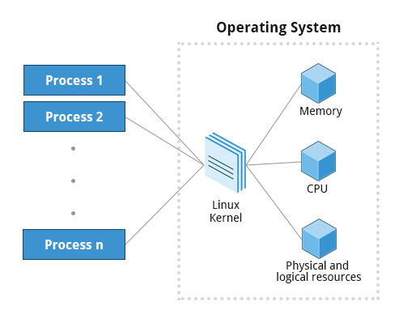

[IMPORTANT]
====
Process is not same as a program or a command.
A single program can start several processes at the same time which may or may not be dependent on and/or related to each other.
====

The OS(mainly kernel) is responsible in ensuring that each process gets a proper share of all the resources.

==== Types
|====
|Process Type |Description |Example

|Interactive Processes
|Need to be manually started by a user.
|bash, firefox, top

|Batch Processes
|Automatic processes which are scheduled from the terminal and then disconnected from it.
These tasks are queued and work on a FIFO (First-In, First-Out) basis.
|updatedb, ldconfig

|Daemons
|Server processes that run continuously in the background.
Usually, they are launched during system startup, and they wait for a user or system to give them a service request.
|httpd, sshd, libvirtd

|Threads
|Lightweight processes.
These are tasks that can be invoked by a process at anytime.
All the threads belonging to a process share memory and other resources, but they are scheduled and run on the CPU on an individual basis(like a process).
An individual thread can end without terminating the whole process, but if a process terminates all its threads are terminated.
Many non-trivial programs use multiple threads.
|firefox, gnome-terminal-server

|Kernel Threads
|These take care of Kernel tasks which users neither start nor terminate and have little control over.
These may perform actions like moving a thread from one CPU to another, or making sure input/output operations to disk are completed.
|kthreadd, migration, ksoftirqd
|====

==== Scheduling
Scheduling a process i.e. when to run/pause what process is a critical kernel function.

.Scheduling
image::pix/LFS01_ch16_screen05.jpg[Scheduling]

===== States
Based on availability of resources, a given thread may be in:

* Running state:
+
It is either currently running on a CPU or waiting(in a queue called run queue) to be assigned its time slice to run on a CPU

* Sleep state:
+
It is waiting(in a queue called wait queue) for an event to occur or for a resource to be available in order to resume their execution

* Zombie state:
+
It has completed its execution but the parent is still not aware and hence has not cleaned up the resources allocated to it

===== Priorities
Some processes are more important than other and a process' importance/priority is identified via a number called a nice value.
Higher priority processes get preferential access to CPU and other resources.
[NOTE]
====
In linux priorities go from [-20, 19] where -20 represents the highest priority and 19 the lowest.
====

To time sensitive tasks a real-time priority can be assigned.
[WARNING]
====
But that doesn't mean linux can be a hard real-time OS, with `real-time priority` we can assign very high priority pushing linux towards soft real-time.
====

To see the current process invoked from current terminal, their IDs, and priorities:
----
ps lf
----
To change the priority of the process:
----
renice <value> <PID>
----
[IMPORTANT]
====
As a non-superuser you may decrease the priority but to increase the priority you'll need root privileges
====

==== IDs
At any given point in time, a system will be executing multiple processes and in addition any of these may be executing multiple threads.
The OS assigns a unique ID to each of the process to keep track of its state, CPU, memory and other resource usage.

|====
|ID Type |Description

|Process ID (PID)
|A unique number assigned to the processes in the ascending order of their birth.
Hence, `/sbin/init` will have PID of 1

|Parent Process ID (PPID)
|PID of the process that started a process.
If the parent dies, the PPID will refer to an adoptive parent; on recent kernels, this is `kthreadd` which has PPID=2.

|Thread ID (TID)
|TID = PID for single-threaded processes.
In a process with multiple threads, each thread has the same PID, but has a unique TID.
|====

==== Termination
To eliminate a process
----
kill -SIGKILL <pid>
----
or
----
kill -9 <pid>
----

[IMPORTANT]
====
Unless you are a root user(or have root privileges), you can only kill your own processes but not that of the system or other users
====

==== User and Group IDs
The OS uses Real User ID(RUID) to identify the user who starts a process.
The user who determines the access rights of the users is identified by Effective UID(EUID).

[WARNING]
====
EUID may or may not be the same as RUID
====

The users can belong to one or more groups each of which are identified by Real Group ID(RGID) and the access rights of the group are determined by Effective GID(EGID).

.User and Group IDs
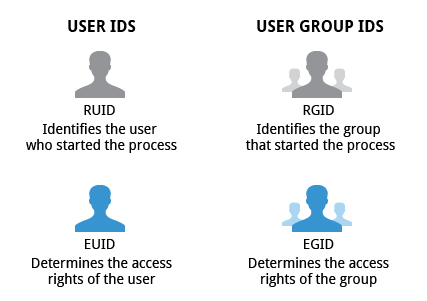

=== Processes metrics and control
==== Load Average
A load average is the average of the load number for a given period of time.
Load average takes into account processes that are in:

* Active state
* Waiting state: runnable have got the resource needed to run but are waiting to be scheduled CPU time)
* Sleeping state(here we consider uninterruptible sleeper i.e. ones which cannot be awakened easily)

It can be seen by running:
----
w
----
or
----
top
----
or
----
uptime
----

The results yield a list of 3 numbers depicting the load averages over the last minute, last 5 minutes and the last 15 minutes.
[WARNING]
====
In a multicore CPU system, the load average number represents the load average across all the CPUs.
Hence, we will need to divide it by the number of CPUs.
====
Comparing the load average with the number of running process help determine if system has reached its capacity or if a particular user is running too many processes.
A load average number greater than 1.0 means there are more processes that need CPU than what is available.
A very high load average is indicative of a problem such as a runaway process i.e. a process in a non-responding state.

A high peak normally indicates a burst of activity.
A high peak seen in 1-minute average is not a problem but in a 5 or 15-minute average it may be a cause of concern.

==== Background and Foreground Processes
Linux can run commands launched from the terminal in the foreground or the background.
These commands are also referred to as jobs.

When a job is run in the foreground, all other jobs that require terminal will need to wait for the foreground job to complete its execution.
This can cause problems if the job takes a very long time to complete.
In such a case it can be run in the background and terminal can be made free for other jobs.

To see the list of all jobs running in the background, their, state and command name:
----
jobs
----
To get the PID of the background jobs:
----
jobs -l
----
[WARNING]
====
When a terminal is closed, the background jobs invoked from it are still running, but we cannot get the info of these jobs from a new terminal using `jobs` command.
====

The terminal process has a high priority as it needs to interact with the user, jobs that are run in the background has lower priority compared to the jobs that are run in the foreground.

To run a job in the background:
----
<cmd> &
----
To suspend(pause) a foreground job, `Ctrl-Z` and to terminate a foreground job, `Ctrl-C` can be used.
To push the last foreground running/suspended job to run in the background:
----
bg
----
To push the last background running command to run in the foreground:
// does this also include suspended command?
----
fg
----

=== Listing processes
==== `ps`
To see all the processes invoked by current terminal:
----
ps
----
|====
|Option |Information

|`e`
|List all processes in system

|`f`
|PID, PPID, UID

|`l`
|Priority, Nice number

|`L`
| Show each thread
|====
[NOTE]
====
If a process name is enclosed in square brackets, then it is a kernel process
====

Alternatively, you can use only arguments without options:
|====
|Argument |Information

|`aux`
|Options `e`, `f`(except PPID), and CPU load & Mem consumption

|`axo <comma_seperated_attributes>`
|Specified attributes
|====

===== `pstree`
Shows the running processes in a tree showing the relationship between a process and its parent and children.
[NOTE]
====
Repeated entries are emitted and threads are enclosed in curly braces
====

==== `top`
For a continuous and live monitoring, `top` or its variants such as `htop` or `atop` can be used.
By default, the output is updated every 2 seconds.

With this utility, you get additional information, for example, in third line you can see % of:

* CPU time spent by kernel and user processes
* jobs running at a low priority/niceness
* jobs that are idle
* jobs that are waiting
* hardware interrupts
* software interrupts
* steal time

You can also see memory usage(total, free, and used) in both RAM and swap.
If system is using swap very often, you need to check your memory intensive application or consider adding more RAM.

In the panel you have various information:
|====
|Column Name |Parameter

|PID
|Process Identification Number

|USER
|Process Owner

|PR
|Priority

|NI
|Nice values

|VIRT
|Virtual memory

|RES
|physical memory

|SHR
|shared memory

|S
|Status

|%CPU
|Percentage of CPU used

|%MEM
|Percentage of memory used

|TIME+
|Execution time

|COMMAND
|Command

|====

[IMPORTANT]
====
Press `h` for help
====

[TIP]
====
To get all the virtual memory statistics every 2 seconds:
----
vmstat -a 2 1000
----
====

=== Starting processes in the future
To schedule a job to run at a desired time in the future, several utilities are available.

==== `at`
* To schedule a job:
** Run the utility:
+
----
at <sch_time>
----
+
[NOTE]
====
Read `man` page to see how to enter the `<sch_time>`
====
+
Then a prompt `at>` is displayed.
** Now type your commands.
+
[IMPORTANT]
====
The command will run in the directory from which you schedule it with `at`
====
** Press `Ctrl-D` to quit.

+
You'll see your normal prompt.

* To delete a scheduled job
** Get the job number:
+
----
atq
----
** Delete the job:
+
----
atrm <job_nb>
----

==== `cron`
It can be used to schedule jobs at specific times and/or periodic intervals.
It is driven by a configuration file `/etc/crontab` which contains the commands and their scheduling information.

* Open configuration file
+
----
crontab -e
----
* Each line is formatted as:
+
----
<Min> 
 <Day_of_Month> <Month> <Day_of_Week> <Cmd>
----
+
Examples:

** The entry:
+
----
* * * * * /usr/local/bin/execute/this/script.sh
----
+
will schedule a job to execute `script.sh` every minute of every hour of every day of the month, and every month and every day in the week.
** The entry:
+
----
30 08 10 06 * /home/sysadmin/full-backup
----
+
will schedule a `full-backup` job at 8.30 a.m., 10-June, irrespective of the day of the week.
* Edit the configuration file add, modify or remove job(s)

== Chapter 10: File operations
=== Filesystems
[quote]
____
in linux everything is a file
____
It means both document files, and resources such as hardware can be interacted with same kind of IO operations.
In other words, apis such as `open`, `read`, and `write` can be used with every resource(if you have sufficient privileges).

.Filesystem
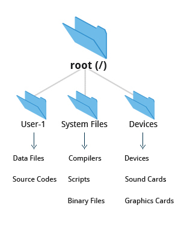

==== Mounting and Unmounting
===== `mount`
To start using a new filesystem(files of an usb key for example), we need to attach it on the existing filesystem tree at a mount point:
----
mount <dev_node> <mount_point>
----
The mount point is normally an empty directory(which already exists in current filesystem).

.Mount Points
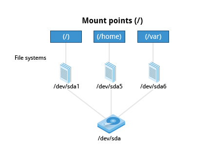

[NOTE]
====
Mounting on a non-empty directory will render its contents invisible(and inaccessible) until the new filesystem is unmounted.
====

Device nodes are automatically created by the kernel when a device is connected.
For storage devices you can do:
----
lsblk -f
----
or
----
blkid
----
For everything else, check the output of kernel buffer:
----
dmesg
----

[NOTE]
====
Disk label, and UUID can be used in place of device node to mount a filesystem.
====

[TIP]
====
* To automatically mount a filesystem everytime during startup, edit filesystem table at `/etc/fstab`.
+
To figure out how
+
----
man fstab
----

* To get info about mounted filesystems:
+
----
df -Th
----
====

===== `umount`
To detach a filesystem, we need to unmount it from existing filesystem:
----
umount <mount_point>
----

==== Network Filesystems
A Network FileSystem(NFS)(also called as distributed filesystem) may have all its data on one machine or have it spread out across several either in the same location or spread out anywhere that can be reached by the internet.
NFS can be seen as an abstraction over grouping of lower filesystems of varying types.

.The Client-Server Architecture of NFS
image::pix/nfs.png[]

Most common use case is system administrators mount remote users' home directories on a server to give them access to the same files and configuration files across multiple client systems(different computers).

===== NFS on server
The NFS needs `nfs` daemon to be running which can be done by:
----
systemctl start nfs
----
or can also be configured to run automatically at startup:
----
systemctl enable nfs
----
[NOTE]
====
After enabling, don't forget to run it for this time using:
----
systemctl start nfs
----
====

The directories to be shared over NFS and their permissions are configured in text file `/etc/exports`:
----
<nfs_shared_directory> <hostname>.<domainname>(<permissions>)
----
An example:
----
/projects *.example.com(rw)
----

[WARNING]
====
After modifying `/etc/exports`, don't forget to:
----
exportfs -av
----
====

===== NFS on client
You can either manually mount:
----
mount <server_name>:<server_directory> <mount_point>
----
or auto-mount on startup by adding an entry into `wtc/fstab`:
----
<server_name>:<server_directory> <mount_point> nfs defaults 0 0
----

=== Filesystem Architecture
==== `/home`
Each user has a home directory placed under `/home`.
If a user belongs to a group, then user's home directory is at `/home/<group_name>/<user_name>` otherwise it resides at `/home/<user_name>`.
[NOTE]
====
The root user's home directory is at `/root`.
====

.Home Directories
image::pix/Home_directories.png[Home Directories]

A user's home directory is often mounted as a separate filesystem residing on its own partition and/or shared via NFS

[TIP]
====
Keep `/home` in a separate partition to enforce clear separation between OS and user files(documents, music, video, photos etc).
This way you can independently upgrade OS without risking losing your personal data.
====

==== `/bin` and `/sbin`
`/bin` contains executable binaries and essential commands to boot the system or use it in single-user mode such as `cat`, `ls` etc. while `/sbin` contains binaries related to system administration such as `fsck`, `ip` etc.

The rest of the binaries are placed under `/usr/bin` and `/usr/sbin`.
[WARNING]
====
After such an organization they found out that, in all the systems it is impossible to boot or operate in single-user mode without binaries in `/usr/bin` and `/usr/sbin`.
Hence, in today's all the binaries from `/usr/bin` and `/usr/sbin` are moved to and are replaced by just a symbolic link to `/usr/sbin` and `/sbin` respectively.
====

==== `/proc`
`/proc` is a pseudo-filesystem as it has no permanent presence on anywhere in the disk and resides only in RAM.
It contains virtual files that are gathered only when needed which allows viewing constantly changing kernel data.

Every process has a directory at `/proc/<PID>` which contains vital information about it and the directory `/proc/sys` contains loads of information about the entire system.

Some very useful files under `/proc` are `cpuinfo`, `interrupts`, `meminfo`, `mounts`, `partitions`, `version`.

==== `/dev`
`/dev` is an empty directory used to mount a pseudo-filesystem which contains device nodes used by most hardware, and software devices, except network devices.

==== `/var`
`/var` contains files that change in size, and content as the system is running.

.`/var` directory
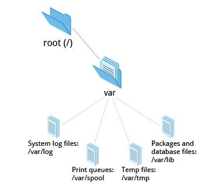

Some important directories under `/var` are:
|====
|Directory |Content

|`log`
|System log files

|`lib`
|Package and database files

|`spool`
|Print queues

|`tmp`
|Temporary files

|`ftp`
|FTP service

|`www`
|HTTP web service
|====

[TIP]
====
Mount `/var` in its own partition so that growth of giles can be accommodated and filesystem is safe from any exploding file sizes.
====

==== `/etc`
`/etc` contains system configuration files.
[IMPORTANT]
====
The configuration files here are for system-wide configuration.
User specific configuration files are found under user's home directory.
====
It has no binaries but may contain some executable scripts.

Few notable examples under `/etc/`, `resolv.conf` for DNS settings, and `passwd`, `shadow`, & `group` for user account management.

==== `/boot`
`/boot` contains files needed to boot the system.
Each kernel installed on system has 4 files:

* `vmlinuz`: Compressed linux kernel
* `initramfs`: Initial ram filesystem
+
[NOTE]
====
`initramfs` is sometimes also called as `initrd`
====
* `config`: Kernel configuration file used for debugging and bookkeeping
* `System.map`: Kernel symbol table used for debugging

[NOTE]
====
Each of the files is suffixed by the kernel version
====

The GRUB bootloader files are found at `/boot/grub` or `/boot/grub2`.

==== `/lib` and `/lib64`
`/lib` and `/lib64` contains libraries(32-bit and 64-bit versions respectively) required by programs in `/bin` and `/sbin`.
The library file names start with `ld` or `lib`.
They are normally dynamically loaded libraries aka shared libraries or Shared Objects(SO).

Kernel modules(kernel code, and device drivers that can be loaded and unloaded at runtime) can be found under `/lib/modules/<kernel_ver_nb>`.

[NOTE]
====
In today's system `/lib` and `/lib64` is a symbolic link to directories of same name but under `/usr`
====

==== `/media`, `/run` and `/mnt`
`/media`, and `/run/media/<username>` are used to mount removable media such USBs, CDs, and DVDs.
`/mnt` is used for temporarily mounting filesystems which can often be NFS, or loopback filesystems etc.

==== `/usr`
|====
|Subdirectory under `/usr` |Usage

|`include`
|Header files used to compile applications

|`lib` and `lib64`
|Libraries for programs in `/usr/bin` and `/usr/sbin`

|`sbin`
|Non-essential system binaries, such as system daemons

|`share`
|Shared data used by applications, generally architecture-independent

|`src`
|Source code, usually for the Linux kernel

|`local`
|Data and programs specific to the local machine; subdirectories include `bin`, `sbin`, `lib`, `share`, `include`, etc.

|`bin`
|Primary directory of executable commands on the system
|====

==== Misc
|====
|Directory Name |Usage

|`/opt`
|Optional application software packages

|`/sys`
|Virtual pseudo-filesystem giving information about the system and the hardware.
Can be used to alter system parameters and for debugging purposes.

|`/srv`
|Site-specific data served up by the system.
Seldom used.

|`/tmp`
|Temporary files erased across a reboot and/or may actually be a ramdisk in memory

|====

=== Comparing files
==== `diff`
`diff` is a utility to compare two files or directories.
Do:
----
man diff
----
to know more

Modifications to files are distributed using patches which contains changed required to update an older version file to a newer version.
It is more concise to distribute a patch file rather than the entire file.
Patches are produced by:
----
diff -Nur <original_file> <modified_file> > <patch_file>
----

Patches are applied using `patch` tool.
To apply patch to entire directory tree, while at the directory tree:
----
patch -p1 < <patch_file>
----
To apply patch to a particular file:
----
patch <original_file> <patch_file>
----
[TIP]
====
While applying the patch, just to preview how it might look like later, you can do:
----
patch <options_arguments> --dry-run
----
====

==== `diff3`
`diff3` is a utility to compare three files at once among which one file acts as a reference basis for the other two:
----
diff3 <original_file> <modified_file1> <modified_file2>
----

=== File types

Unlike other OS in linux, a file extension has little to no meaning to the system.
It is just used for the user's sake.

Most applications directly examines a file's contents regardless of its extension.

To get the real nature of a file:
----
file <file_name>
----

=== Backing up and Compressing data
==== Backing up data
The simplest and the most trivial way is to do a copy:
----
cp -r <src_dir_file> <dst_dir_file>
----

`rsync` is more robust utility.
It is more efficient and fast because before copying it checks if the file being copied already exists and also if the file does exist, it checks if there is no change in size or modification time, to avoid unnecessary copying.

Unlike `cp` which can only copy files on the local machine or a filesystem mounted on the local machine(for example, usb key, NFS etc.), `rsync` can be used to copy files from one machine to another(there is no requirement that either of the machines has to be a local machine i.e. the machine where the command is executed on).
To use `rsync` for archiving:
----
rsync -r <src_machine>:<src_dir> <dst_machine>:<dst_path>
----
[WARNING]
====
Accidental misuse `rsync` can be very destructive.
Hence, do:
----
rsync <option_arguments> --dry-run
----
before executing the actual command
====

==== Compressing data
File compression can save space and time taken to transfer it.

Linux has variety of methods for file compression.

|====
|Command |Usage

|`gzip`
|Works Very well & fast and the most frequently used Linux compression utility

|`bzip2`
|Produces significantly smaller files than those produced by `gzip` and hence slower

|`xz`
|The most space-efficient(hence the slowest) compression utility used in Linux

|`zip`
|Legacy program that is not used in linux but is often required to examine and decompress archives from other operating systems

|`tar`
|Tape ARchive(tar)(was used to archive files to a magnetic tape) groups files in an archive and then compresses the whole archive at once as a tarball.
|====

[NOTE]
====
`bzip2` is deprecated in favor of `xz`
====

==== Disk-to-Disk Copying
`dd` is a utility used to make copies of raw disk space to replicate an exact copy of one disk on another:
----
dd if=<src_disk_dev_node> of=<dst_disk_dev_node>
----

[WARNING]
====
Making raw copy of one disk on another will erase all the data that exists in the destination disk.
====

== Chapter 12: User Environment

=== Accounts, Users and Groups
Linux is a multi-user OS meaning multiple users can log on at the same time.
To get username of current user:
----
whoami
----
To get info of all users:
----
who
----

==== Users and Groups
Groups are a set of accounts having same level of access, and permissions for various files and directories.
Existing groups and their members are defined in `/etc/group`.

All users are assigned a unique id which is normally an integer 1000 or greater.
Every group has a unique ID called Group ID(GID) and these are defined in `/etc/passwd` and `/etc/group`.
[NOTE]
====
By default, every user belongs to primary group.
Whenever a user logs in, the group membership is set to primary group.
The GID of primary group = UID
====

A user can belong to multiple groups, hence multiples GIDs can be associated with a UID.

===== The root account
The root, aka superuser, account is the administrator account which has full power over the system.
To temporarily give some limited privileges to regular user accounts:
----
sudo <cmd>
----
[NOTE]
====
In some distributions, you'll need to enable `sudo` to a user account.
The configuration file `/etc/sudoers` and directory `/etc/sudoers.d` drives this.

To make changes for local users, go to `/etc/sudoers.d/` instead of directly modifying this file `/etc/sudoers`.

See the man page for details on how to write a sudoers file.
====

===== Adding and Removing Users
[NOTE]
====
You need root privileges to add and remove users and groups.
====

* To add a new user:
+
----
useradd -m -c "<comment>" <new_username>
----
option `m` creates a directory `/home/<new_username>` and populates it with files copied from `/etc/skel` while option `c` is a comment which can be used to give user's full name.
+
[NOTE]
====
You can check contents of `/etc/skel`:
----
ls -al /etc/skel
----
Anything you put here will be copied into `/home/<new_username>`
====
+
Also, adds the line:
+
----
<new_username>:x:<uid>:<gid>::/home/<new_username>:/bin/bash
----
to `/etc/passwd` and the line:
+
----
<new_username>:x:<uid>:
----
to `/etc/group`
+
[NOTE]
====
The parameters of the line are controlled by the file `/etc/default/useradd`
====

* To provide a password:
+
----
passwd <username>
----
+
[TIP]
====
To make sure the user account is set up well:
----
grep <username> /etc/passwd /etc/group
----
====

* To log in to the account from the shell:
+
----
ssh <username>@<domain>
----
+
where `domain` is `localhost` if you are logging in on the same machine.

* To log out(on the same shell):
+
----
exit
----

* To switch to another user:
+
----
su <username>
----
+
following this you'll be prompted to enter the password of the user account.
+
if you omit the argument `<username>`, you will log in to the root account after entering the root password
+
[WARNING]
====
It is a bad practice to use `su` to become root rather using `sudo` to temporarily get some limited privileges is much preferred.
====

* To remove a user:
+
----
userdel -r <new_username>
----
+
option `r` makes sure that not only is the user account deleted but also the directory `/home/<username>`.
+
[TIP]
====
You can crosscheck by:
----
ls -l /home
----
====

* To get info about a user:
+
----
id <username>
----
+
to get info about yourself, you can omit the `<username>` field.

===== Adding and Removing Groups
* To create a new group:
+
----
/usr/sbin/groupadd <group_name>
----

* To delete a group:
+
----
/usr/sbin/groupdel <group_name>
----

* To list the users of a particular group:
+
----
/usr/sbin/usermod -G <group_name> <group_name>
----

* To list groups that a user belongs to:
+
----
groups <username>
----

* To add a user to a group:
+
----
/usr/sbin/usermod -a -G <group_name> <username>
----
+
where option `a` makes sure that new user is appended to the group rather than replace all the existing users of the group.

* To delete a user from a particular group:
+
----
/usr/sbin/usermod -G <group_list_excluding_unsubscribing_group> <username>
----
where argument `group_list_excluding_unsubscribing_group` is provided as a comma seperated list with no whitespaces.

==== User startup files
To configure the user environment, command shell uses one or more startup files.

.User Startup files
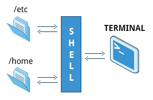

Some configurations are:
* CLI customization
* CLI shortcuts and aliases
* Default application settings
* Executable path

After login, the login shell reads the system-wide configuration at `/etc/profile` and then looks for the following files in the listed order:

* `~/.bash_profile`
* `~/.bash_login`
* `~/.profile`

Whichever is available first, the system-wide configuration are overridden with that and the rest are ignored.

Everytime, a new terminal is opened, `~/.bashrc` is read to load configuration.

.Order of User Config Startup files
image::pix/bashinit.png[Order of User Config Startup files]

==== Aliases
Aliases are used to create custom commands or modify the behavior of existing commands.
Normally, they are listed in `~/.bashrc`

* To view all the current aliases:
+
----
alias
----

* To create an alias:
+
----
alias <alias>=<cmd>
----
+
[NOTE]
====
If there is a white space in your command, use double quotes and if there is a white space within a command argument, use a single quote
====

* To delete an alias:
+
----
unalias <alias>
----

=== Environment Variables
They are variables which can be utilized by the terminal and other applications.
Some are preset values which can be overridden, while others are created by the user.

==== Working with Environment variables
* Use
+
----
<command>$<env_var_name><command>
----
* View
** All
+
----
set
----
+
[NOTE]
====
`set` produces a very lengthy output, which sometimes might include some code at the end.
Without paging the output, we might see only some code on the terminal which could cause us to think that `set` is not the right command.
Hence, pipe output of `set` to an application such as `less`:
----
set | less
----
====
+
or alternatively, you can do
+
----
export
----
+
or
+
----
env
----

** Specific
+
----
echo $<env_var_name>
----
* Create(if it doesn't exist) or replace(if it exists)
+
----
export <env_var_name>=<env_var_val>
----
+
or alternatively, you can set it only for the command that you are executing:
+
----
<var_name>=<var_value> <cmd>
----
+
now the command takes in the environment variables not as an argument but as a value to be used during its execution.
For example:
+
----
TRY=try echo $TRY
----
+
prints nothing coz `TRY` doesn't exist, but if a script `trial.sh`:
+
----
echo $TRY
----
+
is run as:
+
----
TRY=try ./trial.sh
----
+
you'll see output:
+
----
try
----
+
[TIP]
====
Whenever you want to modify an environment variable, back up the current one first and then make your modifications:
----
OLD_<env_var_name>=$<env_var_name>
<env_var_name>=<env_var_val>
----
this way you can test your variable first, either by:
----
echo $<env_var_name>
----
or by running your command.
If you are happy with the change, before closing the shell you can do:
----
export <env_var_name>
----
Once you close the shell, the variable that you created `OLD_<env_var_name>`, is lost.cwd
====

* Delete
+
----
unset <env_var_name>
----

[WARNING]
====
Whatever changes(CRUD) you make to environment variables will be lost after the bash is closed.
To make all the changes persist, you'll need to put all your commands that you used to change the environment variables in a file `~/.bashrc` or `~/.bash_profile` or similar file related to your terminal emulator.

After you make this change in the file, in the current already open terminal don't forget to:
----
source <env_var_file>
----
or
----
. ~/.bashrc
----
or start a new terminal:
----
bash
----

====

==== Some notable environment variables
`HOME`
`HOME` represents `~/` of the current user.

`PATH` is an ordered list of directories which is scanned for a binary or a script to run when a command is executed.
The ordered list is built as:
----
<path_1>:<path_2>:<path_3>:<path_n-1>:<path_n>
----
[NOTE]
====
an empty `<path_i>` represented as:
----
:<path_2>:<path_3>
----
or
----
<path_1>::<path_3>
----
indicates the present working directory at any given time.
As the list ordered, in the first case, pwd is checked for the binary/script first and then `<path_2>` followed by `<path_3>` while in the second case, `<path_1>` is checked, then pwd followed by `<path_3>`.
====

Updating `PATH` to scan a new path before scanning any of the current paths in `PATH`:
----
export PATH=<new_path>:$PATH
----

`SHELL` defines the full path to user's default command shell

Prompt Statement(PS) is used to customize the prompt string of the terminal.
By default, for non-root users the prompt starts with `$` and `#` for root users.
This can be changed by changing the Environment variable `PS1`.
Special characters allowed in `PS1` are:

* `\u` - user name
* `\h` - host name
* `\w` - present working directory
* `\!` - history number of the command
* `\d` - date

----
export PS1='\u@\h:\w$ '
----
will yield a prompt:
----
<username>@<hostname>:<pwd>
----

==== Recalling Previous Commands
Bash keeps track of previously entered commands(and statements), which can be recalled via up and down cursor keys, in a file `~/.bash_history`.
To view the history of stored commands:
----
history
----
Here, the most recent command appears last in the list.
[NOTE]
====
The commands typed in each bash is not saved until the bash is closed.
====

All the `history` related configuration is driven by its environment variables:

* `HISTFILE`: location of history file
* `HISTFILESIZE`: max number of lines in history file
* `HISTSIZE`: max number f commands in history file
* `HISTCONTROL`: how commands are stored
* `HISTIGNORE`: commands to not save in history file

[TIP]
====
To get quick overview:
----
set | grep HIST
----
====

To get a suggestion based on history press `Ctrl-R` and start typing your command.

To simply execute the last command:
----
!!
----
also called as bang-bang.

To execute the n^th^ command in history
----
!n
----
[WARNING]
====
Here `n` starts from 1 not 0.
====

To get the last argument typed in the last command:
----
!$
----

To get the last command that starts with a particular string:
----
!<cmd_starting_string>
----

=== File ownership
In linux, every file has an owner and also a group.
Every file has 3 types of permissions: read(`r`), write(`w`), and execute(`x`).

==== File permission modes
The file permission is represented as `rwx` is defined across 3 groups of owners: user(`u`), group(`g`) and others(`o`).
Hence, for any file, we have 3 groups of 3 permissions:
----
rwx: rwx: rwx
 u:   g:   o
----
These permissions can be modified using `chmod`:
----
chmod <owner_group><+_-><permission_type> <file_name>
----
`<owner_group>` can be:

* a single owner group in which case you'll represent using corresponding character(`u` or `g` or `o`)
* two owner groups, then you'll join the characters(for example, `uo` for user and others)
* all the owner groups, then you can use the character `a` which represents all

`<+_\->` means one character amongst `+`(for adding permission) and `-`(for removing permission)

`<permission_type>` can be:
* a single permission in which case you'll represent using corresponding character(`r` or `w` or `x`)
* two or all permissions then you'll join corresponding characters(for example, `rw` for read and write and `rwx` for read, write and execute)

[NOTE]
====
Various permission operations can be combined.
For example, instead of doing:
----
chmod uo+x file_name
chmod g-w file_name
----
we can do:
----
chmod uo+x,g-w file_name
----
====

Alternatively, one can assign treat each character in `rwx: rwx: rwx` as a binary number(bit) and set/clear it and convert it into an octal number do:
----
chmod <permission_mode_octal_nb> <file_name>
----

==== File owner
To change owner of the file:
----
chown <username> <file_name>
----

To change group of file:
----
chgrp <group_name> <file_name>
----

|====
|Command |Usage

|`chown`
|Used to change user ownership of a file or directory

|`chgrp`
|Used to change group ownership

|`chmod`
|Used to change the permissions on the file, which can be done separately for owner, group and the rest of the world (often named as other)
|====

