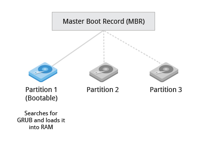
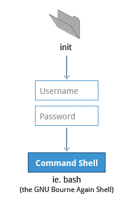

= Notes

== Chapter 3: Linux Basics and System Startup

=== The Boot Process

Boot process is the procedure for initializing the system.
It is everything that happens from the power on to the time when the user interface is fully operational.

.Linux Boot Process
image::pix/chapter03_flowchart_scr15_1.jpg[Linux Boot Process]

==== BIOS
The Basic Input Output System(BIOS) is a program stored on a ROM chip on the motherboard which initializes the hardware and performs a Power On Self Test(POST) where it tests the main memory(RAM).

.BIOS
image::pix/LFS01_ch03_screen16.jpg[BIOS]

==== Locating the Boot loader
After POST, the BIOS needs to run and pass control to a program called the Bootloader.
Depending on the system, the way BIOS locates Bootloader is different.

In traditional systems, the BIOS looks in the first sector of the hard disks for a 512 byte Master Boot Record.
The bootloader at the MBR examines the partition table of the hard disks and finds a partition that contains a (second stage) bootloader and loads it into RAM.

.Master Boot Record

In modern (Unified) Extensible Firmware Interface(EFI/UEFI) systems the BIOS launches the UEFI firmware.
UEFI firmware reads its boot manager's boot entry to locate the EFI partition i.e. the partition that contains the bootloader.
Then from UEFI partition the bootloader is loaded into RAM.

[NOTE]
====
Most common bootloaders are GRand Unified Bootloader(GRUB), ISOLINUX(for booting from removable media) and DAS U-Boot(for booting on embedded systems).
====

==== Bootloader
Bootloader loads an initial RAM disk, and it resides under `/boot`.
The initial RAM disk which is a RAM based filesystem also known as `initramfs` contains programs and binary files to perform all actions required to mount the root filesystem.

It shows a splash screen to choose boot options and available OS.
Once the OS is chosen it loads the corresponding kernel image, and passes control to it.

.Bootloader
image::pix/LFS01_ch03_screen18.jpg[Bootloader]

==== Kernel
Kernels are normally compressed, hence the first thing it does is uncompress itself.
Kernel uses program `udev`(user device) from `initramfs` to list all the devices that are present, locate respective device drivers and loading them.
Then kernel locates the root file system and checks it for errors.
After that kernel uses program `mount` from `initramfs` to mount the root file system, and associate it with a particular point in the overall hierarchy of the file system.

.Initial RAM Disk
image::pix/LFS01_ch03_screen22.jpg[initramfs]

After file system in mounted, `initramfs` is cleared from memory and the `init` program at `/sbin/init` of the root filesystem is executed.

===== `/sbin/init`
`init` becomes the initial process which then starts other process to get the system running.
It mounts the final real root filesystem, and starts a number of text-mode login prompts.
// why a number of them? why not just one?
[NOTE]
====
One most distributions, `init` starts 6 text terminals and 1 graphics terminal to show the login interface.
====
[IMPORTANT]
====
If there is a graphical login interface, you will not see text-mode login prompts at first.
====

After providing the right username and password, in a non-GUI i.e. CLI system, the command shell is displayed and in a GUI system desktop is displayed.

.Text-mode Logins

[NOTE]
====
The command default shell is bash(the GNU Bourne Again Shell) but your distribution may choose to use a different (normally more advanced) shell.
====

=== Kernel, Init and Services

==== `/sbin/init` and Services
`init` is the parent process and except kernel processes, all the processes on the system ultimately trace their origin to it.
[NOTE]
====
Kernel processes are directly started by kernel to manage internal OS details.
====
`init` is also responsible to keep the system running and for shutting it down cleanly.
To do this it starts background system services, user login services when necessary, and it also cleans up after processes upon their completion.

Traditionally, process startup was done using `SystemV` which used a series of runlevels each of which contained a collection of scripts that start and stop services.
Each runlevel was a different mode of running the system where individual services can be set to run or shutdown if running.

Not all process needs to be started one after the other.
For example, two unrelated processes can be started simultaneously.
Hence, `SystemV` fails to take advantage of parallelization, and therefore it is slower.

Modern systems use `systemd` to startup all the system process.
[IMPORTANT]
====
For compatibility purposes modern systems emulate `SystemV`
====

==== `systemd`
On modern systems `systemd` is used to startup all the system process.
It uses simpler configuration files in place of complex start-up shell scripts.
These configuration files lists:

* what has to be done before starting a service
* how to execute service startup
* what conditions the service needs to indicate when the startup is finished

In modern systems `/sbin/init` points to `/lib/systemd/systemd`
`systemd` uses `systemctl` command to:

* start/stop/restart a service:
----
sudo systemctl start|stop|restart <service_name>.service
----

* enable/disable a service from startup during system boot:
----
sudo systemctl enable|disable <service_name>.service
----

[NOTE]
====
In most cases `.service` can be omitted
====

=== Filesystem Basics

A filesystem is a method of storing and organizing files on a storage.

There are different types of filesystems supported by Linux:

* Conventional disk filesystems: `ext3`, `ext4`, `XFS`, `Btrfs`, `JFS`, `NTFS`, `vfat`, `exfat`, etc.
* Flash storage filesystems: `ubifs`, `jffs2`, `yaffs`, etc.
* Database filesystems
* Special purpose filesystems: `procfs`, `sysfs`, `tmpfs`, `squashfs`, `debugfs`, `fuse`, etc.

==== Partition

A partition is a physical or logical contiguous section of a disk or disk(s) respectively.
It is a container where the filesystem resides.

Unlike Windows, Linux does not have drive letters and multiple partitions and/or drives are mounted as directories in the single filesystem.

==== Filesystem Hierarchy Standard
Linux systems store their important files as per a standard layout defined by the Linux Foundation called Filesystem Hierarchy Standard(FHS).

.Linux FHS
image::pix/dirtree.jpg[FHS]

Linux uses `/` to build the hierarchy of the filesystem.
Filesystem names are case-sensitive.