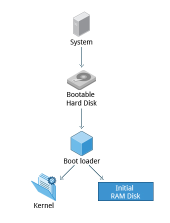
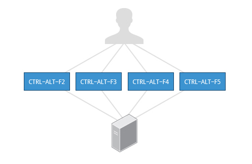

= Notes

== Chapter 3: Linux Basics and System Startup

=== The Boot Process

Boot process is the procedure for initializing the system.
It is everything that happens from the power on to the time when the user interface is fully operational.

.Linux Boot Process
image::pix/chapter03_flowchart_scr15_1.jpg[Linux Boot Process]

==== BIOS
The Basic Input Output System(BIOS) is a program stored on a ROM chip on the motherboard which initializes the hardware and performs a Power On Self Test(POST) where it tests the main memory(RAM).

.BIOS
image::pix/LFS01_ch03_screen16.jpg[BIOS]

==== Locating the Boot loader
After POST, the BIOS needs to run and pass control to a program called the Bootloader.
Depending on the system, the way BIOS locates Bootloader is different.

In traditional systems, the BIOS looks in the first sector of the hard disks for a 512 byte Master Boot Record.
The bootloader at the MBR examines the partition table of the hard disks and finds a partition that contains a (second stage) bootloader and loads it into RAM.

.Master Boot Record
image::pix/LFS01_ch03_screen20.jpg[BIOS]

In modern (Unified) Extensible Firmware Interface(EFI/UEFI) systems the BIOS launches the UEFI firmware.
UEFI firmware reads its boot manager's boot entry to locate the EFI partition i.e. the partition that contains the bootloader.
Then from UEFI partition the bootloader is loaded into RAM.

[NOTE]
====
Most common bootloaders are GRand Unified Bootloader(GRUB), ISOLINUX(for booting from removable media) and DAS U-Boot(for booting on embedded systems).
====

==== Bootloader
Bootloader loads an initial RAM disk, and it resides under `/boot`.
The initial RAM disk which is a RAM based filesystem also known as `initramfs` contains programs and binary files to perform all actions required to mount the root filesystem.

It shows a splash screen to choose boot options and available OS.
Once the OS is chosen it loads the corresponding kernel image, and passes control to it.

.Bootloader

==== Kernel
Kernels are normally compressed, hence the first thing it does is uncompress itself.
Kernel uses program `udev`(user device) from `initramfs` to list all the devices that are present, locate respective device drivers and loading them.
Then kernel locates the root file system and checks it for errors.
After that kernel uses program `mount` from `initramfs` to mount the root file system, and associate it with a particular point in the overall hierarchy of the file system.

.Initial RAM Disk
image::pix/LFS01_ch03_screen22.jpg[initramfs]

After file system in mounted, `initramfs` is cleared from memory and the `init` program at `/sbin/init` of the root filesystem is executed.

==== `/sbin/init`
`init` becomes the initial process which then starts other process to get the system running.
It mounts the final real root filesystem, and starts a number of text-mode login prompts.
// why a number of them? why not just one?
[NOTE]
====
One most distributions, `init` starts 6 text terminals and 1 graphics terminal to show the login interface.
====
[IMPORTANT]
====
If there is a graphical login interface, you will not see text-mode login prompts at first.
====

After providing the right username and password, in a non-GUI i.e. CLI system, the command shell is displayed and in a GUI system desktop is displayed.

.Text-mode Logins
image::pix/LFS01_ch03_screen26.jpg[initramfs]

[NOTE]
====
The command default shell is bash(the GNU Bourne Again Shell) but your distribution may choose to use a different (normally more advanced) shell.
====

==== `X System`

When you install a desktop environment(`GNOME`, `KDE`, `XFCE`), the display manager(`gdm`, `kdm`, `xdm`) gets launched at the end.
[NOTE]
====
If the display manager(gdm, lightdm, kdm, xdm, etc.) is not started by default in the default runlevel, you can manually start it after logging on to a text-mode console by running:
----
startx
----
====

.Display Manager
image::pix/LFS01_ch03_screen28.jpg[Display Manager]

The display manager launches the `X server`.
[NOTE]
====
Though there is no web involved, it is called server because it provides graphical services to applications, sometimes called `X clients`.
====
`X` is responsible for starting the graphics system, logging in the user, and starting the user’s desktop environment.

[NOTE]
====
`X server` is often called as just `X`
====
You can often select from a choice of desktop environments when logging in to the system.

[NOTE]
====
`X` uses `/etc/X11/xorg.conf` as its configuration file if it exists.
In modern Linux distributions, this file is usually present only in unusual circumstances, such as when certain less common graphic drivers are in use.
====

[IMPORTANT]
====
`X` is legacy software dating back to the mid 1980s which has been stretched rather far from its original purposes.
It has certain deficiencies on modern systems(for example, with security).
A newer system, known as `Wayland`, is gradually superseding it and is the default display system for Fedora, RHEL 8, and other recent distributions.
To the user, it looks similar to `X`, but under the hood it is quite different.
====

===== Desktop Environment

.Desktop Environment
image::pix/LFS01_ch03_screen29.jpg[Desktop Environment]

A desktop environment consists of:

* a session manager, which starts and maintains the components of the graphical session
* the window manager, which controls the placement and movement of windows, window title-bars, and controls.
* a set of utilities

=== Kernel, Init and Services

==== `/sbin/init` and Services
`init` is the parent process and except kernel processes, all the processes on the system ultimately trace their origin to it.
[NOTE]
====
Kernel processes are directly started by kernel to manage internal OS details.
====
`init` is also responsible to keep the system running and for shutting it down cleanly.
To do this it starts background system services, user login services when necessary, and it also cleans up after processes upon their completion.

Traditionally, process startup was done using `SystemV` which used a series of runlevels each of which contained a collection of scripts that start and stop services.
Each runlevel was a different mode of running the system where individual services can be set to run or shutdown if running.

Not all process needs to be started one after the other.
For example, two unrelated processes can be started simultaneously.
Hence, `SystemV` fails to take advantage of parallelization, and therefore it is slower.

Modern systems use `systemd` to startup all the system process.
[IMPORTANT]
====
For compatibility purposes modern systems emulate `SystemV`
====

==== `systemd`
On modern systems `systemd` is used to startup all the system process.
It uses simpler configuration files in place of complex start-up shell scripts.
These configuration files lists:

* what has to be done before starting a service
* how to execute service startup
* what conditions the service needs to indicate when the startup is finished

In modern systems `/sbin/init` points to `/lib/systemd/systemd`
`systemd` uses `systemctl` command to:

* start/stop/restart a service:
----
sudo systemctl start|stop|restart <service_name>.service
----

* enable/disable a service from startup during system boot:
----
sudo systemctl enable|disable <service_name>.service
----

[NOTE]
====
In most cases `.service` can be omitted
====

=== Filesystem Basics

A filesystem is a method of storing and organizing files on a storage.

There are different types of filesystems supported by Linux:

* Conventional disk filesystems: `ext3`, `ext4`, `XFS`, `Btrfs`, `JFS`, `NTFS`, `vfat`, `exfat`, etc.
* Flash storage filesystems: `ubifs`, `jffs2`, `yaffs`, etc.
* Database filesystems
* Special purpose filesystems: `procfs`, `sysfs`, `tmpfs`, `squashfs`, `debugfs`, `fuse`, etc.

==== Partition

A partition is a physical or logical contiguous section of a disk or disk(s) respectively.
It is a container where the filesystem resides.

Unlike Windows, Linux does not have drive letters and multiple partitions and/or drives are mounted as directories in the single filesystem.

==== Filesystem Hierarchy Standard
Linux systems store their important files as per a standard layout defined by the Linux Foundation called Filesystem Hierarchy Standard(FHS).

.Linux FHS
image::pix/dirtree.jpg[FHS]

Linux uses `/` to build the hierarchy of the filesystem.
Filesystem names are case-sensitive.

=== Choosing a distribution
Different distros cater to different purposes.

.Choosing Linux Distribution

Hence, you'll need to consider various factors such as:

* Function of the system:
+
Server, desktop or Embedded device

* Types of packages that are important:
+
Web server, word processing etc

* Memory size

* Hardware architecture
+
x86, ARM, PPC etc

* Kernel customization
+
Yes or No; if yes, from vendor or 3rd party

* Support cycle for each release

=== Some notes

* Many installers can do an installation completely automatically, using a configuration file to specify installation options.
This file is called a `Kickstart` file for Red Hat-based systems, an `AutoYAST` profile for SUSE-based systems, and a `Preseed` file for Debian-based systems.

* Different states:
** Lock: keeps everything still running
** Suspend/Sleep: saves everything to RAM so that it can be restored when Wakes up again and turns of all the hardware
** Poweroff/Shutdown: Shutdown system

== System Configuration

=== Installing and updating software

`dpkg` is the underlying package manager for Debian based systems.
It can install, remove, and build packages.
Unlike higher-level package management systems, it does not automatically download and install packages and satisfy their dependencies.

.Debian Package Management
image::pix/LFS01_ch05_screen34.jpg[Debian Package Management]

The higher-level package management system is the Advanced Package Tool (`APT`).
Each distribution creates its own user interface on top of `APT`(for example, `synaptic`, `gnome-software`, `Ubuntu Software Center`, etc).
[WARNING]
====
Although `apt` repositories are generally compatible with each other, the software they contain generally is not.
Therefore, most repositories target a particular distribution (like Ubuntu), and often software distributors ship with multiple repositories to support multiple distributions.
====

=== Some notes

Linux always uses Coordinated Universal Time (UTC) for its own internal time-keeping.

== Common Applications

=== Some notes

Most email clients use the Internet Message Access Protocol (`IMAP`) or the older Post Office Protocol (`POP`) to access emails stored on a remote mail server.

== Command Line operations

=== Introduction to the command line

[quote]
____
graphical user interfaces make easy tasks easier, while command line interfaces make difficult tasks possible
____

Linux has an abundance of command line tools.
Advantages of CLI:

* No overhead of a GUI
* Virtually any and every task can be accomplished from the CLI without switching windows
* Possible to automate tasks and series of procedures using scripts
* Can sign-in to remote machines anywhere on the internet
* Can run graphical applications directly from the cli instead of hunting through menus
* While graphical tools may vary among distributions, the CLI does not

=== Text Terminal on the Graphical Desktop
A terminal emulator program emulates (simulates) a standalone terminal within a window on the desktop behaving like a machine with a pure text terminal with no running graphical interface.
Most terminal emulator programs support multiple terminal sessions by opening additional tabs or windows.

=== Some Basic Utilities
* `cat`: type out a file (or combine files).

* `head`: show the first few lines of a file.

* `tail`: show the last few lines of a file.

* `man`: view documentation.

=== The Command Line

Most input lines entered at the shell prompt have three basic elements:

* Command, it is the name of the program you are executing
* Options, these follow the command and one or more of these can be used to modify the command's behavior
+
[NOTE]
====
In order to differentiate options from arguments, options start with one or two dashes, for example, `-p` or `--print`
====
* Arguments, these are what the command operates on

Options, and arguments are optional.
In addition to options and arguments, other elements (such as setting environment variables) can also appear on the command line when launching a task.

=== `sudo`

`sudo` allows users to run programs using the security privileges of another user, generally root (superuser).

==== Setting Up and Running `sudo`
In some systems you'll need to set up and enable `sudo`.
You can do that by:

* Login to `root` using `su` and entering root password when prompted

* In `/etc/sudoers.d/` create a configuration file having the filename same as your username with the content:
+
----
<username> ALL=(ALL) ALL
----
by doing:
+
----
echo "<username> ALL=(ALL) ALL" > /etc/sudoers.d/<username>
----

* Change the permissions of this configuration file by doing:
+
----
chmod 440 /etc/sudoers.d/<username>
----

After doing this you can execute a command that requires superuser privileges while being a normal user by prefixing it with `sudo` and entering superuser password on prompt.
Once you do that for a time interval you won't be required to give the superuser password again, you can just execute privileged commands by prefixing it with `sudo`.

[WARNING]
====
It is possible to configure `sudo` to not ask for a superuser password or change the time window in which the password does not have to be re-entered.
But, it is very insecure and highly not recommended.
====

=== Switching Between the GUI and the Command Line

Linux allows users to drop the graphical interface(temporarily or permanently) or to start it up after the system has been running.

Most Linux distributions can be installed with or without a graphical desktop.
Desktops are normally installed with GUI while production servers are usually installed without the GUI, and even if it is installed, usually do not launch it during system startup.
Removing GUI from a production server keeps the system lean, secure and easier to support.

=== Virtual Terminals
Virtual Terminals(VT) are console sessions that use the entire display and keyboard outside of a graphical environment.
Such terminals are considered "virtual" because, although there can be multiple active terminals, only one terminal remains visible at a time.
A VT is not quite the same as a command line terminal window; you can have many of those visible at once on a graphical desktop.
// still don't get difference between VT and terminal emulator

One of the virtual terminals (usually number one or seven) is reserved for the graphical environment, and text logins are enabled on the unused VTs.

VTs can be helpful especially when you run into problems with the graphical desktop(coz now you can't run your terminal emulator program given by your desktop environment anyways).
In this situation, you can switch to one of the text VTs and troubleshoot.

.Virtual terminals

To switch between VTs, press CTRL-ALT-function key for the VT.
For example, press CTRL-ALT-F6 for VT 6.

=== Turning Off the Graphical Desktop
For the newer `systemd`-based distributions, the display manager is run as a service.
Hence, you can use the `systemctl` utility and most distributions will also work with the `telinit` command too.
To stop the GUI:
----
sudo systemctl stop <display_manager>
----
or
----
sudo telinit 3
----

Restart it (after logging into the console) with:
----
sudo systemctl start <display_manager>
----
or
----
sudo telinit 5
----
