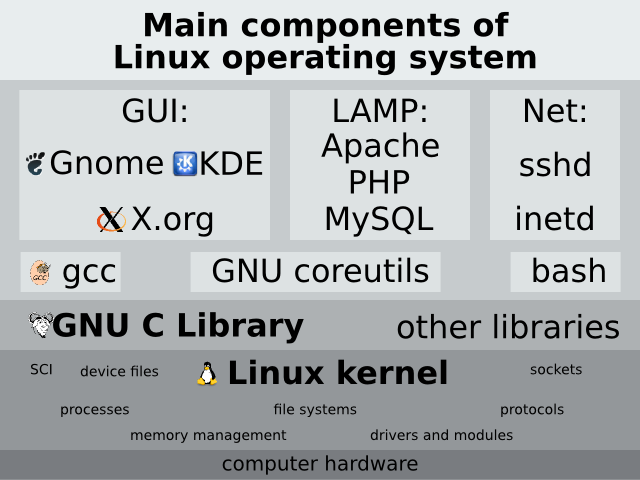
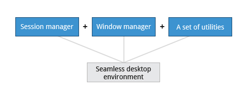
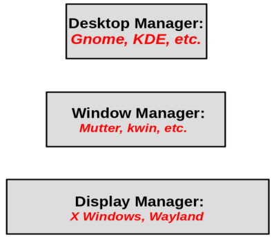

== Chapter 3: Linux Basics and System Startup

=== Introduction
To be precise, Linux is only the kernel which is a central component of an OS.
However, it is sloppily used to refer to the entire OS, and distribution.
The kernel connects the hardware to the software and manages system's resources such as CPU, memory, IO devices etc.

At the bare minimum a functioning OS along with a kernel will require:

* Device drivers: they are used by the kernel to handle the devices that are connected to the system and make them available for use by the OS.
* System libraries: these are dynamically loaded libraries used by pretty much every application.
* System services: they are started since the boot to control and monitor activities on the system.
* System utilities: these are programs that make the system more usable.

Finally, there are the applications that run on the system.
Linux provides so much choice, and they can be used in a modular way which enables the system to run with different or even no choices for them.

[NOTE]
====
Linux is not UNIX, though Linux has always borrowed heavily from UNIX, such as an inode-based filesystem, accessing hardware through device nodes, multiprocess scheduling, process creation, and destruction etc.

The open nature of the Linux development model has thus far avoided the serious fracturing that took place in UNIX(System V and BSD along with a number vendor specific implementations of UNIX).
It is perhaps ironic that the easily legal possibility of having Linux fork into competing versions at any time is perhaps what has prevented it.
====

==== Distributions
Major families:

* Red Hat: CentOS, Fedora, Oracle Linux
* Debian: Ubuntu, Linux Mint
* SUSE: openSUSE

There are a variety of standards relevant to UNIX-like OSes.
Linux, though it strives to be POSIX compliant it is not fully POSIX compliant.
However, Linux has its own standard, Linux Standard Base(LSB) to make software developed to be portable across distributions.

==== Installation
Linux can be installed as a standalone OS or in a multi-boot environment alongside other OSes.
Linux can be installed from CD, DVD, and USB key.
Many distributions offer the option of doing a network-based installation, where you boot from a medium with just a few files, or from within another operating system, and then download all the remaining files required through the Internet.

Moreover, now all major distributions have a live versions for the above listed mediums.
These make it possible to try out Linux without actually touching the hard disk.
It is even possible to never install Linux on the hard disk, but be able to save your state and work on a file or partition on the disk, or on removable media such as USB disks.

You can run and install Linux on a number of systems including virtual machines.

=== The Boot Process

Boot process is the procedure for initializing the system.
It is everything that happens from the power on to the time when the user interface is fully operational.

.Linux Boot Process
image::pix/chapter03_flowchart_scr15_1.jpg[Linux Boot Process]

==== BIOS
The Basic Input Output System(BIOS) is a program stored on a ROM chip on the motherboard which initializes the hardware and performs a Power On Self Test(POST) where it tests the main memory(RAM).

.BIOS
image::pix/LFS01_ch03_screen16.jpg[BIOS]

==== Locating the Boot loader
After POST, the BIOS needs to run and pass control to a program called the Bootloader.
Depending on the system, the way BIOS locates Bootloader is different.

In traditional systems, the BIOS looks in the first sector of the hard disks for a 512 byte Master Boot Record.
The bootloader at the MBR examines the partition table of the hard disks and finds a partition that contains a (second stage) bootloader and loads it into RAM.

.Master Boot Record
image::pix/LFS01_ch03_screen20.jpg[BIOS]

In modern (Unified) Extensible Firmware Interface(EFI/UEFI) systems the BIOS launches the UEFI firmware.
UEFI firmware reads its boot manager's boot entry to locate the EFI partition i.e. the partition that contains the bootloader.
Then from UEFI partition the bootloader is loaded into RAM.

[NOTE]
====
Most common bootloaders are GRand Unified Bootloader(GRUB), ISOLINUX(for booting from removable media) and DAS U-Boot(for booting on embedded systems).
====

==== Bootloader
Bootloader loads an initial RAM disk, and it resides under `/boot`.
The initial RAM disk which is a RAM based filesystem also known as `initramfs` contains programs and binary files to perform all actions required to mount the root filesystem.

It shows a splash screen to choose boot options and available OS.
Once the OS is chosen it loads the corresponding kernel image, and passes control to it.

.Bootloader
image::pix/LFS01_ch03_screen18.jpg[Bootloader]

[NOTE]
====
In GRUB, the basic configuration file is `/boot/grub/grub.cfg` or `/boot/grub2/grub.cfg` which is auto-generated when you run `update-grub` or `grub2-mkconfig` (depending on the distribution), after editing files `/etc/grub.d` and `/etc/default/grub`.
It contains some global information followed by one stanza for each OS/Kernel, and it should not be edited by hand.
====

==== Kernel
Kernels are normally compressed, hence the first thing it does is uncompress itself.
Kernel uses program `udev`(user device) from `initramfs` to list all the devices that are present, locate respective device drivers and loading them.
Then kernel locates the root file system and checks it for errors.
After that kernel uses program `mount` from `initramfs` to mount the root file system, and associate it with a particular point in the overall hierarchy of the file system.

.Initial RAM Disk
image::pix/LFS01_ch03_screen22.jpg[initramfs]

After file system in mounted, `initramfs` is cleared from memory and the `init` program at `/sbin/init` of the root filesystem is executed.

==== `/sbin/init`
`init` becomes the initial process which then starts other process to get the system running.
It mounts the final real root filesystem, and starts a number of text-mode login prompts.
// why a number of them? why not just one?
[NOTE]
====
One most distributions, `init` starts 6 text terminals and 1 graphics terminal to show the login interface.
====
[IMPORTANT]
====
If there is a graphical login interface, you will not see text-mode login prompts at first.
====

After providing the right username and password, in a non-GUI i.e. CLI system, the command shell is displayed and in a GUI system desktop is displayed.

.Text-mode Logins
image::pix/LFS01_ch03_screen26.jpg[initramfs]

[NOTE]
====
The command default shell is bash(the GNU Bourne Again Shell) but your distribution may choose to use a different (normally more advanced) shell.
====

==== `X System`

When you install a desktop environment(`GNOME`, `KDE`, `XFCE`), the display manager(`gdm`, `kdm`, `xdm`) gets launched at the end.
[NOTE]
====
If the display manager(gdm, lightdm, kdm, xdm, etc.) is not started by default in the default runlevel, you can manually start it after logging on to a text-mode console by running:
----
startx
----
====

.Display Manager
image::pix/LFS01_ch03_screen28.jpg[Display Manager]

The display manager launches the `X server`.
[NOTE]
====
Though there is no web involved, it is called server because it is fundamentally a communication protocol that provides graphical services to applications, sometimes called `X clients`.
In fact, it was designed to handle displaying the results of activities on remote computers.
====
`X` is responsible for starting the graphics system, logging in the user, and starting the user’s desktop environment.

[NOTE]
====
`X server` is often called as just `X`
====
You can often select from a choice of desktop environments when logging in to the system.

[NOTE]
====
`X` uses `/etc/X11/xorg.conf` as its configuration file if it exists.
In modern Linux distributions, this file has disappeared as `X` is autoconfigured on system start.
Now, usually it is present only in unusual circumstances, such as when certain less common graphic drivers are in use.
====

[IMPORTANT]
====
`X` is legacy software dating back to the mid 1980s which has been stretched rather far from its original purposes.
It has certain deficiencies on modern systems(for example, with security).
A newer system, known as `Wayland`, is gradually superseding it and is the default display system for Fedora, RHEL 8, and other recent distributions.
To the user, it looks similar to `X`, but under the hood it is quite different.
====

===== Desktop Environment

.Desktop Environment

A desktop environment consists of:

* a session manager, which starts and maintains the components of the graphical session
* the window manager, which controls the appearance, placement and movement of windows, window title-bars, and controls.
+
Ex: `kwin` for `KDE`
* a set of utilities

=== Kernel, Init and Services

==== `/sbin/init` and Services
`init` is the parent process and except kernel processes, all the processes on the system ultimately trace their origin to it.
[NOTE]
====
Kernel processes are directly started by kernel to manage internal OS details.
====
`init` is also responsible to keep the system running and for shutting it down cleanly.
To do this it starts background system services, user login services when necessary, and it also cleans up after processes upon their completion.

Traditionally, process startup was done using `SystemV` which used a series of runlevels each of which contained a collection of scripts that start and stop services.
Each runlevel was a different mode of running the system where individual services can be set to run or shutdown if running.

Not all process needs to be started one after the other.
For example, two unrelated processes can be started simultaneously.
Hence, `SystemV` fails to take advantage of parallelization, and therefore it is slower.

Modern systems use `systemd` to startup all the system process.
[IMPORTANT]
====
For compatibility purposes modern systems emulate `SystemV`
====

==== `systemd`
On modern systems `systemd` is used to startup all the system process.
It uses simpler configuration files in place of complex start-up shell scripts.
These configuration files lists:

* what has to be done before starting a service
* how to execute service startup
* what conditions the service needs to indicate when the startup is finished

In modern systems `/sbin/init` points to `/lib/systemd/systemd`.
`systemd` uses `systemctl` command to:

* start/stop/restart a service:
+
----
systemctl start|stop|restart <service_name>.service
----

* enable/disable a service from startup during system boot:
+
----
systemctl enable|disable <service_name>.service
----

[NOTE]
====
In most cases `.service` can be omitted
====

* show info about services
** status of particular service:
+
----
systemctl status <service_name>.service
----
** status of everything that `systemd` controls:
+
----
systemctl
----
** all available services
+
----
systemctl list-units -t service --all
----
** only active services
+
----
systemctl list-units -t service
----

=== Filesystem Basics

A filesystem is a method of storing and organizing files on a storage.

There are different types of filesystems supported by Linux:

* Conventional disk filesystems: `ext3`, `ext4`, `xfs`, `btrfs`, `jfs`, `ntfs`, `vfat`, `exfat`, `hfs`, `hfs+` etc.
+
[NOTE]
====
|====
|Filesystem |Origin OS

|`ntfs`, `vfat`
|Windows

|`xfs`
|SGI

|`jfs`
|IBM

|`hfs`, `hfs+`
|MacOS
|====
`ext4`, `xfs`, `btrfs` and `jfs` are journaling filesystems with advanced features, high performance and resistance to accidental corruption.
====
* Flash storage filesystems: `ubifs`, `jffs2`, `yaffs`, etc.
* Database filesystems
* Special purpose filesystems: `procfs`, `sysfs`, `tmpfs`, `squashfs`, `debugfs`, `fuse`, etc.

Utilities such as `fsck` can be used to check and optionally repair filesystem.

==== Partition

A partition is a physical or logical contiguous section of a disk or disk(s) respectively.
It is a container where the filesystem resides and is used to organize the disks based on the kind of data and its usage.

[NOTE]
====
Sometimes, an alternative word slice is used for partition.
====

Unlike Windows, Linux does not have drive letters and multiple partitions and/or drives are mounted as directories in the single filesystem.

The older MBR based systems can have upto 4 primary partitions.
By making one these an extended partition, one could have as many logical partitions allowed by the disk type(For example, SCSI disks allow max 16 partitions).

Modern UEFI based systems use a newer, more powerful, and flexible scheme called GUID Partition Table(GPT) which allows upto 128 partitions.

Utilities such as `fdisk` can be used to handle GPT.
To see all currently attached devices:
----
/sbin/fdisk -l
----
[IMPORTANT]
====
`fdisk` doesn't allow you to move or resize partitions.
====
To resize `ext4` partitions `resize2fs` can be used.
To format a partition:
----
mkfs -t <filesystem_format> <path>
----
Before mounting a filesystem on the partition, you'll need to format it.
[TIP]
====
`gparted` is a GUI utility that allows you to do all the above and a lot more including partition resize and move.
====

===== Partition Scheme
The recommended partition scheme depends on the type of the system such as single-user or multi-user etc.

For a single user it is recommended to have at least 3 partitions:

* `/boot`: a small 100-200 MB partition to hold the kernel, and the boot files.
* `/`: everything in filesystem hierarchy except `/boot`, the system installation can take up between 3-8 GB.
* swap: it is recommended to be at least as big as the RAM size

Additionally, one can have `/home`(holds personal data), `/usr`(not changed very much), `/var`(quite volatile), and `/tmp`(temporary) on its own partition as well.

You can set up boot related partition in the fastest disk such as SSD, and user's large personal files on a slower disk.
You might also have a separate partition for all that you'll share on a Network File System.

==== Filesystem Hierarchy Standard
Linux systems store their important files as per a standard layout defined by the Linux Foundation called Filesystem Hierarchy Standard(FHS).

.Linux FHS
image::pix/dirtree.jpg[FHS]

Linux uses `/` to build the hierarchy of the filesystem.
Filesystem names are case-sensitive.

=== Choosing a distribution
Different distros cater to different purposes.

.Choosing Linux Distribution
image::pix/distros.png[Distros]

Hence, you'll need to consider various factors such as:

* Function of the system:
+
Server, desktop or Embedded device

* Types of packages that are important:
+
Web server, word processing etc

* Memory size

* Hardware architecture
+
x86, ARM, PPC etc

* Kernel customization
+
Yes or No; if yes, from vendor or 3rd party

* Support cycle for each release

=== Some notes

* Many installers can do an installation completely automatically, using a configuration file to specify installation options.
This file is called a `Kickstart` file for Red Hat-based systems, an `AutoYAST` profile for SUSE-based systems, and a `Preseed` file for Debian-based systems.

* Different states:
** Lock: keeps everything still running
** Suspend/Sleep: saves everything to RAM so that it can be restored when Wakes up again and turns of all the hardware
** Power-off/Shutdown: Shutdown system

* Graphical Environment:
+
In linux, it is composed of 3 basic layers
+

+
Window manager and Display Manager has already been discussed above.
Desktop manager sits on top of window manager to offer:

** a desktop: taskbar, menubar, icons, launchers, themes, backgrounds, etc.
** saving desktop states
** utility applications such as clocks, performance monitors, volume controls etc