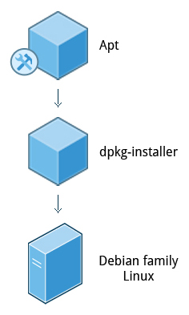

== Chapter 5: System Configuration

=== Installing and updating software

`dpkg` is the underlying package manager for Debian based systems.
It can install, remove, and build packages.
Unlike higher-level package management systems, it does not automatically download and install packages and satisfy their dependencies.

.Debian Package Management

The higher-level package management system is the Advanced Package Tool (`APT`).
Each distribution creates its own user interface on top of `APT`(for example, `synaptic`, `gnome-software`, `Ubuntu Software Center`, etc).
[WARNING]
====
Although `apt` repositories are generally compatible with each other, the software they contain generally is not.
Therefore, most repositories target a particular distribution (like Ubuntu), and often software distributors ship with multiple repositories to support multiple distributions.
====

[NOTE]
====
To update software, Linux doesn't use patching model, but rather installs complete new packages.
====

The only time that requires a reboot is when the kernel itself is updated.
Otherwise, updating packages don't require a reboot.

=== Some notes

Linux always uses Coordinated Universal Time (UTC) for its own internal time-keeping.

== Chapter 6: Common Applications

=== Text Editors
Almost all the configuration files in linux are text files.
Hence, you'll need a text editor rather than a word processing program which may insert binary and embedded hidden information.

* Basic:
** Command line: `nano`
** GUI: `Kate`
* Advanced:
** Command line: `vi`, `emacs`

[TIP]
====
Use `vimtutor` utility to learn `vi`.
To learn emacs, open it and type `Ctl-h` and then `t`.
====

=== Some notes

Most email clients use the Internet Message Access Protocol (`IMAP`) or the older Post Office Protocol (`POP`) to access emails stored on a remote mail server.
