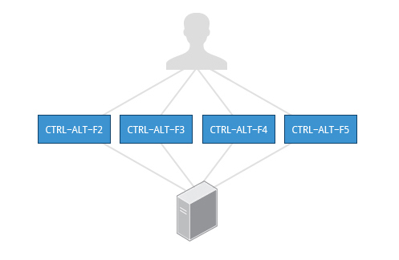
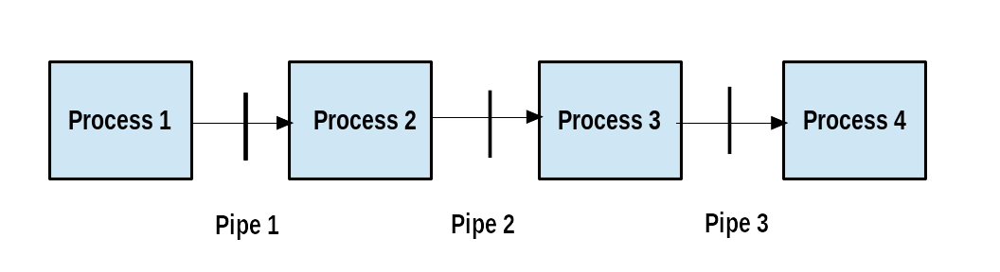
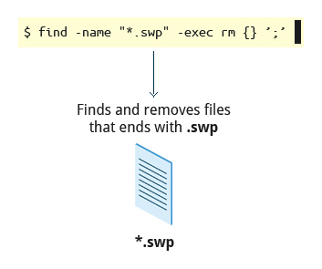

== Chapter 7: Command Line operations

=== Command-Line Mode Options

==== Introduction to the command line

[quote]
____
graphical user interfaces make easy tasks easier, while command line interfaces make difficult tasks possible
____

Linux has an abundance of command line tools.
Advantages of CLI:

* No overhead of a GUI
* Virtually any and every task can be accomplished from the CLI without switching windows
* Possible to automate tasks and series of procedures using scripts
* Can sign-in to remote machines anywhere on the internet
* Can run graphical applications directly from the cli instead of hunting through menus
* While graphical tools may vary among distributions, the CLI does not

==== Text Terminal on the Graphical Desktop
A terminal emulator program emulates (simulates) a standalone terminal within a window on the desktop behaving like a machine with a pure text terminal with no running graphical interface.
Most terminal emulator programs support multiple terminal sessions by opening additional tabs or windows.

==== The Command Line

Most input lines entered at the shell prompt have three basic elements:

* Command, it is the name of the program you are executing
* Options, these follow the command and one or more of these can be used to modify the command's behavior
+
[NOTE]
====
In order to differentiate options from arguments, options start with one or two dashes, for example, `-p` or `--print`
====
* Arguments, these are what the command operates on

Options, and arguments are optional.
In addition to options and arguments, other elements (such as setting environment variables) can also appear on the command line when launching a task.

==== `sudo`

`sudo` allows users to run programs using the security privileges of another user, generally root (superuser).

===== Setting Up and Running `sudo`
In some systems you'll need to set up and enable `sudo`.
You can do that by:

* Login to `root` using `su` and entering root password when prompted

* In `/etc/sudoers.d/` create a configuration file having the filename same as your username with the content:
+
----
<username> ALL=(ALL) ALL
----
by doing:
+
----
echo "<username> ALL=(ALL) ALL" > /etc/sudoers.d/<username>
----

* Change the permissions of this configuration file by doing:
+
----
chmod 440 /etc/sudoers.d/<username>
----

After doing this you can execute a command that requires superuser privileges while being a normal user by prefixing it with `sudo` and entering superuser password on prompt.
Once you do that for a time interval you won't be required to give the superuser password again, you can just execute privileged commands by prefixing it with `sudo`.

[WARNING]
====
It is possible to configure `sudo` to not ask for a superuser password or change the time window in which the password does not have to be re-entered.
But, it is very insecure and highly not recommended.
====

==== Switching Between the GUI and the Command Line

Linux allows users to drop the graphical interface(temporarily or permanently) or to start it up after the system has been running.

Most Linux distributions can be installed with or without a graphical desktop.
Desktops are normally installed with GUI while production servers are usually installed without the GUI, and even if it is installed, usually do not launch it during system startup.
Removing GUI from a production server keeps the system lean, secure and easier to support.

==== Virtual Terminals
Virtual Terminals(VT) are console sessions that use the entire display and keyboard outside a graphical environment.
Such terminals are considered "virtual" because, although there can be multiple active terminals, only one terminal remains visible at a time.
A VT is not quite the same as a command line terminal window; you can have many of those visible at once on a graphical desktop.
// still don't get difference between VT and terminal emulator

One of the virtual terminals (usually number one or seven) is reserved for the graphical environment, and text logins are enabled on the unused VTs.

VTs can be helpful especially when you run into problems with the graphical desktop(coz now you can't run your terminal emulator program given by your desktop environment anyway).
In this situation, you can switch to one of the text VTs and troubleshoot.

.Virtual terminals

To switch between VTs, press CTRL-ALT-function key for the VT.
For example, press CTRL-ALT-F6 for VT 6.

==== Turning Off the Graphical Desktop
For the newer `systemd`-based distributions, the display manager is run as a service.
Hence, you can use the `systemctl` utility and most distributions will also work with the `telinit` command too.
To stop the GUI:
----
sudo systemctl stop <display_manager>
----
or
----
sudo telinit 3
----

Restart it (after logging into the console) with:
----
sudo systemctl start <display_manager>
----
or
----
sudo telinit 5
----

=== Basic Operations

==== Logging in and out
On a local system, you can just enter the login username and password when prompted to log in.

You can also log in to a remote system using Secure SHell(SSH) by:
----
ssh <username_on_remote_server>@<remote_server_domain_name>.<top_level_domain_name>
----
During remote login, you may enter password, or you can auto-verify your identity using cryptographic key

==== Rebooting and Shutting Down
To shut down you can do:
----
shutdown -h
----
or
----
poweroff
----

To reboot you can do:
----
shutdown -r
----
or
----
reboot
----

These commands send a warning message and prevents further users from logging in.
The `init` process will then control shutdown/reboot.
Failure to do a proper shutdown can cause system damage and/or data loss.

==== Locating Applications
To find the location of an executable binary or script you can do:
----
which <executable>
----
or
----
whereis <executable>
----
compared to `which`, `whereis` searches a broader range of system directories and also locates the source and the man files packaged with the executable

[NOTE]
====
In general, executable programs and scripts reside in the `/bin`, `/usr/bin`, `/sbin`, `/usr/sbin` directories, or somewhere under `/opt` or `/usr/local/bin`, `/usr/local/sbin`, or in a directory in a user's account space, such as `/home/<username>/bin`.
====

==== Accessing Directories

|===
|Command |Result

|`pwd`
|Displays present working directory

|`cd $HOME` or `cd ~/` or `cd ~` or just `cd`
|Change to home directory of current user

|`cd..`
|Change to parent directory

|`cd -`
|Change to previous directory

|`pushd <path>`
|Change to directory `<path>` and push the path to the history

|`popd`
|Change to directory `<path>` present at the top of the history
|===

==== Absolute and relative paths
Absolute path name starts at the root `/` and follows the filesystem tree branch by branch until it reaches the desired directory or file.
Relative path name starts in relation to the present working directory with either `.` or `..` meaning pwd or its parent respectively.
[TIP]
====
Relative paths never start with `/` and absolute paths never start with `.` or `..`
====
[NOTE]
====
Multiple slashes `/` between elements are allowed while writing the path but all but one slash between elements are ignored.
For example:
----
////usr//bin
----
is as seen as:
----
/usr/bin
----
====

==== Exploring the Filesystem
|===
|Command |Result

|`ls`
|List the contents of the pwd

|`ls -a`
|List all files, and directories including the hidden ones in the pwd

|`ls -R`
|List all files, and directories but while showing directories, list the files and directories inside them too

|`tree`
|Get a tree view of the pwd

|`tree -d`
|Get a tree view of just the directories in the pwd

|===

[NOTE]
====
For all the commands above you can optionally pass as an argument, an absolute/relative path that you'd like to explore
====

==== Hard link
A hard link is used to associate more than one file name to a file.

Hard links are created using `ln` utility as:
----
ln <file_name1> <file_name2>
----
where `<file_name1>` is the name of the already existing file and `<file_name2>` is the another file name that will be associated with it.

If you check the inode number of the file associated with `<file_name1>`, and `<file_name2>` using `ls` utility with option `i` as:
----
ls -li <file_name1> <file_name2>
----
[NOTE]
====
Inode number is a unique number for each file object
====
you'll see that the inode numbers of the file associated with both `<file_name1>`, and `<file_name2>` are the same.
In other words, one file has two names.

Hard links are very useful, and they save space, but you have to be careful with their use.
For example, when you do:
----
rm `<file_name1>`
----
The file still exists and is still accessible via `<file_name2>`.
// What is the "subtle error" in "when For one thing, if you remove either file1 or file2 in the example, the inode object (and the remaining file name) will remain, which might be undesirable, as it may lead to subtle errors later if you recreate a file of that name."?

[WARNING]
====
If you open the file in a text editor using both the file names and edit and save on one of them, then the text editor may break the link and create two file objects saving the updated version as a new file object
====

==== Soft link
A soft (or symbolic) links is more like a shortcut on a Windows system.
It can ve created with the `ln` utility with option `s` as:
----
ln -s <file_name1> <file_name2>
----
`<file_name2>` is a short-cut for `<file_name1>` and when you do:
----
ls -li <file_name1> <file_name2>
----
You'll see that `<file_name2>` is not a regular file, and it points to `<file_name1>`.
It has a different inode number, and it takes no extra space on the filesystem (unless their names are very long).

[TIP]
====
An easy way to create a shortcut from your home directory to long pathname is to create a symbolic link.
====

Symbolic links are extremely convenient, as they can easily be modified to point to different places.
Moreover, unlike hard links, soft links can point to object even on different filesystems, partitions, and/or disks and other media, which may or may not be currently available or even exist.

[WARNING]
====
In the case where the link does not point to a currently available or existing object, you obtain a dangling link.
====

=== Working with Files

==== Viewing Files
|===
|Command |Result

|`cat <file_name>`
|Just output file on stdout/output stream; hence there is no scroll-back and is used to view not very long files

|`tac <file_name>`
|Same as `cat` but in the reverse direction(printing the last line first)

|`less <file_name>`
|A paging program; hence it provides scroll-back and is used to view larger files

|`tail -n <k> <file_name>` or `tail -<k> <file_name>`
|Same as `cat` but used to print last `<k>` lines of the file.
If option `n` or `k` is not used by default, 10 lines are shown.

|`head -n <k> <file_name>` or `tail -<k> <file_name>`
|Opposite of `tail`

|`wc <file_name>`
|get word count in a file
|===

==== Creating a file or a directory
===== File
If a file by name <filename> doesn't exist `touch` can be used to create it:
----
touch <filename>
----
[WARNING]
====
If it does exist, the above command just changes the access time of the file to current time.
====
[NOTE]
====
To set a specific access time of an already existing file:
----
touch -t <time_in_yyyymmddhhmm_format> <filename>
----
====
Alternatively, `echo` can be used to create a file with some content:
----
echo <file_content> > <filename>
----

To delete a file:
----
rm <file>
----
Additionally, you can use option `i` to get prompts before deleting the file and `f` to force delete a file

===== Directory
To create directory:
----
mkdir -p <dirname>
----
[NOTE]
====
Option `p` tells to create all the parent directories in the path of `<dirname>` if any of them doesn't exist.
Without this option you can create the directory iff all the parent directories in the path `<dirname>` exists
====

To delete directory and all its contents:
----
rm -rf <dirname>
----
[WARNING]
====
`rm` with `rf` is extremely dangerous and use it with cation
====
[NOTE]
====
There is a command `rmdir`, but it can only delete empty directories
====

==== Move, or Rename a file or directory
`mv` can be used to both move and rename a file or a directory:
----
mv <src_path> <dst_path>
----
In the paths `<src_path>` and `<dst_path>`:
* If dir/file names are different, dir/file is renamed
* If dir/file paths are different, dir/file is moved

=== Streams and Pipes
==== Standard File Streams
By default, three std file streams(or descriptors) are always open for use:
|===
|File stream |Name |Descriptor no |Example

|standard input
|`stdin`
|0
|keyboard

|standard output
|`stdout`
|1
|Terminal

|standard error
|`stderr`
|2
|Log file
|===

Any file that is opened will take file descriptors numbers starting from 3.

==== I/O Redirection
The std file streams can be used on the terminal to redirect output of one program to another program/a file

Symbol `>` can be used as:
----
<src_prog> > <dst_prog_or_file>
----
directs output stream of `<src_prog>` to input stream of `<dst_prog_or_file>`.
[IMPORTANT]
====
Using file descriptor number of the stream with `>` can redirect output to specific stream
----
<src_prog> 2> <dst_prog_or_file>
----
directs error stream of `<src_prog>` to input stream of `<dst_prog_or_file>`.
====
[TIP]
====
To silence(not display on terminal), for example, standard error stream:
----
<cmd> 2> /dev/null
----
The output stream you can still display on terminal or redirect it to a file or pipe it to another program.
If you don't write 2, then standard output stream gets silenced.
====
[NOTE]
====
To send both output and error stream to input stream of another program or a file:
----
<src_prog> > <dst_prog_or_file> 2>&1
----
which is of the general form:
----
<cmd> <redirections> <file_descriptor_manipulations>
----
or its shorthand:
----
<src_prog> >& <dst_prog_or_file>
----
====
[WARNING]
====
When outputting to a file using `>` will overwrite all the contents of the file.
To append the contents at the bottom of the file use `>>`
====
Similarly, symbol `<` can be used as:
----
<src_prog> < <ip_file>
----
directs contents of `<ip_file>` to input stream of `<src_prog>`

==== Pipes
We can use pipes to create a chain where each program sends its output to the next one in the chain as:

.Pipeline

we can do:
----
<cmd1> | <cmd2> | <cmd3> | <cmd4>
----
[IMPORTANT]
====
All the commands/programs in the pipeline run at the same time(concurrent/parallel) and don't wait for the previous one to complete to start execution of the new one.

When a program that writes output something encounters write call, it blocks until there is a program that reads something using a read call and vice-versa.
====

This way there is no need to create intermediate files on disk to write output into it and read from it.
Using intermediate files are bad strategy coz apart from the obvious disk space consumption, file read and write from/to disk is the slowest operation and causes performance bottlenecks.

[NOTE]
====
Piping effectively connects, `stdout` of one program to `stdin` of another program.
If you want to pipe `stderr` instead of `stdout`:
----
<cmd1> 3>&1 1>&2 2>&3 3>&- | <cmd2>
----
For `<cmd1>`, you swap `stderr` and `stdout` using an intermediate file descriptor `3`.
`3>&1 1>&2 2>&3` does the swapping, and `3>&-` closes the intermediate file descriptor `3`.
Now piping as usual provides, lets `<cmd2>` work on `<cmd1>` 's `stderr`.

To pipe both `stderr` and `stdout` of `<cmd1>` to `stdin` of `<cmd2>`, we can do:
----
<cmd1> |& <cmd2>
----
this is expanded as:
----
<cmd1> 2>&1 | <cmd2>
----
where `2>&1` combines `stdout` and `stderr` by redirecting `stderr` into `stdout`.
====

=== Searching for files
`locate` and `find` are two important commands to search for files

==== `locate`
To search for a file/director or a list of files/directories that match a particular pattern:
----
locate <path_or_pattern>
----
`locate` searches all matching entries in a database of files and directories created by a utility called `updatedb`.

===== `updatedb`
This database is automatically updated once a day.
[WARNING]
====
This is the fastest way to search files/directories but the database may not be up-to-date which can cause you problems if files/dirs you are looking for were related to file system hierarchy changes that you made in the last 24 hours.
====
To manually update the database:
----
updatedb
----
The configuration of `updatedb` is defined in `/etc/updatedb.conf`.
By modifying the options in this file you can for example exclude a particular file extension or directory(and its files) or pseudo-filesystems(such as `proc` etc.) from being added to the database.
[IMPORTANT]
====
To this modification you cannot change the file but rather invoke `updatedb` with options such as:
----
updatedb -e <path>
----
This will make `updatedb` to add an additional `<path>` to `PRUNEPATHS` along with values already defined in `/etc/updatedb.conf`.
====
[TIP]
====
To know more:
----
man updatedb
----
====

==== `find`
`find` recurses down the file system tree from the given `src_path` to find all the files and directories that matches a pattern.
----
find <src_path> -name <pattern>
----

==== Advanced options
You can even narrow down the search to a particular type such as a directory or file etc. by:
----
find <src_path> -type <type_char> -name <pattern>
----
where `<type_char>` can be `d` for directory, `f` for regular file and `l` for symbolic link.

You can search for files of a based on file sizes:
----
find <src_path> -size <+n_-n_n>
----
where `<+n>` searches for files/dirs of size greater than `n` bytes, `-n` for less than `n` bytes and `n` for size `n` bytes.

You can search based on how long ago file was created
----
find <src_path> -ctime <+n_-n_n>
----
where `n` is the number of days.
Alternatively, you can use options `atime` for last access time and `mtime` for last modification time
[NOTE]
====
For time in minutes instead of days options `cmin`, `amin` and `mmin` are available
====

===== Advanced operations
You can execute operations on each of the path in the output of `find` operation by doing:
----
find <cmd_opt_arg> -exec <cmd> {} "\;"
----
here, `{}` is the placeholder for the output of `find` and `"\;"`(or `’;’`) is a must to end the command.
Alternatively, you can also do:
----
find <cmd_opt_arg> -ok <cmd> {} ’;’
----
in this case you'll receive a prompt before executing the command

.Advanced operation using `find` command

=== Wildcards and Matching
For almost all the commands the file name or the directory name can be an absolute or relative path.
Moreover, these paths can be `glob`-ed using wildcards
|===
|Wildcard |Result |Example

|`?`
|Match any single character in pattern string
|`ls ba?.out` lists files(in current directory) with three letter filename where the first two letters are `ba` and ends with an extension `.out`

|`*`
|Match any string of characters in pattern string
|`ls ba*.out`  lists files(in current directory) with filename where the first two letters are `ba` and ends with an extension `.out`

|`[<character_set>]`
|Match any one of the character in the character set in `<character_set>` in pattern string
|`ls ba[x2].out`  lists files(in current directory) with filename `bax.out` and `ba2.out` if they exist

|`[!<character_set>]`
|Match any character not in the character set in pattern string
|`ls ba[!p-r].out` prints `ls ba?.out` output except `bap.out`, `baq.out` and `bar.out`
|===

[IMPORTANT]
====
If you just do:
----
<cmd> <opt> <argument_w_wildcards>
----
the argument with wildcards pattern matches for files and dirs.
But if you do:
----
<cmd> <opt> "<argument_w_wildcards>"
----
the argument with wildcards is a pattern matching string not a file or a dir.
====

=== Package Mgmt

|===
|operation |Command

|Install package
|`dpkg --install <pkg_name>.deb`

|Install package, dependencies
|`apt-get install <pkg_name>`

|Remove package
|`dpkg --remove <pkg_name>.deb`

|Remove a package, and its dependencies(which are not used by other packages)
|`apt-get autoremove <pkg_name>`

|Update package
|`dpkg --install <pkg_name>.deb`

|Update a package, and its dependencies
|`apt-get install <pkg_name>`

|Update entire system
|`apt-get dist-upgrade`

|Show all installed packages
|`dpkg --list`

|List all files related to a package
|`dpkg --listfiles <pkg_name>`

|List packages named `foo`
|`apt-cache search foo`

|List and show details of packages named `foo`
|`apt-cache dumpavail foo`

|What package is a particular file part of?
|`dpkg --search <file_name>`
|===

[TIP]
====
When you use commands to list packages they all get printed on terminal in one go, and you may not be able to see the whole output.
You can redirect the output to `less` command to page it or `grep` to filter it.
====

=== Some notes
* To filter output of any command you can use `grep`:
+
----
<cmd> | grep <pattern>
----

* Keyboard shortcuts
+
|====
|Keyboard Shortcut |Task

|`Ctrl-L`
|Clear the screen

|`Ctrl-D`
|Exit the current shell

|`Ctrl-Z`
|Put the current process into suspended background

|`Ctrl-C`
|Kill the current process

|`Ctrl-H`
|Same as `backspace` key

|`Ctrl-A`
|Same as `home` key

|`Ctrl-W`
|Delete the word before the cursor

|`Ctrl-U`
|Delete from the beginning of line to the current cursor position

|`Ctrl-E`
|Same as `end` key

|`Tab`
|Auto-completes files, directories, and binaries
|====

* Below are pretty much all the commands you'll probably ever need:
+
|====
|File Compression |File Ownership, Permissions, and Attributes |Files |Filesystem |Networking |Job Control |Expression Evaluation

a|
* bunzip2
* bzcat
* bdiff
* bzip2
* bzless
* gunzip
* gzexe
* gzip
* zcat
* zless
* zip
* upzip
* xz
* unxz
* xzcat

a|
* attr
* chgrp
* chown
* chmod

a|
* awk
* basename
* cat
* col
* cp
* cpio
* csplit
* cut
* dd
* diff
* dirname
* egrep
* expand
* file
* fgrep
* fmt
* grep
* head
* join
* less
* more
* sed
* tail
* ta

a|
* cd
* chroot
* df
* dirs
* du
* fdisk
* fsck
* fuser
* ln
* ls
* mkdir
* mv
* pushd
* popd
* rm
* rmdir

a|
* arp
* domainname
* finger
* ftp
* host
* hostname
* ifconfig
* netstat

a|
* at
* atrm
* batch
* crontab
* exec
* exit
* ipcs
* ipcrm
* kill
* killall

a|
* bc
* dc
* eval
* expr
* factor
* false
* true
|====
