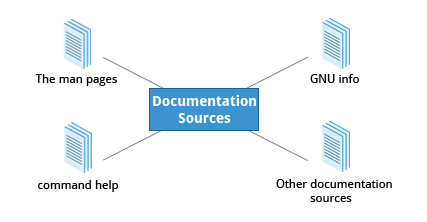

== Chapter 8: Finding Linux Documentation

Linux is very vast, and we may not always know or remember the proper use of commands and utilities.
Hence, we will need to consult help documentation regularly.

In most cases, the documentation is well-made and well-organized, but sometimes it can be lacking in depth or clarity.
In such cases, due to the open nature of linux, it is easy to find support online.

=== Sources
Linux draws from various sources and hence there are various sources for documentation as well.

.Documentation sources

=== The `man` pages
The manual pages present in all linux distributions provide in-depth documentation about programs, utilities, configuration files, system call APIs, library routines, and the kernel.
They can be accessed using `man` command:
----
man <topic_name>
----
But, any given topic might have multiple pages associated with it.
To see available pages specific to the topic:
----
man -f <topic_name>
----
or
----
whatis <topic_name>
----

To list all pages that have a particular topic name in their name/description:
----
man -k <topic_name>
----
or
----
apropos <topic_name>
----

Each man page can have multiple chapters numbered 1-9, and a specific chapter can be accessed by:
----
man <ch_nb> <topic_name>
----
|===
|Chapter number |Contents

|1
|User Commands

|2
|System Calls

|3
|C Library Functions

|4
|Devices and Special Files

|5
|File Formats and Conventions

|6
|Games et. al.

|7
|Miscellanea

|8
|System Administration tools and Daemons

|9
|Kernel routines and Documentation

|n
|New, mainly used by Tcl/TK
|===
In addition, sometimes chapters may have suffixes:
|===
|Suffix |Meaning

|p
|POSIX

|x
|X Window System
|===

[NOTE]
====
Doing:
----
man <topic_name>
----
will open the first available chapter.
====

To see all the chapters, one after the other
----
man -a <topic_name>
----

=== The GNU Info System
Documentation in GNU project's standard documentation format which is basically `man` with topics connected using links which can be viewed via CLI, GUI app or online etc.

Can be accessed using:
----
info <topic_name>
----
All the links are organized like hierarchical tree.
They are prefixed by `*`, you can move your cursor to the link and press enter to access it.
|====
|Key |Function

|`n`
|Go to next node

|`p`
|Go to previous node

|`u`
|Go to upper node

|`l`
|Go to last visited node

|`space` or `PageDown`
|Go to next page

|`delete` or `backspace` or `PageUp`
|Go to previous page

|`/` or `ctrl+s`
|Search for the string prompted for

|`i`
|Search for a node containing the string prompted for
|====
[NOTE]
====
At the top of each page its next, previous and upper links are listed
====
To search for a particular word, you can do `/` and then on prompt type the word you are searching for.
[TIP]
====
Press `h` to get a help, listing all the keystroke bindings
====

=== `--help` option
Most commands have a `-h` or `--help` option which can be used to get command usage info.
----
<cmd> -h
----
[NOTE]
====
Simply doing:
----
help
----
displays synopsis of all available built-in commands.
You can also do:
----
help <command>
----
====

=== Other sources
.Other sources
image::pix/LFS01_ch07_screen23.jpg[Other sources]

==== Desktop help system
Distribution's GUI help systems, for example `khelpcenter` for kde.

==== Package documentation
Found in `/usr/share/doc`

==== Online resources
* https://linuxcommand.org/tlcl.php[Good book]
* https://help.ubuntu.com/[Distribution help]
* https://www.google.com[Duh!]
