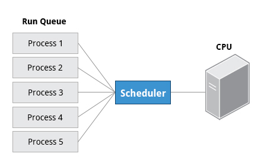

== Chapter 9: Processes

=== Intro to processes and its attributes

A process is an instance of one or more related tasks.
A process uses memory, CPU and may also use resources such as hard disk, printers etc.

.Processes
image::pix/LFS01_ch16_screen03.jpg[Processes]

[IMPORTANT]
====
Process is not same as a program or a command.
A single program can start several processes at the same time which may or may not be dependent on and/or related to each other.
====

The OS(mainly kernel) is responsible in ensuring that each process gets a proper share of all the resources.

==== Types
|====
|Process Type |Description |Example

|Interactive Processes
|Need to be manually started by a user.
|bash, firefox, top

|Batch Processes
|Automatic processes which are scheduled from the terminal and then disconnected from it.
These tasks are queued and work on a FIFO (First-In, First-Out) basis.
|updatedb, ldconfig

|Daemons
|Server processes that run continuously in the background.
Usually, they are launched during system startup, and they wait for a user or system to give them a service request.
|httpd, sshd, libvirtd

|Threads
|Lightweight processes.
These are tasks that can be invoked by a process at anytime.
All the threads belonging to a process share memory and other resources, but they are scheduled and run on the CPU on an individual basis(like a process).
An individual thread can end without terminating the whole process, but if a process terminates all its threads are terminated.
Many non-trivial programs use multiple threads.
|firefox, gnome-terminal-server

|Kernel Threads
|These take care of Kernel tasks which users neither start nor terminate and have little control over.
These may perform actions like moving a thread from one CPU to another, or making sure input/output operations to disk are completed.
|kthreadd, migration, ksoftirqd
|====

==== Scheduling
Scheduling a process i.e. when to run/pause what process is a critical kernel function.

.Scheduling

===== States
Based on availability of resources, a given thread may be in:

* Running state:
+
It is either currently running on a CPU or waiting(in a queue called run queue) to be assigned its time slice to run on a CPU

* Sleep state:
+
It is waiting(in a queue called wait queue) for an event to occur or for a resource to be available in order to resume their execution

* Zombie state:
+
It has completed its execution but the parent is still not aware and hence has not cleaned up the resources allocated to it

===== Priorities
Some processes are more important than other and a process' importance/priority is identified via a number called a nice value.
Higher priority processes get preferential access to CPU and other resources.
[NOTE]
====
In linux priorities go from [-20, 19] where -20 represents the highest priority and 19 the lowest.
====

To time sensitive tasks a real-time priority can be assigned.
[WARNING]
====
But that doesn't mean linux can be a hard real-time OS, with `real-time priority` we can assign very high priority pushing linux towards soft real-time.
====

To see the current process invoked from current terminal, their IDs, and priorities:
----
ps lf
----
To change the priority of the process:
----
renice <value> <PID>
----
[IMPORTANT]
====
As a non-superuser you may decrease the priority but to increase the priority you'll need root privileges
====

==== IDs
At any given point in time, a system will be executing multiple processes and in addition any of these may be executing multiple threads.
The OS assigns a unique ID to each of the process to keep track of its state, CPU, memory and other resource usage.

|====
|ID Type |Description

|Process ID (PID)
|A unique number assigned to the processes in the ascending order of their birth.
Hence, `/sbin/init` will have PID of 1

|Parent Process ID (PPID)
|PID of the process that started a process.
If the parent dies, the PPID will refer to an adoptive parent; on recent kernels, this is `kthreadd` which has PPID=2.

|Thread ID (TID)
|TID = PID for single-threaded processes.
In a process with multiple threads, each thread has the same PID, but has a unique TID.
|====

==== Termination
To eliminate a process
----
kill -SIGKILL <pid>
----
or
----
kill -9 <pid>
----

[IMPORTANT]
====
Unless you are a root user(or have root privileges), you can only kill your own processes but not that of the system or other users
====

==== User and Group IDs
The OS uses Real User ID(RUID) to identify the user who starts a process.
The user who determines the access rights of the users is identified by Effective UID(EUID).

[WARNING]
====
EUID may or may not be the same as RUID
====

The users can belong to one or more groups each of which are identified by Real Group ID(RGID) and the access rights of the group are determined by Effective GID(EGID).

.User and Group IDs
image::pix/LFS01_ch16_screen07.jpg[User and Group IDs]

=== Processes metrics and control
==== Load Average
A load average is the average of the load number for a given period of time.
Load average takes into account processes that are in:

* Active state
* Waiting state: runnable have got the resource needed to run but are waiting to be scheduled CPU time)
* Sleeping state(here we consider uninterruptible sleeper i.e. ones which cannot be awakened easily)

It can be seen by running:
----
w
----
or
----
top
----
or
----
uptime
----

The results yield a list of 3 numbers depicting the load averages over the last minute, last 5 minutes and the last 15 minutes.
[WARNING]
====
In a multicore CPU system, the load average number represents the load average across all the CPUs.
Hence, we will need to divide it by the number of CPUs.
====
Comparing the load average with the number of running process help determine if system has reached its capacity or if a particular user is running too many processes.
A load average number greater than 1.0 means there are more processes that need CPU than what is available.
A very high load average is indicative of a problem such as a runaway process i.e. a process in a non-responding state.

A high peak normally indicates a burst of activity.
A high peak seen in 1-minute average is not a problem but in a 5 or 15-minute average it may be a cause of concern.

==== Background and Foreground Processes
Linux can run commands launched from the terminal in the foreground or the background.
These commands are also referred to as jobs.

When a job is run in the foreground, all other jobs that require terminal will need to wait for the foreground job to complete its execution.
This can cause problems if the job takes a very long time to complete.
In such a case it can be run in the background and terminal can be made free for other jobs.

To see the list of all jobs running in the background, their, state and command name:
----
jobs
----
To get the PID of the background jobs:
----
jobs -l
----
[WARNING]
====
When a terminal is closed, the background jobs invoked from it are still running, but we cannot get the info of these jobs from a new terminal using `jobs` command.
====

The terminal process has a high priority as it needs to interact with the user, jobs that are run in the background has lower priority compared to the jobs that are run in the foreground.

To run a job in the background:
----
<cmd> &
----
To suspend(pause) a foreground job, `Ctrl-Z` and to terminate a foreground job, `Ctrl-C` can be used.
To push the last foreground running/suspended job to run in the background:
----
bg
----
To push the last background running command to run in the foreground:
// does this also include suspended command?
----
fg
----

=== Listing processes
==== `ps`
To see all the processes invoked by current terminal:
----
ps
----
|====
|Option |Information

|`e`
|List all processes in system

|`f`
|PID, PPID, UID

|`l`
|Priority, Nice number

|`L`
| Show each thread
|====
[NOTE]
====
If a process name is enclosed in square brackets, then it is a kernel process
====

Alternatively, you can use only arguments without options:
|====
|Argument |Information

|`aux`
|Options `e`, `f`(except PPID), and CPU load & Mem consumption

|`axo <comma_seperated_attributes>`
|Specified attributes
|====

===== `pstree`
Shows the running processes in a tree showing the relationship between a process and its parent and children.
[NOTE]
====
Repeated entries are emitted and threads are enclosed in curly braces
====

==== `top`
For a continuous and live monitoring, `top` or its variants such as `htop` or `atop` can be used.
By default, the output is updated every 2 seconds.

With this utility, you get additional information, for example, in third line you can see % of:

* CPU time spent by kernel and user processes
* jobs running at a low priority/niceness
* jobs that are idle
* jobs that are waiting
* hardware interrupts
* software interrupts
* steal time

You can also see memory usage(total, free, and used) in both RAM and swap.
If system is using swap very often, you need to check your memory intensive application or consider adding more RAM.

In the panel you have various information:
|====
|Column Name |Parameter

|PID
|Process Identification Number

|USER
|Process Owner

|PR
|Priority

|NI
|Nice values

|VIRT
|Virtual memory

|RES
|physical memory

|SHR
|shared memory

|S
|Status

|%CPU
|Percentage of CPU used

|%MEM
|Percentage of memory used

|TIME+
|Execution time

|COMMAND
|Command

|====

[IMPORTANT]
====
Press `h` for help
====

[TIP]
====
To get all the virtual memory statistics every 2 seconds:
----
vmstat -a 2 1000
----
====

=== Misc monitoring tools
Apart from already discussed `top`, `uptime`, `ps`, `pstree`, few other interesting tools are:

|====
|Utility |Purpose |Package

|`mpstat`
|Multiple processor usage
|`sysstat`

|`iostat`
|CPU utilization and I/O statistics
|`sysstat`

|`sar`
|Display and collect information about system activity
|`sysstat`

|`numastat`
|Information about NUMA (Non-Uniform Memory Architecture)
|`numactl`

|`strace`
|Information about all system calls a process makes
|`strace`
|====

=== Starting processes in the future
To schedule a job to run at a desired time in the future, several utilities are available.

==== `at`
* To schedule a job:
** Run the utility:
+
----
at <sch_time>
----
+
[NOTE]
====
Read `man` page to see how to enter the `<sch_time>`
====
+
Then a prompt `at>` is displayed.
** Now type your commands.
+
[IMPORTANT]
====
The command will run in the directory from which you schedule it with `at`
====
** Press `Ctrl-D` to quit.

+
You'll see your normal prompt.

* To delete a scheduled job
** Get the job number:
+
----
atq
----
** Delete the job:
+
----
atrm <job_nb>
----

==== `cron`
It can be used to schedule jobs at specific times and/or periodic intervals.
It is driven by a configuration file `/etc/crontab` which contains the commands and their scheduling information.

* Open configuration file
+
----
crontab -e
----
* Each line is formatted as:
+
----
<Min> 
 <Day_of_Month> <Month> <Day_of_Week> <Cmd>
----
+
Examples:

** The entry:
+
----
* * * * * /usr/local/bin/execute/this/script.sh
----
+
will schedule a job to execute `script.sh` every minute of every hour of every day of the month, and every month and every day in the week.
** The entry:
+
----
30 08 10 06 * /home/sysadmin/full-backup
----
+
will schedule a `full-backup` job at 8.30 a.m., 10-June, irrespective of the day of the week.
* Edit the configuration file add, modify or remove job(s)

