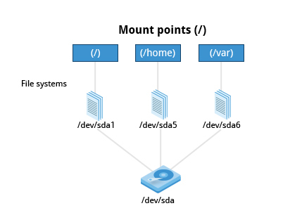

== Chapter 10: File operations
=== Filesystems
[quote]
____
in linux everything is a file
____
It means both document files, and resources such as hardware can be interacted with same kind of IO operations.
In other words, apis such as `open`, `read`, and `write` can be used with every resource(if you have sufficient privileges).

.Filesystem
image::pix/LFS01_ch08_screen_03.jpg[Filesystem]

==== Mounting and Unmounting
===== `mount`
To start using a new filesystem(files of an usb key for example), we need to attach it on the existing filesystem tree at a mount point:
----
mount <dev_node> <mount_point>
----
Option `L`, and `U` can be used to mount a filesystem using a Disk label and UUID in place of a device node.
The mount point is normally an empty directory(which already exists in current filesystem).

.Mount Points

[WARNING]
====
Mounting on a non-empty directory will render its contents invisible(and inaccessible) until the new filesystem is unmounted.
====

[NOTE]
====
A partition can be mounted in more than one place, and the changes are effective in all locations.
====

`mount` can also mount a NFS partition locally:
----
mount <ip>:<remote_path> <local_mount_location>
----

Device nodes are automatically created by the kernel when a device is connected.
For storage devices you can do:
----
lsblk -f
----
or
----
blkid
----
For everything else, check the output of kernel buffer:
----
dmesg
----
To have a continuous update, you can use option `w`.

===== `umount`
To detach a filesystem, we need to unmount it from existing filesystem:
----
umount <mount_point>
----

==== Network Filesystems
A Network FileSystem(NFS)(also called as distributed filesystem) may have all its data on one machine or have it spread out across several either in the same location or spread out anywhere that can be reached by the internet.
NFS can be seen as an abstraction over grouping of lower filesystems of varying types.

.The Client-Server Architecture of NFS
image::pix/nfs.png[]

Most common use case is system administrators mount remote users' home directories on a server to give them access to the same files and configuration files across multiple client systems(different computers).

===== NFS on server
The NFS needs `nfs` daemon to be running which can be done by:
----
systemctl start nfs
----
or can also be configured to run automatically at startup:
----
systemctl enable nfs
----
[NOTE]
====
After enabling, don't forget to run it for this time using:
----
systemctl start nfs
----
====

The directories to be shared over NFS and their permissions are configured in text file `/etc/exports`:
----
<nfs_shared_directory> <hostname>.<domainname>(<permissions>)
----
An example:
----
/projects *.example.com(rw)
----

[WARNING]
====
After modifying `/etc/exports`, don't forget to:
----
exportfs -av
----
====

===== NFS on client
You can either manually mount:
----
mount <server_name>:<server_directory> <mount_point>
----
or auto-mount on startup by adding an entry into `wtc/fstab`:
----
<server_name>:<server_directory> <mount_point> nfs defaults 0 0
----

=== Filesystem Architecture
==== `/home` and `/root`
A user's home directory is used to store personal settings, files, etc.

Each user has a home directory placed under `/home`.
If a user belongs to a group, then user's home directory is at `/home/<group_name>/<user_name>` otherwise it resides at `/home/<user_name>`.
The root user's home directory is at `/root`.

.Home Directories
image::pix/Home_directories.png[Home Directories]

It is often mounted as a separate filesystem residing on its own partition and/or shared via NFS

[TIP]
====
Keep `/home` in a separate partition to enforce clear separation between OS and user files(documents, music, video, photos etc).
This way you can independently upgrade OS without risking losing your personal data.
====

==== `/bin` and `/sbin`
`/bin` contains executable binaries and essential commands to boot the system or use it in single-user mode such as `cat`, `ls` etc. while `/sbin` contains binaries related to system administration such as `fsck`, `ip` etc.

The rest of the binaries are placed under `/usr/bin` and `/usr/sbin`.
[WARNING]
====
After such an organization they found out that, in all the systems it is impossible to boot or operate in single-user mode without binaries in `/usr/bin` and `/usr/sbin`.
Hence, in today's all the binaries from `/usr/bin` and `/usr/sbin` are moved to and are replaced by just a symbolic link to `/usr/sbin` and `/sbin` respectively.
====

==== `/proc`
`/proc` is a pseudo-filesystem as it has no permanent presence on anywhere in the disk and resides only in RAM.
It contains virtual files whose contents are gathered only when viewed.

Every process has a directory at `/proc/<PID>` which contains vital information about it and the directory `/proc/sys` contains loads of information about the entire system.
[NOTE]
====
`/proc/self` contains data of the process that accessed it
====

Some very useful files under `/proc` are `cpuinfo`, `interrupts`, `meminfo`, `mounts`, `partitions`, `version`.

==== `/dev`
`/dev` is an empty directory used to mount a pseudo-filesystem which contains device nodes used by most hardware, and software devices, except network devices.

==== `/var`
`/var` contains files that change in size, and content as the system is running.

.`/var` directory
image::pix/varfolders.png[/var directory]

Some important directories under `/var` are:
|====
|Directory |Content

|`log`
|System log files

|`lib`
|Package and database files

|`spool`
|Print queues

|`tmp`
|Temporary files

|`ftp`
|FTP service

|`www`
|HTTP web service
|====

[TIP]
====
Mount `/var` in its own partition so that growth of giles can be accommodated and filesystem is safe from any exploding file sizes.
====

==== `/etc`
`/etc` contains system configuration files.
[IMPORTANT]
====
The configuration files here are for system-wide configuration.
User specific configuration files are found under user's home directory.
====
It has no binaries but may contain some executable scripts.

Few notable examples under `/etc/`, `resolv.conf` for DNS settings, and `passwd`, `shadow`, & `group` for user account management.

==== `/boot`
`/boot` contains files needed to boot the system.
Each kernel installed on system has 4 files:

* `vmlinuz`: Compressed linux kernel
* `initramfs`: Initial ram filesystem
+
[NOTE]
====
`initramfs` is sometimes also called as `initrd`
====
* `config`: Kernel configuration file used for debugging and bookkeeping
* `System.map`: Kernel symbol table used for debugging

[NOTE]
====
Each of the files is suffixed by the kernel version
====

The GRUB bootloader files are found at `/boot/grub` or `/boot/grub2`.

==== `/lib` and `/lib64`
`/lib` and `/lib64` contains libraries(32-bit and 64-bit versions respectively) required by programs in `/bin` and `/sbin`.
The library file names start with `ld` or `lib`.
They are normally dynamically loaded libraries aka shared libraries or Shared Objects(SO).

Kernel modules(kernel code, and device drivers that can be loaded and unloaded at runtime) can be found under `/lib/modules/<kernel_ver_nb>`.

[NOTE]
====
In today's system `/lib` and `/lib64` is a symbolic link to directories of same name but under `/usr`
====

==== `/media`, `/run` and `/mnt`
`/media`, and `/run/media/<username>` are used to mount removable media such USBs, CDs, and DVDs.
`/run` also contains system information data describing system since it was booted.
`/mnt` is used for temporarily mounting filesystems which can often be NFS, or loopback filesystems etc.

==== `/usr`
A system should be able to boot and go into single user, or recovery mode, with only the `/bin`, `/sbin`, `/etc`, `/lib`, and `/root` directories mounted, while the contents of the `/boot` directory are needed for the system to boot in the first place.

Many of these directories (such as `/etc`, and `/lib`) generally have subdirectories for specific applications or sub-systems.
Two of them, `/usr` and `/var`, are relatively standardized.

|====
|Subdirectory under `/usr` |Usage

|`include`
|Header files used to compile applications

|`lib` and `lib64`
|Libraries for programs in `/usr/bin` and `/usr/sbin`

|`sbin`
|Non-essential system binaries, such as system daemons

|`share`
|Shared data used by applications, generally architecture-independent

|`src`
|Source code, usually for the Linux kernel

|`local`
|Data and programs specific to the local machine; subdirectories include `bin`, `sbin`, `lib`, `share`, `include`, etc.

|`bin`
|Primary directory of executable commands on the system
|====

==== Misc
|====
|Directory Name |Usage

|`/opt`
|Optional application software packages

|`/sys`
|Virtual pseudo-filesystem giving information about the system and the hardware.
Can be used to alter system parameters and for debugging purposes.

|`/srv`
|Site-specific data served up by the system.
Seldom used.

|`/tmp`
|Temporary files erased across a reboot and/or may actually be a ramdisk in memory

|====

=== Comparing files
==== `diff`
`diff` is a utility to compare two files or directories.
Simplest usage:
----
diff <original_file> <modified_file>
----
This outputs differences in the form:
----
<start_line_original>,<end_line_original><action><start_line_modified>,<end_line_modified>
< <start_line_original_content>
> ...
< <end_line_original_content>
---
> <start_line_modified_content>
> ...
> <end_line_modified_content>
----
`<action>` can be:

* `a` for addition
* `d` for deletion
* `c` for changing

`<` represents contents of original file.
`>` represents contents of modified file.

Modifications to files are distributed using patches which contains changed required to update an older version file to a newer version.
To see the changes in the patch format option `u` can be used which would produce output:
----
--- <original_file>
<original_file_time> -<original_file_permissions_octal_nb>
+++ <modified_file>
<modified_file_time> -<modified_file_permissions_octal_nb>
@@ -<start_line_original>,<end_line_original> +<start_line_modified>,<end_line_modified> @@
...
<common_content>
-<original_file_content>
-<original_file_content>
+<modified_line_content>
+<modified_line_content>
<common_content>
...
----
This is more concise to distribute as a patch file rather than the entire file.
Additionally, option `r` shows diff of all the files recursively and option `N` shows diff of directory tree.

Hence, Patches are produced by:
----
diff -Nur <original_file> <modified_file> > <patch_file>
----

Patches are applied using `patch` tool.
To apply patch to entire directory tree, while at the directory tree:
----
patch -p1 < <patch_file>
----
To apply patch to a particular file:
----
patch <original_file> <patch_file>
----
[TIP]
====
While applying the patch, just to preview how it might look like later, you can do:
----
patch <options_arguments> --dry-run
----
====

To undo an applied patch:

* To a directory:
+
----
patch -R -p1 < <patch_file>
----
* To a file:
+
----
patch -R <patched_file> <patch_file>
----

==== `diff3`
`diff3` is a utility to compare three files at once among which one file acts as a reference basis for the other two:
----
diff3 <original_file> <modified_file1> <modified_file2>
----

=== File types

In linux everything is a file, and its types(and the character used to represent it in `ls` output) are:

* Normal file(`-`) and directory(`d`)
+
These are the basic entries in the filesystem structure

* Symbolic links(`l`)
+
A reference to somewhere else on the system

* Named pipe(`p`)
+
Also called as FIFO(First In, First Out) are used for interprocess communication(ipc)

* Unix domain sockets(`s`)
+
Also used for ipc but via networking infrastructure and also has more capabilities than `p`

* Block device(`b`) and character device(`c`)
+
Both these are mounted in `/dev` directory

** Block devices read and write in fixed size chunks which is normally buffered and cached.
Example, USB key.
** Character devices read and write streams of data
Example, sound card.

==== `file`

Unlike other OS in linux, a file extension has little to no meaning to the system.
It is just used for the user's sake.

Most applications directly examines a file's contents regardless of its extension.

To get the real nature of a file:
----
file <file_name>
----

=== Backing up and Compressing data
==== Backing up data
The simplest and the most trivial way is to do a copy:
----
cp -r <src_dir_file> <dst_dir_file>
----

`rsync` is more robust utility.
It is more efficient and fast because before copying it checks if the file being copied already exists and also if the file does exist, it checks if there is no change in size or modification time, to avoid unnecessary copying.

Unlike `cp` which can only copy files on the local machine or a filesystem mounted on the local machine(for example, usb key, NFS etc.), `rsync` can be used to copy files from one machine to another(there is no requirement that either of the machines has to be a local machine i.e. the machine where the command is executed on).
To use `rsync` for archiving:
----
rsync -r <src_machine>:<src_dir> <dst_machine>:<dst_path>
----
[WARNING]
====
Accidental misuse `rsync` can be very destructive.
Hence, do:
----
rsync <option_arguments> --dry-run
----
before executing the actual command
====

==== Compressing data
File compression can save space and time taken to transfer it.

Linux has variety of methods for file compression.

|====
|Command |Usage

|`gzip`
|Works Very well & fast and the most frequently used Linux compression utility

|`bzip2`
|Produces significantly smaller files than those produced by `gzip` and hence slower

|`xz`
|The most space-efficient(hence the slowest) compression utility used in Linux

|`zip`
|Legacy program that is not used in linux but is often required to examine and decompress archives from other operating systems

|`tar`
|Tape ARchive(tar)(was used to archive files to a magnetic tape) groups files in an archive and then compresses the whole archive at once as a tarball.
|====

[NOTE]
====
`bzip2` is deprecated in favor of `xz`
====

==== Disk-to-Disk Copying
`dd` is a utility used to make copies of raw disk space to replicate an exact copy of one disk on another:
----
dd if=<src_disk_dev_node> of=<dst_disk_dev_node>
----

[WARNING]
====
Making raw copy of one disk on another will erase all the data that exists in the destination disk.
====
 
