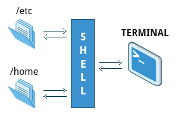

== Chapter 12: User Environment

=== Accounts, Users and Groups
Linux is a multi-user OS meaning multiple users can log on at the same time.
To get username of current user:
----
whoami
----
To get info of all users:
----
who
----

Additionally, there are utilities such as `finger`, a user information lookup command which gives details of all the users logged in.

==== Users and Groups
Groups are a set of accounts having same level of access, and permissions for various files and directories.
Access rights to files are granted on the basis of the user and the group that they belong to.
Existing groups and their members are defined in `/etc/group`.

All users are assigned a unique id which is normally an integer 1000 or greater.
Every group has a unique ID called Group ID(GID) and these are defined in `/etc/passwd` and `/etc/group`.
[NOTE]
====
By default, every user belongs to primary group.
Whenever a user logs in, the group membership is set to primary group.
The GID of primary group = UID
====

A user can belong to multiple groups, hence multiples GIDs can be associated with a UID.

===== The root account
The root, aka superuser, account is the administrator account which has full power over the system.
To temporarily give some limited privileges to regular user accounts:
----
sudo <cmd>
----
[NOTE]
====
In some distributions, you'll need to enable `sudo` to a user account.
The configuration file `/etc/sudoers` and directory `/etc/sudoers.d` drives this.

To make changes for local users, go to `/etc/sudoers.d/` instead of directly modifying this file `/etc/sudoers`.

See the man page for details on how to write a sudoers file.
====

===== Adding and Removing Users
[NOTE]
====
You need root privileges to add and remove users and groups.
====

* To add a new user:
+
----
/usr/sbin/useradd -m -c "<comment>" <new_username>
----
option `m` creates a directory `/home/<new_username>` and populates it with files copied from `/etc/skel` while option `c` is a comment which can be used to give user's full name.
+
[NOTE]
====
You can check contents of `/etc/skel`:
----
ls -al /etc/skel
----
Anything you put here will be copied into `/home/<new_username>`
====
+
Also, to the file `/etc/passwd` it adds the line:
+
----
<new_username>:x:<uid>:<gid>:<comment>:/home/<new_username>:/bin/bash
----
and to file `/etc/group` it adds/updates the line:
+
----
<group_name>:x:<gid>:<group_members>
----
+
[NOTE]
====
The parameters of the line are controlled by the file `/etc/default/useradd`
====

* To provide a password:
+
----
passwd <username>
----
+
[TIP]
====
To make sure the user account is set up well:
----
grep <username> /etc/passwd /etc/group
----
====

* To change user accounts characteristics `usermod` can be used.

* To log in to the account from the shell:
+
----
ssh <username>@<domain>
----
+
where `domain` is `localhost` if you are logging in on the same machine.

* To log out(on the same shell):
+
----
exit
----

* To switch to another user:
+
----
su <username>
----
+
following this you'll be prompted to enter the password of the user account.
But, you'll still be in the same directory where you executed the command.
This should not be a cause of concern thanks to file permissions.
In any case, to change the pwd to home directory of the user account that we are logging into, then use `-` after `su` in the command above.
+
If you omit the argument `<username>`, you will log in to the root account after entering the root password.
+
[WARNING]
====
If you give out root password, there is no way to ensure that it will not be abused.
Hence, it is a bad practice to use `su` to become root rather using `sudo`(which will require not the root password, but the user's own password) to temporarily get some limited privileges is much preferred.
====
+
[CAUTION]
====
`su` starts an entirely new shell, independent of the one currently running your script.

`su; <cmd>` will start a root shell and wait for it to exit before running `<cmd>`.
It will not start a root shell and then proceed to run `<cmd>` in it.

To run commands as another user, use:

----
su -c "<cmd>"
----
====

* To remove a user:
+
----
/usr/sbin/userdel -r <new_username>
----
+
option `r` makes sure that not only is the user account deleted but also the directory `/home/<username>`.
+
[TIP]
====
You can crosscheck by:
----
ls -l /home
----
====

* To get info about a user:
+
----
id <username>
----
+
to get info about yourself, you can omit the `<username>` field.

===== Adding and Removing Groups
* To create a new group:
+
----
/usr/sbin/groupadd <group_name>
----

* To delete a group:
+
----
/usr/sbin/groupdel <group_name>
----

* To list the users of a particular group:
+
----
/usr/sbin/usermod -G <group_name> <group_name>
----

* To list groups that a user belongs to:
+
----
groups <username>
----

* To add a user to a group:
+
----
/usr/sbin/usermod -a -G <group_name> <username>
----
+
where option `a` makes sure that new user is appended to the group rather than replace all the existing users of the group.

* To delete a user from a particular group:
+
----
/usr/sbin/usermod -G <group_list_excluding_unsubscribing_group> <username>
----
where argument `group_list_excluding_unsubscribing_group` is provided as a comma seperated list with no whitespaces.

==== User startup files

In linux there are 3 types of shells:

* Login shell: requires logging in
* Interactive shell: terminal program to which the standard input/output streams are connected
* Non-interactive shell: one where the standard input/output streams are connected to process etc.

To configure the user environment, command shell based on its type uses one or more startup files.

.User Startup files

Some configurations are:

* CLI customization
* CLI shortcuts and aliases
* Default application settings
* Executable path

After login, the login shell reads the system-wide configuration at `/etc/profile` and then looks for the following files in the listed order:

* `~/.bash_profile`
* `~/.bash_login`
* `~/.profile`

Whichever is available first, the system-wide configuration are overridden with that and the rest are ignored.
And upon logout `~/.bash_logout` is read if it exists.

Everytime, a new terminal(interactive shell)/non-interactive shell is opened, `~/.bashrc` is read to load configuration.

.Order of User Config Startup files
image::pix/bashinit.png[Order of User Config Startup files]

==== Aliases
Aliases are used to create custom commands or modify the behavior of existing commands.
Normally, they are listed in `~/.bashrc`

* To view all the current aliases:
+
----
alias
----

* To create an alias:
+
----
alias <alias>=<cmd>
----
+
[NOTE]
====
If there is a white space in your command, use double quotes and if there is a white space within a command argument, use a single quote
====

* To delete an alias:
+
----
unalias <alias>
----

=== Environment Variables
They are variables which can be utilized by the terminal and other applications.
They are not limited in length or number.
Some are preset values which can be overridden, while others are created by the user.

==== Working with Environment variables
* Use
+
----
<command>$<env_var_name><command>
----

* View
** All
+
----
set
----
+
[NOTE]
====
`set` produces a very lengthy output, which sometimes might include some code at the end.
Without paging the output, we might see only some code on the terminal which could cause us to think that `set` is not the right command.
Hence, pipe output of `set` to an application such as `less`:
----
set | less
----
====
+
or alternatively, you can do
+
----
export
----
+
or
+
----
env
----

** Specific
+
----
echo $<env_var_name>
----
* Create(if it doesn't exist) or replace(if it exists)
+
----
export <env_var_name>=<env_var_val>
----
+
or alternatively, you can set it only for the command that you are executing:
+
----
<var_name>=<var_value> <cmd>
----
+
now the command takes in the environment variables not as an argument but as a value to be used during its execution.
For example:
+
----
TRY=try echo $TRY
----
+
prints nothing coz `TRY` doesn't exist, but if a script `trial.sh`:
+
----
echo $TRY
----
+
is run as:
+
----
TRY=try ./trial.sh
----
+
you'll see output:
+
----
try
----
+
[TIP]
====
Whenever you want to modify an environment variable, back up the current one first and then make your modifications:
----
OLD_<env_var_name>=$<env_var_name>
<env_var_name>=<env_var_val>
----
this way you can test your variable first, either by:
----
echo $<env_var_name>
----
or by running your command.
If you are happy with the change, before closing the shell you can do:
----
export <env_var_name>
----
Once you close the shell, the variable that you created `OLD_<env_var_name>`, is lost.cwd
====
+
[NOTE]
====
An environment variable can be defined using another one.
For example,
----
PATH=$HOME/bin:$PATH
----
which you may or may not export
====
+
[WARNING]
====
Adding `./` to your `PATH` is a security risk.
An unfriendly user might substitute a commonly used program with a harmful executable of same name in a folder from which you frequently open shell, tricking you to inadvertently run the harmful program.
====
* Delete
+
----
unset <env_var_name>
----

[WARNING]
====
Whatever changes(CRUD) you make to environment variables will be lost after the bash is closed.
To make all the changes persist, you'll need to put all your commands that you used to change the environment variables in a file `~/.bashrc` or `~/.bash_profile` or similar file related to your terminal emulator.

After you make this change in the file, in the current already open terminal don't forget to:
----
source <env_var_file>
----
or
----
. ~/.bashrc
----
or start a new terminal:
----
bash
----

====

==== Some notable environment variables
* `HOME` represents `~/` of the current user.

* `PATH` is an ordered list of directories which is scanned for a binary or a script to run when a command is executed.
+
The ordered list is built as:
+
----
<path_1>:<path_2>:<path_3>:<path_n-1>:<path_n>
----
+
[NOTE]
====
an empty `<path_i>` represented as:
----
:<path_2>:<path_3>
----
or
----
<path_1>::<path_3>
----
indicates the present working directory at any given time.
As the list ordered, in the first case, pwd is checked for the binary/script first and then `<path_2>` followed by `<path_3>` while in the second case, `<path_1>` is checked, then pwd followed by `<path_3>`.
====
+
Updating `PATH` to scan a new path before scanning any of the current paths in `PATH`:
+
----
export PATH=<new_path>:$PATH
----

* `SHELL` defines the full path to user's default command shell

* Prompt Statement(PS) is used to customize the prompt string of the terminal.
By default, for non-root users the prompt starts with `$` and `#` for root users.
This can be changed by changing the Environment variable `PS1`.
Special characters allowed in `PS1` are:

** `\u` - user name
** `\h` - host name
** `\w` - present working directory
** `\!` - history number of the command
** `\d` - date
+
----
export PS1='\u@\h:\w$ '
----
+
will yield a prompt:
+
----
<username>@<hostname>:<pwd>
----

==== Recalling Previous Commands
Bash keeps track of previously entered commands(and statements), which can be recalled via up and down cursor keys, in a file `~/.bash_history`.
To view the history of stored commands:
----
history
----
Here, the most recent command appears last in the list.
[NOTE]
====
The commands typed in each bash is not saved until the bash is closed.
====

All the `history` related configuration is driven by its environment variables:

* `HISTFILE`: location of history file
* `HISTFILESIZE`: max number of lines in history file
* `HISTSIZE`: max number f commands in history file
* `HISTCONTROL`: how commands are stored
* `HISTIGNORE`: commands to not save in history file

[TIP]
====
To get quick overview:
----
set | grep HIST
----
====

To get a suggestion based on history press `Ctrl-R` and start typing your command.

To simply execute the last command:
----
!!
----
also called as bang-bang.

To execute the n^th^ command in history
----
!n
----
[WARNING]
====
Here `n` starts from 1 not 0.
====

To get the last argument typed in the last command:
----
!$
----

To get the last command that starts with a particular string:
----
!<cmd_starting_string>
----

=== File ownership
In linux, every file has an owner and also a group.
Every file has 3 types of permissions: read(`r`), write(`w`), and execute(`x`).

==== File permission modes
The file permission is represented as `rwx` is defined across 3 groups of owners: user(`u`), group(`g`) and others(`o`).
Hence, for any file, we have 3 groups of 3 permissions:
----
rwx: rwx: rwx
 u:   g:   o
----
[NOTE]
====
`ls` with option `l` outputs in the first column file type(first character) and file permissions(next nine characters).
If any of the `rwx` permission for `ugo` is granted, corresponding `rwx` character is displayed and if permission is denied, you'll see `-` in the corresponding permission field.
====
These permissions can be modified using `chmod`:
----
chmod <owner_group><+_-><permission_type> <file_name>
----
`<owner_group>` can be:

* a single owner group in which case you'll represent using corresponding character(`u` or `g` or `o`) or nothing to represent current user
* two owner groups, then you'll join the characters(for example, `uo` for user and others)
* all the owner groups, then you can use the character `a` which represents all

`<+_\->` means one character amongst `+`(for adding permission) and `-`(for removing permission)

`<permission_type>` can be:
* a single permission in which case you'll represent using corresponding character(`r` or `w` or `x`)
* two or all permissions then you'll join corresponding characters(for example, `rw` for read and write and `rwx` for read, write and execute)

[NOTE]
====
Various permission operations can be combined.
For example, instead of doing:
----
chmod uo+x file_name
chmod g-w file_name
----
we can do:
----
chmod uo+x,g-w file_name
----
====

Alternatively, one can assign treat each character in `rwx: rwx: rwx` as a binary number(bit) and set/clear it and convert it into an octal number do:
----
chmod <permission_mode_octal_nb> <file_name>
----

===== Default permission
No newly created file can by default have an executable permission(`x`).
For any new file that is created by a user, the default `rw` permissions for `ugo` groups depend upon their 4-digit `umask` value:
----
default permission octal number = Octal666 & ~(umask)
----

To check current mask value:
----
umask
----
To set mask value:
----
umask <mask_value>
----

==== File owner
To change owner of the file:
----
chown <username> <file_name>
----

To change group of file:
----
chgrp <group_name> <file_name>
----

To change owner and group of the file:
----
chown <username>.<group_name> <file_name>
----

[NOTE]
====
`chown`, `chgrp`, and `chmod` takes option `R` which performs the action recursively.
====

[WARNING]
====
To perform `chown`, `chgrp`, and `chmod` commands on files that you don't own, you'll need `sudo`.
====

==== File Access Authorization
File access authorization is granted depending on one of these three sets of permissions, in the following order:

* If the requester is the file owner, the file owner permissions are used.
* Otherwise, if the requester is in the group that owns the files, the group permissions are examined.
* If that does not succeed, the world permissions are examined.

==== Access Control List(ACL)
They are used to extend the file permission model beyond the simple user, group, world and read, write, execute model.
Using ACL particular privileges can be granted to specific users/groups when accessing certain files/classes of files.

[NOTE]
====
Though linux supports ACL, it needs to be implemented in the particular filesystem format as well.
====
