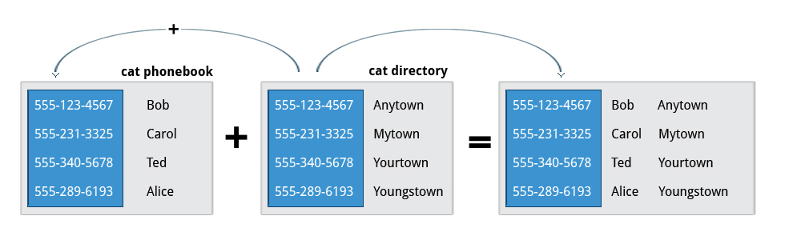

== Chapter 13: Manipulating Text
All the configuration files, scripts etc. are simple text files.
Hence, manipulating text is important.

=== Output commands
==== `cat`
Advanced usage:

|====
|Command |Usage

|`cat <file_name_1> <file_name_2> <file_name_n>`
|Concatenate contents of multiple files in the order that they are written and print it

|`cat <file_name_1> <file_name_2> > <op_file>`
|Combine multiple files and print it(save) to a new file

|`cat <file_name_1> >> <file_name_2>`
|Append contents of the file `<file_name_1>` to the end of the file `<file_name_2>`

|`cat > <file_name>`
|Any subsequent lines typed will go into the file `<file_name>`, until `Ctrl-D` is pressed

|`cat >> <file_name>`
|Any subsequent lines are appended to the file `<file_name>`, until `Ctrl-D` is pressed

|`cat > <file_name> << EOF` or `cat << EOF > <file_name>`
|Any subsequent lines typed will go into the file `<file_name>`, until string `EOF` or `STOP` is typed at the beginning of a new line following which `enter` key is pressed
|====

==== `echo`
Advanced usage:

|====
|Command |Usage

|`echo -e <string> > <op_file>`
|Take the string `<string>` and print it(save) to a new file.
Option `e` enables use of special character sequences such as `\n` for new line and `\t` for tab etc.

|`echo -e <string> >> <file_name>`
|Append the string `<string>` to the end of the file `<file_name>`

|`echo > <file_name>`
|Same as `touch <file_name>`

|`echo $<env_var>`
|View value of environment variable

|====

==== `strings`
Used to extract human-readable content embedded in files that are not regular text files such as a binary etc.
----
strings <filename>
----

==== `tee`
Takes output from any command and writes it to both output stream(terminal) and a file:
----
<cmd> | tee <op_filename>
----
if the `<op_filename>` doesn't exist it gets created but if it does, it gets overwritten.
If you'd like to append contents to an existing file, option `a` can be used

[NOTE]
====
When `>` or `>>` is used you cannot see the output on the terminal.
But now with `tee` you can see the output and write the contents to the file as well
====

==== `wc`
prints the number of lines, words and characters in the content of a file or a list of files.

|====
|Option |Count

|`l`
|lines

|`c`
|bytes
// or characters(in case of UTF-8)

|`w`
|words
|====

=== Working with large files
==== Normal files
[NOTE]
====
`man` internally uses `less`
====

Advanced usage:

|====
|Command |Usage

|`cat <file_name_1> <file_name_2> <file_name_n> \| less`
|Concatenate contents of multiple files in the order that they are written and print it with paging/scrolling abilities

|`tail -f <file_name>`
|Option `f` will cause `tail` to continuously display any new lines in <file_name> as soon as that get added.
Mostly used to monitor activity, log files etc.
|====

==== Compressed files
For compressed files you cannot use the regular commands.
The common utilities for regular files:

* `cat`
* `less`
* `more`
* `grep`
* `diff`

have their counterparts that work with compressed files, which have the same name but prefixed with:
|====
|Prefix |Compression type

|`z`
|gz

|`bz`
|bzip2

|`xz`
|xz
|====

Hence, for gz compression we have `zcat`, `zless`. `zmore`, `zgrep`, and `zdiff`.

`cpio` is a tool that can copy files between archives and directories.

=== Manipulating strings
Normally people write scripts using scripting languages such as Python to deal with strings and text.
Though that makes things simple, it is quite resource heavy.
Hence, in resource constrained situations or situations where speed is very important such as boot-up, it is preferred to use conventional linux tools such as `sed` and `awk` as they are very lightweight and fast.

==== `sed`
Stream EDitor(sed) takes contents from an input stream, modify it and push it to the output stream.

.`sed`

Major ways to use `sed` are:
|====
|Command |Usage

|`sed -e <sed_cmd> <filename>`
|File `<filename>` as text input and string `<sed_cmd>` as command input while output displayed on terminal

|`sed -f <sed_cmd_script_file> <filename>`
|File `<filename>` as text input and file `<sed_cmd_script_file>` as command input while output displayed on terminal

|`<cmd> \| sed <sed_cmd>`
|String output of command `<cmd>` as text input and string `<sed_cmd>` as command input while output displayed on terminal

|====

For the file inputs, option `i` will replace the input file contents with the manipulated text.
[TIP]
====
As changes from option `i` is irreversible, you can output it to another file:
----
sed <opt_arg> <ip_filename> > <op_filename>
----
inspect its contents:
----
diff <ip_filename> <op_filename>
----
then overwrite the original file:
----
mv <op_filename> <ip_filename>
----
====

The `<sed_cmd>` are generally written as:
|====
|Command |Usage

|`s/<string>/<replace_string>/`
|In every line, substitute first occurrence of string `<string>`

|`s/<string>/<replace_string>/g`
|In every line, substitute all occurrences of string `<string>`

|`<starting_line_nb,ending_line_nb>s/<string>/<replace_string>/g`
|In a range of lines [`<starting_line_nb>`, `<ending_line_nb>`], substitute all occurrences of string `<string>`
|====
[WARNING]
====
If you are using expression from extended regex set such `"\s{2,}"`, then don't forget to use option `E` before option `e`
====
[NOTE]
====
Instead of `/`, `:` can be used to used as:
----
s:<string>:<replace_string>:
----

If your `<string>` or `<replace_string>` contains character `/` then you can use escape character `\` to write the character as `\/` or use the above alternate form.
====

==== `awk`
`awk` is used to extract, manipulate and print specific contents of a file.

Major ways to use `awk` are:
|====
|Command |Usage

|`awk '<awk_cmd>' <filename>`
|File `<filename>` as text input and string `'<awk_cmd>'` as command input while output displayed on terminal

|`awk -f <awk_cmd_script_file> <filename>`
|File `<filename>` as text input and file `<awk_cmd_script_file>` as command input while output displayed on terminal

|====

The `'<awk_cmd>'` is generally used as:
|====

|Command |Usage

|`awk '{ print $0 }' <filename>`
|Print entire file

|`awk -F<delim_char> '{ print $1 }' <filename>`
|Print first field (column) of every line, separated by `<delim_char>`

|`awk -F<delim_char> '{ print $1 $7 }' <filename>`
|Print first and seventh field of every line, separated by `<delim_char>`

|====

==== `tr`
`tr` is used to translate specified characters into other characters or to delete them.
----
tr <options> '<set_1>' '<set_2>'
----
`<set_1>` is the characters that need to be manipulated as per the characters in `<set_2>`

[NOTE]
====
`<options>` and `<set_2>` are optional
====

The `<options>` is generally used as:
|====
|Command |Usage

|`<cmd> \| tr a-z A-Z`
|convert lower case to upper case

|`tr '{}' '()' < input_file > output_file`
|modify braces into parenthesis

|`<cmd> \| tr [:space:] '\t'`
|convert white-space to tabs

|`<cmd> \| tr -s [:space:]`
|squeeze repetition of characters using option `s`

|`<cmd> \| tr -d 't'`
|delete specified characters using `d` option

|`<cmd> \| tr -cd [:digit:]`
|complement the sets using `c` option

|`tr -cd [:print:] < <filename>`
|remove all non-printable character from a file

|`tr -s '\n' ' ' < <filename>`
|join all the lines in a file into a single line
|====

=== File Manipulation

Unless specified most file manipulation tool's general usage types are:
|====
|Usage |Meaning

|`<file_manipulation_cmd> <opt_arg> <filename>`
|File `filename` as input to command `<file_manipulation_cmd>` and output on terminal

|`<cmd> \| <file_manipulation_cmd>`
|String output from command `<cmd>` as input to command `<file_manipulation_cmd>` and output on terminal
|====

==== `sort`
To sort the lines as per the key(default being alphabetic) in ascending or descending order.

Common usage options:
|====
|Option |Argument |Meaning

|`r`
|
| sort in reverse order

|`k`
|`n`
|sort the lines by the `n`^th^ field on each line instead of the beginning

|`u`
|
|after sorting print the unique lines

|====

==== `uniq`
To remove consecutive duplicate lines
[IMPORTANT]
====
If duplicate lines are not consecutive then they are not removed.
If you want to remove the duplicate lines even if they are not consecutive, then if the order of lines are not important, you can:
----
sort <opt_arg> | uniq
----
or simply do:
----
sort -u <opt_arg>
----
====
Option `c` counts the number of duplicate entries.

==== `cut`
To extract specific field or column in column based files

Common usage options:
|====
|Option |Argument |Meaning

|`d`
|`<char_delim>`
|in every line `<char_delim>` is used to determine the column number

|`f`
|`<n>`
|`<n>`^th^ field/column is extracted in each line
|====

==== `paste`

.`paste`
image::pix/LFS01_ch12_screen27.jpg[paste]

General usage types:
|====
|Usage |Meaning

|`paste <filename_1> <filename_2> <filename_n>`
|Each line of file `filename_1` is concatenated with respective line of `<filename_2>` while seperated by a tab and is concatenated with respective line of `<filename_n>` and output is shown on terminal
|====

Common usage options:
|====
|Option |Argument |Meaning

|`d`
|`<char_delim>`
|in every line before concatenation character `<char_delim>` is inserted

|`s`
|
|transposes each contents of file and then pastes this in the specified file order one below another
|====

==== `join`
This is an enhanced version of `paste` which does the same but based on a command field

.`join`

==== `split`
It is used to split a file into equal-sized segments.
The new files will have the same name as the original one with a prefix.

.`split`

Common usage:
----
split -l <nb_lines> <ip_file> <prefix>
----
or
----
<cmd> | split -l <nb_lines> - <prefix>
----

Default: 1000-line files and prefix `x` meaning alphabets.

There is also, `csplit` which can be used to split the file but based on a pattern:
----
csplit <ip_file> <pattern>
----
The `<pattern>` can be a regex or more.

==== Misc
|====
|Command |Function

|`col`
|filter reverse line feeds from input

|`expand`
|convert tab to spaces

|`fmt`
|simple optimal text formatter
|====

=== String matching
==== Regular expressions and Search patterns
Regular expressions are text strings used for matching a specific pattern in a given string.
[NOTE]
====
They are very different from wildcards used for 'glob'-ing
====

|====
|Search Patterns |Usage

|`.`
|any single character

|`<reg_1>\|<reg_2>`
|`<reg_1>` or `<reg_1>`

|$
|end of a line

|^
|beginning of a line

|*
|preceding item 0 or more times
|====

==== Example
Consider the sentence:
----
the quick brown fox jumped over the lazy dog
----

|====
|Regex |Match

|`a..`
|__azy__

|`b.\|j.`
|Both __br__, and __ju__

|`..$`
|__og__

|`l.*`
|__lazy dog__

|`l.*y`
|__lazy__

|`the.*`
|the whole sentence, __the quick brown fox jumped over the lazy dog__
|====
[TIP]
====
Regex is not very intuitive for example, for any character in `glob`-ing we write:
----
*
----
However, in Regex it is:
----
.*
----
Use https://regex101.com/ to build and debug your regex.
====
[WARNING]
====
But, if you are using things like `\s` in regex etc. make sure that *extended regex* option is enabled in whichever command you are using it in.
====

==== `grep`
It is the primary text searching tool.

Common usage:

* With file:
+
----
grep <opt_arg> -e <pattern> <ip_file>
----

* With string:
+
----
<cmd> | grep <opt_arg> -e <pattern>
----

Using option `e` ensures prevents ambiguity that would arise if `<pattern>` contains `-` character.
The `<pattern>` can be a string to match or a regular expression enclosed in `[]`.

Common usage options:
|====
|Option |Argument |Meaning

|`v`
|
|lines that do not match the pattern

|`C`
|`n`
|along with the line that matches the pattern, print `n` lines above and below

|`n`
|
|print the line number in the input file while printing the matching lines

|`E`
|
|use extended regex

|`F`
|
|interpret patterns as fixed strings rather than regex

|`r`
|directory
|recursively read all the files under a directory
|====

[NOTE]
====
The variant programs `egrep`, `fgrep` and `rgrep` are the same as `grep -E`, `grep -F` and `grep -r` respectively.
====
