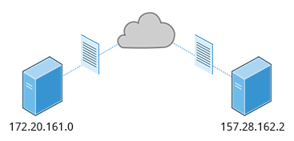

== Chapter 14: Network Operations

A network is two or more computers connected together through a communication channel.

=== Network Addresses and DNS
==== IP Address
Devices in a network has a unique network address identifier called Internet Protocol(IP) address.

.IP Addresses

Data between computers in a network is exchanged using a stream of small packets.
The packets at the bare minimum contains:

* Header
** Packet source IP
** Packet destination IP
** Where the packet fits in the sequence of packets used to send a particular data
* Payload

There are two types of IP addresses:

* IPv4
* IPv6

===== IPv4
Older and most widely used.
32-bit address i.e. 4.3 billion addresses.
Considering the growth of connected devices, we'll run out of addresses soon.
Moreover, many addresses are allotted and reserved.

Techniques such as Network Address Translation(NAT) has enabled to work around the problem of inadequate number of IP addresses and has increased the longevity of IPv4.
NAT enables sharing one external IP address among several locally connected computers each having a unique IP address within their local network.
Hence, IP addresses on the global network can be saved.

====== Decoding
32-bit address is divided into four 8-bit sections called octets.
As an octet is an 8-bit number, it can go from 0-255.

.Decoding IPv4
image::pix/LFS01_ch11_screen06.jpg[Decoding IPv4]

IPv4 addresses are classified into 5 groups: Class A-E:

* Class A-C has their address divided into 2 parts:
** Network ID, used to identify the network
** Host ID, used to identify the host in the network

+
|====
|Class |Size of Network ID(Octets) |Size of Host ID(Octets) |Restriction |Network Address Range |Nb Networks available |Host Address Range in a particular network|Nb Hosts available in a particular network |Host Address range |Total nb of hosts |Comment

|A
|1
|3
|bit 7 of first octet always set to 0 and among the valid first octet values (0-128), 0(bit 0-6 are all 0) and 127(bit 0-6 are all 1) are reserved
|1.x.x.x - 126.x.x.x
|126 = (126-1 + 1)
|x.0.0.0 - x.255.255.255
|16,777,216 = 256 x 256 x 256 = (255-0 + 1) x (255-0 + 1) x (255-0 + 1)
|`1.0.0.0` - `126.255.255.255`
|2,113,929,216 = 16,777,216 x 126
|Number of network addresses was not enough, hence class B was introduced

|B
|2
|2
|bit 7-6  of first octet always set to (10)~2~.
Hence, valid values of first octet: 128-191
|128.0.x.x - 191.255.x.x
|16,384 = 64 x 256 = (191-128 + 1) x (255-0 + 1)
|x.x.0.0 - x.x.255.255
|65,536 = 256 x 256 = (255-0 + 1) x (255-0 + 1)
|`128.0.0.0` - `191.255.255.255`
|1,073,741,824 = 65,536 x 16,384
|As the number of networks grew, even this was not enough, hence class C was introduced

|C
|3
|1
|bit 7-5  of first octet always set to (110)~2~.
Hence, valid values of first octet: 192-223
|192.0.0.x - 223.255.225.x
|2,097,152 = 32 x 256 x 256 = (223-192 + 1) x (255-0 + 1) x (255-0 + 1)
|x.x.x.0 - x.x.x.255
|256 = 255-0 + 1
|`192.0.0.0` - `223.255.255.255`
|536,870,912 = 256 x 2,097,152
|Most commonly used for smaller networks which don't have many unique hosts

|====
* Class D is used for special multicast applications
* Class E is reserved for future use

===== IPv6
Newer.
64-bit address i.e. 3.4 x 10^38^ addresses.
More robust and more addresses but complex to migrate from IPv4 network to IPv6 due to poor interoperability.
Therefore, widespread adoption is going at a slow pace.

==== Domain Name System(DNS)
===== IP Address Allocation
Internet Service Provider(ISP) provides a range of IP addresses for your network.
The class of IP address depends on the size of your network and expected growth needs.

If small and home networks, NAT is used and only one external visible IP address is provided by ISP.

IP addresses of computers in a network can be assigned either manually or dynamically.
Manually assigned IP addresses are called static addresses as they do not change.
Dynamically assigned IP addresses are assigned by a Dynamic Host Configuration Protocol(DHCP) server, and it can change everytime you reboot your computer.

===== Name resolution
Name resolution is used to convert a numerical IP address into a human-readable hostname which is much easier to remember and access compared to numerical IP values.

.IP of Linux Foundation Website server

[NOTE]
====
To see your computer's hostname:
----
hostname
----
====
[IMPORTANT]
====
Every linux system has a special hostname called `localhost` with IP `127.0.0.1` to describe your local system on which you are working on.
====

===== DNS
DNS server translates internet domain and host names to IP address.
The IP address of DNS server to connect to is configured in `/etc/resolv.conf`.
The service `systemd-resolved` manages communication with DNS server.
It caches all the previous IPs and creates a local DNS server.

Another important file that is consulted before DNS is `/etc/hosts`.
This file consists of all the machines in the local network(LAN).
To find the IP of a web address you can do:
----
host <web_address>
----
or
----
nslookup <web_address>
----
or
----
dig <web_address>
----

=== Network Configuration
==== Network Configuration Files
They are located under `/etc/network`.
[IMPORTANT]
====
Modern linux systems highly recommend that you use GUI application like `Network Manager` or CLI applications such as `netplan`, `nmtui`, or `nmcli`, rather than manually editing network configuration files.
====

==== Network interfaces
They are a connection channel between a device and a network.
It might be a physical device such as a Network Interface Card(NIC) or a software.
A system can have multiple interfaces which can be individually activated or deactivated at anytime.

* interface info
+
To get info about network interfaces:
+
----
ip addr
----
or
----
ifconfig
----

* routing info
** To get routing info:
+
----
ip route
----
or
+
----
route -n
----

** To add a static route:
+
----
ip route add <route_info>
----
or
+
----
route add -net <address>
----
** To delete a static route:
+
----
ip route del <route_info>
----
or
+
----
route del -net <address>
----

** To inspect the route which the packets take to reach the destination host:
+
----
traceroute <ip_or_web_address>
----
This is useful for troubleshooting network delays, and errors

* status check
+
To check whether a machine on network can send and receive data:
+
----
ping <hostname_or_ip>
----
+
This pings the device indefinitely but with option `c` you can specify how many times you would like to try.

* More tools
+
|====
|Networking Tools |Description

|`ethtool`
|Queries network interfaces and can also set various parameters such as the speed

|`netstat`
|Displays all active connections and routing tables; useful for monitoring performance and troubleshooting

|`nmap`
|Scans open ports on a network; important for security analysis

|`tcpdump`
|Dumps network traffic for analysis

|`iptraf`
|Monitors network traffic in text mode

|`mtr`
|Combines functionality of ping and traceroute and gives a continuously updated display
|====

==== Network Troubleshooting tips
Let's say your browser says that it cannot reach a particular web address

* Interface:
+
----
ip addr
----
+
Check:

** Is the interface up?
+
If the device was down:
+
----
systemctl restart NetworkManager
systemctl restart network
----
** Is the IP valid?
Depending on where you are checking, it is most probably class C IP address.
+
----
dhclient <interface_name>
----

* Hostname:
+
----
hostname
----
+
Check:

** Does your machine has a valid hostname?
It is very unlikely that this might be the problem.

* DNS
+
** You can check if DNS server is working by:
+
----
host <web_address>
----
+
Check:

*** Do you see a valid IPv4 address produced by the command?
If you don't, try with another DNS server instead of the one configured at `/etc/resolv.conf`:
+
----
host <web_address> <dns_server_ip>
----
+
[NOTE]
====
You can use Google's DNS which has an IP `8.8.8.8`
====
+
Now if you are able to connect using external DNS server then your own DNS server may be down.
To check your DNS server:

**** if it is up or not?
+
----
ping -c 10 <dns_server_ip>
----
**** if it's facing any routing issues?
+
----
traceroute <dns_server_ip>
----
or
+
a more advanced tool with live monitoring capabilities
+
----
mtr --report-cycles 3 <dns_server_ip>
----
If you don't see any routing info, you need to check your system's routing

*** Do you see some anomaly in file `/etc/hosts`?
This file is checked first before going to DNS.

** Alternatively, you can also try:
+
----
dig <web_address>
----

* Routing
+
----
ip route
----
If output is blank or points to your own machine, then that is your problem!
To fix it:
+
----
ip route add <route_info>
----
Now, rerun some of the above tests to see if problem is solved.

=== Surfing and Downloading
==== Surfing
Browsers are used to retrieve, transmit, and explore the world wide web.

Just like GUI browsers there are CLI browsers(`lynx`, `links`, `elinks`, `w3m`) which can be useful when you want to browse the internet but don't have a GUI environment installed.

===== Using `links`
With `links`, you can use your mouse.
To open:
----
links
----
To close, click the first cursor position in the terminal.
You'll see a menu, there `File` > `Exit`.

==== Downloading
===== `wget`
It is very useful when you want to download via scripts.
It can download any number of files of any size, recursive webpages, password-required downloads etc.

To download:
----
wget <url>
----

===== `curl`
To download all of url including the source code:
----
curl <url>
----
You can use option `o` with a filename as an argument to save the `<url>` for offline viewing via a browser

=== File transfer
You may need to transfer files from one computer to another in the network.

==== File Transfer Protocol(FTP)
FTP built on a client-server model, is a well-known method for file transfer.
[WARNING]
====
Though popular, it is intrinsically insecure as it doesn't employ any means of encryption and any data(including the login credentials) sent can be intercepted.
It is used when security is not a concern.
====
Your browser or a standalone program(GUI: `Filezilla`, CLI: `ftp`, `sftp`, `ncftp`, `yafc`) can act as an FTP client.
`sftp` is very secure as it uses SSH protocol to establish a secure mode of communication.
But, it does not work with so-called anonymous FTP (guest user credentials).

==== Secure SHell(SSH)
SSH is a cryptographic network protocol used for secure data communication.
It is used for accessing systems on the network remotely and for remote services between any two systems on the network.

.SSH

To log in to a remote system:
----
ssh <username_on_remote_server>@<remote_server_domain_name>.<top_level_domain_name>
----
or, if you have the ip of the remote server:
----
ssh <username_on_remote_server>@<remote_server_ip>
----
[NOTE]
====
To get ip of a machine, you'll need to locally run:
----
ip addr
----
Then you need to note the ip of the relevant interface
====
During remote login, you may enter password, or you can auto-verify your identity using cryptographic key

To run a command on remote system(while you are not in the terminal with which you logged in):
----
ssh <username_on_remote_server>@<remote_server_domain_name>.<top_level_domain_name> <cmd>
----

==== Secure CoPy(`scp`)
`scp` uses SSH for transferring data.

.`scp`

To copy file from local system to remote system:
----
scp <localfile> <user@remotesystem>:<path_in_remotesys>
----
you'll be prompted to enter password, unless you have set up a cryptographic key to auto-verify your identity
[NOTE]
====
Just like normal `cp`, even in `scp` you'll need to use option `r` for recursively copying a directory.
====
