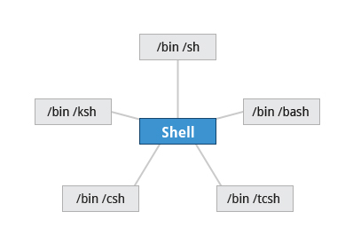

== Chapter 15: The Bash Shell and Basic Scripting

A shell is a command line interpreter which provides the user interface for terminal windows.

The choices of shells available in the system are listed in the file `/etc/shells`.

.Shell choices

=== Shell scripting

Shell scripts are used to execute bash commands in a non-interactive session as if the commands were being typed in.
They are developed, and run under the `bash` command shell interpreter.

.Shell script features
image::pix/LFS01_ch14_screen03.jpg[Shell script features]

==== Shell script
Normally, whatever you manually enter into the terminal can be written as a shell script as:
----
#!<cmd_interpreter_full_name>
<cmd>
----
the most common `<cmd_interpreter_full_name>` is `/bin/bash`.

===== Creation
* Write a regular text file with the structure as mentioned above
* To run the script
** you can either feed it to an instance of `bash`:
+
----
bash <script_name>.sh
----
** or you can turn it into an executable
*** Change its permissions to make it executable:
+
----
chmod +x <script_name>.sh
----
*** Run the script like you would run any binary:
+
----
./<script_name>.sh
----

=== Language
==== Type of commands
.Type of commands
image::pix/LFS01_chapter14_screen_15.jpg[Type of commands]

* Compiled applications:
+
They are binary executable files normally located in a directory that is included in the `PATH` environment variable
* Built-in commands:
+
These are commands that are part of `bash` scripting language.
+
[TIP]
====
To get list of all the built-in commands:
----
help
----
====
+
[WARNING]
====
In newer shells some external programs are replaced with built-in commands which have the same name as the external program's executable in `PATH`.
For example, `echo` and `/bin/echo`.
This can lead to subtle problems(so much so that the output of `man echo`(program) and `help echo`(built-in command) are different too), and it can be avoided by using the full path in the script such as `/bin/echo` to refer to external program instead of just `echo` which will refer to built-in command.
====
* Other scripts:
+
Shell scripts can be run as an executable if the file permission is set as executable, otherwise it can be fed to `bash` command as an input.
Scripts from other interpreted languages such as python/perl etc. can also be run from within a shell script.

==== Exporting Environment Variables
Variables created in a script are available only within that script.
If you create a child process, it doesn't have access to these variables.
To make it available to child process, you'll need to promote the variable to an environment variable which is done using `export` statement.

==== Return values
Return values permit a process to monitor the exit state of another process enabling it to take any steps if necessary.

.Return values

All program(and, scripts) return a value upon finishing the execution.
Upon success `0` is returned and a non-zero value upon failure.
To get the return value of last executed command you can use `$?`.

==== `if` statement
`if` statement is used for:

* Numerical or string comparisons
+
|====
|Operator |Meaning

|`eq`
|Equal to

|`ne`
|Not equal to

|`gt`
|Greater than

|`lt`
|Less than

|`ge`
|Greater than or equal to

|`le`
|Less than or equal to
|====
* Testing return value of a command (0 for success)
* Checking for file/directory existence or permissions
+
|====
|Condition Flag |Meaning

|`e`
|does file/directory exist

|`d`
|is it a directory

|`f`
|is it a regular file(i.e. not a symbolic link, device node, directory, etc.)

|`s`
|is file of non-zero size

|`g`
|has SGID been set for the file

|`u`
|has SUID been set for the file

|`r`
|is readable

|`w`
|is writable

|`x`
|is executable

|====

[TIP]
====
To know all the flags for testing:

----
man 1 test
----
====

==== Example
Things to pay attention to:

* shebang `#!`
* braces `[[]]` vs `(())` vs `{}`
* flags `x`, `le`, `gt`
* `exit` with a return code
* decision-making constructs `if` vs `case`
* `;` vs `&&` vs `||`
* `>` vs `>>`, and `<`
* variable declaration and usage
* `$#`, `$@`, `$*`, `$0` and `$?`
* enclosing variable with `""` and `{}` when used as a command argument
* string operations `${\#<string>}`, `${<string>#*<char>}`, and `${#<string>:<offset>:<nb_char>}`
* string comparisons using `>`, `<`, and `==`
* looping constructs `for`, `while`, and `until`
* performing arithmetic operations using `$(())`
* accessing output of a command using `$()`
* splitting a command across multiple lines using `\`
* function, calling a function, passing arguments to a function, and receiving arguments within a function
* variable scope, and `local`
* redirecting output of one program as input to another using `|`
* wildcard `*`, and using it for glob-ing
* using environment variables

[source, bash]
----
include::rsrcs/refex/example.sh[]
----
