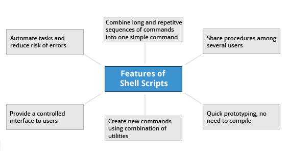
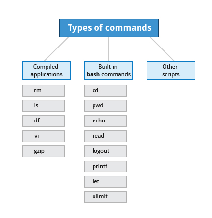

== Chapter 15: The Bash Shell and Basic Scripting

A shell is a command line interpreter which provides the user interface for terminal windows.

The choices of shells available in the system are listed in the file `/etc/shells`.

.Shell choices
image::pix/LFS01_chapter14_screen_5.jpeg[]

=== Shell scripting

Shell scripts are used to execute bash commands in a non-interactive session as if the commands were being typed in.
They are developed, and run under the `bash` command shell interpreter.

.Shell script features

==== Shell script
Normally, whatever you manually enter into the terminal can be written as a shell script as:
----
#!<cmd_interpreter_full_name>
<cmd>
----
the most common `<cmd_interpreter_full_name>` is `/bin/bash`.

===== Creation
* Write a regular text file with the structure as mentioned above
* To run the script
** you can either feed it to an instance of `bash`:
+
----
bash <script_name>.sh
----
** or you can turn it into an executable
*** Change its permissions to make it executable:
+
----
chmod +x <script_name>.sh
----
*** Run the script like you would run any binary:
+
----
./<script_name>.sh
----

=== Language
==== Type of commands
.Type of commands

* Compiled applications:
+
They are binary executable files normally located in a directory that is included in the `PATH` environment variable
* Built-in commands:
+
These are commands that are part of `bash` scripting language.
+
[TIP]
====
To get list of all the built-in commands:
----
help
----
====
+
[WARNING]
====
In newer shells some external programs are replaced with built-in commands which have the same name as the external program's executable in `PATH`.
For example, `echo` and `/bin/echo`.
This can lead to subtle problems(so much so that the output of `man echo`(program) and `help echo`(built-in command) are different too), and it can be avoided by using the full path in the script such as `/bin/echo` to refer to external program instead of just `echo` which will refer to built-in command.
====
* Other scripts:
+
Shell scripts can be run as an executable if the file permission is set as executable, otherwise it can be fed to `bash` command as an input.
Scripts from other interpreted languages such as python/perl etc. can also be run from within a shell script.

==== Exporting Environment Variables
Variables created in a script are available only within that script.
If you create a child process, it doesn't have access to these variables.
To make it available to child process, you'll need to promote the variable to an environment variable which is done using `export` statement.

[WARNING]
====
Shell scripts are interpreted not compiled.
Hence, everything variables, functions etc. must be interpreted before they are used.
====

==== Return values
Return values permit a process to monitor the exit state of another process enabling it to take any steps if necessary.

.Return values
image::pix/LFS01_ch14_screen10.jpg[]

All program(and, scripts) return a value upon finishing the execution.
Upon success `0` is returned and a non-zero value upon failure.
To get the return value of last executed command you can use `$?`.

==== `if` statement
`if` statement is used for:

* Numerical comparisons
+
|====
|Operator |Meaning

|`eq`
|Equal to

|`ne`
|Not equal to

|`gt`
|Greater than

|`lt`
|Less than

|`ge`
|Greater than or equal to

|`le`
|Less than or equal to
|====
* String comparisons
** Two string operands
+
|====
|Operator |Meaning

|`==`
|Equal to

|`!=`
|Not equal to

|`<`
|Precedes

|`>`
|Succeeds
|====
** One string operand
+
|====
|Option |Checks

|
|string is not empty

|`n`
|string not null

|`z`
|string is null
|====
* Testing return value of a command (0 for success)
* Checking for file/directory existence or permissions
+
|====
|Condition Flag |Meaning

|`e`
|does file/directory exist

|`d`
|is it a directory

|`f`
|is it a regular file(i.e. not a symbolic link, device node, directory, etc.)

|`s`
|is file of non-zero size

|`g`
|has SGID been set for the file

|`u`
|has SUID been set for the file

|`r`
|is readable

|`w`
|is writable

|`x`
|is executable

|====

[TIP]
====
To know all the flags for testing:

----
man 1 test
----
====

[NOTE]
====
Any `if` condition can be negated using `!`
====

==== Misc
* The command `shift n` shifts the arguments `n` times (to the left).
* If you run a command in background:
+
----
<cmd> <options> <arguments> &
----
+
You can do:
+
----
echo "${!}"
----
to get process id of the `<cmd>` running in the background
* When you launch a command as a sub-process using `$()` construct, the trailing newline characters in the output get discarded.

==== Example
Things to pay attention to:

* shebang `#!`
* braces `[[]]` vs `(())` vs `{}`
* flags `x`, `le`, `gt`
* `exit` with a return code
* decision-making constructs `if` vs `case`
* `;` vs `&&` vs `||`
* `>` vs `>>`, and `<`
* variable declaration and usage
* `$#`, `$@`, `$*`, `$0` and `$?`
* enclosing variable with `""` and `{}` when used as a command argument
* string operations `${\#<string>}`, `${<string>#*<char>}`, and `${#<string>:<offset>:<nb_char>}`
* string comparisons using `>`, `<`, and `==`
* looping constructs `for`, `while`, and `until`
* performing arithmetic operations using `$(())`
* accessing output of a command using `$()`
* splitting a command across multiple lines using `\`
* function, calling a function, passing arguments to a function, and receiving arguments within a function
* variable scope, and `local`
* redirecting output of one program as input to another using `|`
* wildcard `*`, and using it for glob-ing
* using environment variables

[source, bash]
----
include::rsrcs/refex/example.sh[]
----

== Chapter 16: More on Bash Shell Scripting

=== Including script files
There are two ways to include a `<script>` file inside a script file:
----
. <script>
----
or
----
source <script>
----

=== Debugging bash scripts
The options available for debugging scripts are:
|====
|Option |Purpose

|`n`
|syntax checking

|`x`
|echo all commands after(setting it)

|`v`
|echo all commands before(setting it)

|`u`
|treat using unset(uninitialized) variables as an error

|`e`
|exit script immediately upon non-zero exit status
|====

To run the script in the debugging mode with an option `opt`:
----
bash -<opt> ./<script_name>
----
or in your script you can do:
[source, bash]
----
set -<opt> # turn on debugging option
<script>
set +<opt> # turn off debugging option
----

=== Creating temporary files and directories
Temporary files and directories are used for intermediate storage while the program is running and should disappear once the program ends executing.
You can create the file using `touch` but using a predictable filename will give the hackers ability to gain access to your intermediate data and reverse engineer your program.
Moreover, if two programs running at the same time, unintentionally create and access the temp file of same name, they end up overwriting and corrupted each other's data.
Hence, to avoid all these problems, the best practice is to use `mktemp` utility.
To create a temporary file:
----
mktemp /<dir_name>/<temp_base_name>.<X_string>
----
To create a directory option `d` is used.
Normally, `<dir_name>` above will be `tmp` directory in the root file system and `<X_string>` is a string of at least three number of `X` which will be replaced by corresponding number of random characters generated during file creation.
Hence, the temporary file/directory will have a random name.
[NOTE]
====
`mktemp` prints the name of the file/directory that it creates.
Hence, you can store it into a variable:
----
<var_name>=$(mktemp /<dir_name>/<temp_base_name>.<X_string>)
----
You can use the name stored in `<var_name>` to manipulate or manually delete the file or the directory.
====

=== Discarding output
When you don't want to see the output of `stdout` or `stderr` on the screen or any other output stream, you can redirect it to a pseudo-file `/dev/null`.
[NOTE]
====
`/dev/null` is also called as bit bucket or black hole
====
`>` can be used to redirect `stdout`, `2>` for `stderr`, and `>&` for both.

=== Random numbers and Data
To generate a random number use environment variable `RANDOM`.
Everytime you use in the script as `"$\{RANDOM}"` you get a different value which is derived from kernel's built in random number generator or by OpenSSL library's function which uses FIPS140(Federal Information Processing Standard) algorithm.

==== Kernel's Random number generator
Random number can be created using:

* Hardware
+
This requires special hardware that takes different types of noise signals such as thermal noise, as input and converts into an electric signal using a transducer, which is again converted into a digital number using an ADC.
* Software
+
Most computers don't have special hardware for random number generation.
They rely on events created during booting to create the raw data required.

The raw data created either by hardware or software forms part of an entropy pool from which random number are generated.
Device nodes `/dev/random` and `/dev/urandom` continuously outputs these random numbers.
`/dev/random` has a high quality of randomness(required for OTP generation) but is relatively slow while `/dev/urandom` is good enough for most cryptographic purposes, and is faster.
[NOTE]
====
When the entropy pool is empty, `/dev/random` gets blocked until new raw data is generated.
However, `/dev/urandom` is still functional
====
