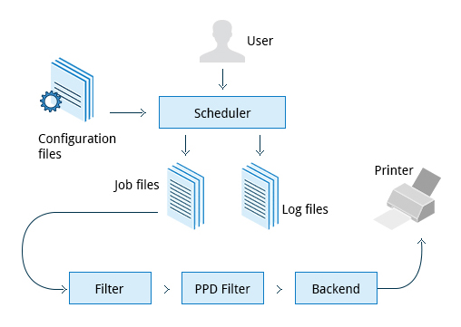
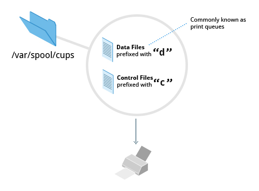
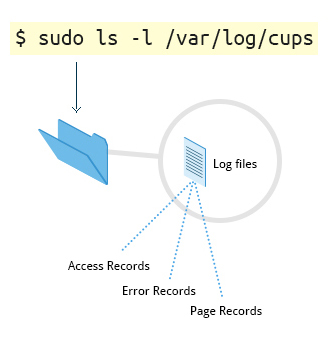
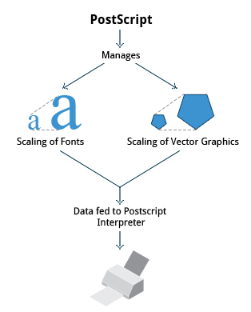
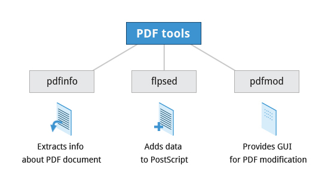

== Chapter 17: Printing

The linux standard for printing software, which converts data from application to the format that the printer understands, is Common UNIX Printing System(CUPS).

=== CUPS

CUPS acts as a print server for both local and network printers.
As it is a server it runs as a daemon, and it can be managed using `systemctl`:

* Get status:
+
----
systemctl status cups
----

* To change status
----
systemctl <status> cups
----
where `<status>` can be: `enable`, `disable`, `start`, `stop`, `restart`.
[NOTE]
====
`<status>`: `enable`, `disable` dictates whether CUPS will be automatically started during booting or not.
Hence, executing `disable` will not turn off CUPS right away but will not automatically start it when the system boots again.
====

It uses a modular printing system which allows it to accommodate wide variety of printers and their formats.
Often CUPS automatically configures itself by detecting the printer.
But, sometimes we'll need to configure it.

==== Architecture

.CUPS

CUPS server has the following components:

* Configuration files
+
There are several config files under `/etc/cups/`, but the most important files are:

** `cupsd.conf`
+
Here system-wide settings related to network security such as CUPS access permissions for systems on network, printer discovery on the local network, management features etc. are configured.
It doesn't contain any printer-specific details.
** `printers.conf`
+
Here printer-specific settings such as printer's status and capabilities are configured.
+
[IMPORTANT]
====
This file is generated or modified automatically after connecting a printer to the system and should not be modified by hand.
====

* Scheduler
+
It manages the print jobs, handle user commands and manages the flow of data through all the components of CUPS

* Job files
+
CUPS stores print requests as files under `/var/spool/cups/`.
+
.Print Queue

+
Data files are prefixed with `d` and control files with `c`.
After a job is successfully completed, data files are automatically removed.
The data files are commonly known as print queue.

* Log files
+
Log files are located in `/var/log/cups/`.
+
.Logs

+
They are used by scheduler to record access, activity, error, and page records.

* Filter
+
Filters convert job file formats to printable formats.

* Printer drivers
+
Printer drivers, normally stored under `/etc/cups/ppd/`, contains descriptions for currently connected and configured printers.

* Backend
+
Backend helps locate devices connected to the system.

In summary, when a print command is executed, the scheduler validatees the command and processes the print job as per the configuration file settings to generate job files.
While doing all this, scheduler alos records the activities in the log files.
The filter then processes the job files into printable format and with the help of printer driver and the backend it locates and communicates with the printer to transmit the printable format.

==== Printer set-up
Normally distros have their GUI application that lets you add, remove and configure local or remote printers.
You can use this to easily set up printers.

CUPS also has a web interface which can be opened using web browser at http://localhost:631
Using this you can do everything that the GUI application can do, and also you can control print jobs.

==== Troubleshooting
If printer is not visible:

* Make sure it is ON
* Verify if it is connected to your computer
* Use `lsusb` utility to see if your system detects the printer as an usb device
* Check if printer drivers and/or additional software required is installed

=== Printing Operations
In GUI applications you can just use the print menu to print.

For CLI, CUPS provides `lp` to print text, PostScript, PDF and Image files:
----
lp <filename>
----
or
----
<cmd> | lp
----

Common usage options:
|====
|Option |Argument |Meaning

|`d`
|`<printer_name>`
|to direct the print job to a particular printer rather than the default printer

|`n`
|`<k>`
|to print `<k>` number of copies
|====

Then there are additional commands:
|====
|Command |Usage

|`lpoptions -d <printer_name>`
|To set the printer `<printer_name>` as the default printer

|`lpq -a`
|To show the queue status

|`lpadmin`
|To configure printer queues
|====

[NOTE]
====
You can configure more system-wide values with `lpoptions`.
To check current configuration:
----
lpoptions
----

To know how to set/modify a configuration option:
----
lpoptions help
----
====

==== Managing print jobs
You can not only list all the printers, and check their status but also monitor, cancel or move(to another printer) the print jobs of a printer.

|====
|Command |Usage

|`lpstat -p -d`
|list available printers, and their status

|`lpstat -a`
|Check the status of all connected printers, including job numbers

|`cancel <job_id>` or `lprm <job_id>`
|Cancel a print job `<job_id>`

|`lpmove <job_id> <new_printer>`
|To move a print job `<job_id>` to a new printer `<new_printer>`

|====

=== Manipulating PostScript(PS) and Portable Document Format(PDF) files
==== PS
PS is a standard page description language developed by Adobe to enable the transfer of data to printers.

.PS

PS file is purely a text format where page appearance information is embedded in the page.
PS file is fed to a PS interpreter.
It manages the scaling of fonts and vector graphics.

As it is a standard language any application that understands its specification can print to it and any compatible printer can print it.

[NOTE]
====
pdf format which produces far smaller files in a compressed format has superseded ps.
====

===== `enscript`
It is used to convert text into ps, rtf(rich text format) and html(hyper-text markup language) formats.

----
enscript <filename>.txt
----
prints a text file directly to the default printer.
`<filename>.txt` is replaced by `-` to read from stdio.

Common usage options:
|====
|Option |Argument |Meaning

|`r`
|
|rotates the page to landscape mode

|`<n>`
|
|convert a text file to `<n>` columns where 'n' is [1, 9]

|`p`
|`<op_file>.ps`
|to convert input text file to `<op_file>.ps`
|====

==== PDF
===== Manipulating PDF
`qpdf` and `ghostscript`(also invoked as `gs`) can be used to:

* Merge/split/rotate pdfs:
** Merge
+
----
qpdf --empty --pages <filename_1>.pdf <filename_n>.pdf -- <merged_file>.pdf
----
or
----
gs -dBATCH -dNOPAUSE -q -sDEVICE=pdfwrite -sOutputFile=<merged_file>.pdf <filename_1>.pdf <filename_n>.pdf
----
** Rotate
+
----
qpdf --rotate=<+_-><angle>:<page_nb> <filename>.pdf <rotated_file>.pdf
----
To rotate all the pages `<page_nb>` is `1-z`

* repair corrupted pages
* extract select pages from pdf
+
----
qpdf --empty --pages <filename>.pdf <start_pg_nb>-<end_pg_nb> -- <extracted_file>.pdf
----
or
----
gs -dBATCH -dNOPAUSE -q -sDEVICE=pdfwrite -dDOPDFMARKS=false -dFirstPage=<start_pg_nb> -dLastPage=<last_pg_nb> -sOutputFile=<extracted_file>.pdf <filename>.pdf
----
[NOTE]
====
`<filename>.pdf` can be replaced by `-` when reading input from stdio.
====

* encrypt/decrypt pdfs
** Encrypt(128-bit encryption)
+
----
qpdf --encrypt <password> <password> 128 -- <public_filename>.pdf <private_filename>.pdf
----
`<password>` same argument is typed twice as a means of confirming the password
** Decrypt
+
----
qpdf --dencrypt --password=<password> -- <private_filename>.pdf <public_filename>.pdf
----

* add, update and export a pdf's metadata
* export bookmarks to a text file
* filling out pdf forms

Some Additional tools:

.Additional tools

==== Converting between ps and pdf
Packages such as `ghostscript`, `poppler` and `ImageMagick` provides utilities such as `ps2pdf` & `pdf2ps`, `pstopdf` & `pdftops` and `convert` respectively for conversion between ps and pdf formats.

|====
|Command |Usage

|<pdf2ps_pdftops> <filename>.pdf
|Converts `<filename>.pdf` to `<filename>.ps`

|<ps2pdf_pstopdf> <filename>.ps
|Converts `<filename>.ps` to `<filename>.pdf`

|convert <ip_file>.<ps_pdf> <op_file>.<pdf_ps>
|Converts `<ip_file>.ps` or `<ip_file>.pdf`  to `<ip_file>.pdf` or `<ip_file>.ps`
|====

[NOTE]
====
`pdf2ps` and `ps2pdf` uses same options as `gs`
====

An example of Getting kernel buffer data as a pdf:
----
dmesg | enscript -p - | ps2pdf -sOutputFile=dmesg.pdf -
----
