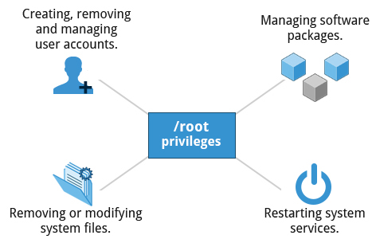
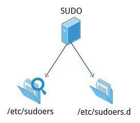
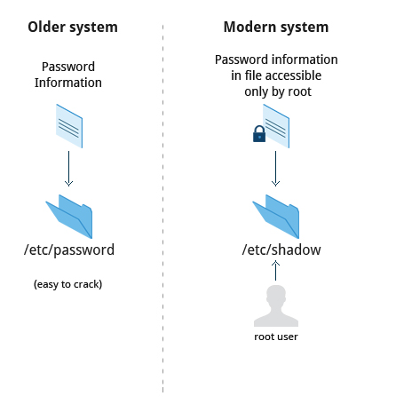

== Chapter 18: Local Security Principles

=== User Accounts
For each user, the following seven fields are maintained in the `/etc/passwd` file:

|====
|Field Name |Details |Remarks

|username
|User login name
|Should be between 1 and 32 characters long

|password
|User password (or the character `x` if the password is stored in the /etc/shadow file) in encrypted format
|Is never shown in Linux when it is being typed; this stops prying eyes

|User ID (UID)
|Every user must have a user id (UID)
a|
// "a|" is used to say cell needs adoc parsing so that the following lines be shown as bullet points
* 0 is reserved for root user
* UID that range in 1-99 is reserved for other predefined accounts
* UID that range in 100-999 is reserved for system accounts and groups
* Normal users have UIDs of 1000 or greater

|Group ID (GID)
|The primary Group ID (GID); Group Identification Number stored in the `/etc/group` file
|-

|User Info
|Optional and allows insertion of extra information about the user such as their name
|For example: `Rufus T. Firefly`

|Home Directory
|The absolute path location of user's home directory
|For example: `/home/rtfirefly`

|Shell
|The absolute location of a user's default shell
|For example: `/bin/bash`

|====

==== Types of Accounts
4 types:

* root
* system
* normal
* network

Some guidelines:

* Grant as minimum privileges as possible to accounts
* Remove inactive accounts
+
View the last time each user logged into the system:
+
----
last
----

==== `root`
`root` is the most privileged account, it can do anything and everything i.e. no security restrictions imposed on it.
Hence, use it with utmost care.

[NOTE]
====
When you are logged in as `root`, the shell shows `#` in the prompt
====

===== `root` privileges

* Operations that require `root` privilege
+
.Operations requiring `root` privilege

* Operations that do not require `root` privilege
+
`SUID`(Set UID upon execution, similar to "run as" in Windows) is a special type of file permission that is temporarily given to a user to get the permissions of the owner(which maybe `root`).
+
|====
|Operation |Examples

|Running a network client
|Sharing a file over the network

|Using devices such as printers
|Printing over the network

|Operations on files that the user has proper permissions to access
|Accessing files that you have access to or sharing data over the network

|Running SUID-root applications
|Executing programs such as `passwd`
|====
+
[WARNING]
====
To use SUID, the system configuration must allow a user account to exercise it in the first place
====

==== `sudo`
Whenever there is an attempt at `sudo`-ing, a message:
upon success:
----
<date_time> <username> sudo: op : TTY=pts/<nb> ; PWD=/var/log ; USER=root ; COMMAND=<cmd>
----
or upon failure:
----
<date_time> <username> sudo: user NOT in sudoers ; TTY=pts/<nb> ; PWD=/var/log ; USER=root ; COMMAND=<cmd>
----
is logged in `/var/log/auth.log`

Usage of `sudo`, for a user account should be enabled by configuring the `/etc/sudoers` file and in the `/etc/sudoers.d` as mentioned in the earlier chapters.

.`sudo` config files

===== `sudo` vs `su`
Both these methods can be used to gain `root` privileges, but they are quite different.
|====
|`su` |`sudo`

|When elevating privilege, you need to enter the root password.
Giving the root password to a normal user should never, ever be done.
|When elevating privilege, you need to enter the user’s password and not the root password.

|Once a user elevates to the root account using `su`, the user can do anything that the `root` user can do for as long as the user wants, without being asked again for a password.
|Offers more features and is considered more secure and more configurable.
Exactly what the user is allowed to do can be precisely controlled and limited.
By default, the user will either always have to keep giving their password to do further operations with `sudo`, or can avoid doing so for a configurable time interval.

|The command has limited logging features.
|The command has detailed logging features.
|====

==== Passwords

.password storage location

In modern systems, passwords are stored in encrypted format(512 bit Secure Hashing Algorithm, SHA-512) in `/etc/shadow`.
Root access is required to read/modify this file.

[NOTE]
====
SHA-512, one of the most tested, encryption was developed by U.S. NSA and is used in protocols such as TLS, SSL, PHP, SSH, S/MIME, and IPSec.

To generate SHA-512 hash:
----
sha512sum <string>
----
This is irreversible hash i.e. it cannot be decrypted to get the original password.
====

Good practices:

* Use password aging forces users to change their password after specific period.
This way, even if password is cracked, it will be usable only for a limited duration.

* Force users to set strong passwords using Pluggable Authentication Modules(PAM).
PAM can verify that a password is sufficiently strong.

* A password cracking program(for example, https://www.openwall.com/john/[John The Ripper]) can be used to secure the password by auditing the password entries.

=== Process Isolation
Linux is considered to be more secure than any other OS because processes are naturally isolated from each other in other words, one process cannot access the resources of another process even if the other process is running with same privileges.
Hence, it is difficult for viruses and security exploits to access and attack random resources on a system.

Additional modern security mechanisms include:

* Control Groups (`cgroup` s)
+
Allows system administrators to group processes and associate finite resources to each `cgroup`.
* Containers
+
Makes it possible to run multiple isolated Linux systems (containers) on a single system by relying on `cgroup` s.
* Virtualization
+
Hardware is emulated in such a way that not only processes can be isolated, but entire systems are run simultaneously as isolated and insulated guests (virtual machines) on one physical host.

=== Hardware Device Access
Linux treats non-networking hardware devices as regular files.
Applications will need to go through the filesystem layer to access these devices mounted as regular files under `/dev`.
Hence, by the virtue of being a regular file, each device will automatically get the standard owner, group and other permission fields which leads security to be enforced naturally.

[WARNING]
====
Without proper permissions, something stupid and damaging such as:
----
echo <string> > /dev/<hard_disk_dev_node>
----
can be done by any user.
Hence, device nodes require root access.

THis forces all users to use the hardware devices at higher level through filesystem and never through direct access to device node.
====

=== Keeping system up-to-date
Whenever bugs, security problems and performance issues are found in kernel or applications & libraries, Linux distributions react quickly and pushes out the fixes to their software repositories and sending notifications to update immediately.
Hence, systems that are not updated regularly can suffer from issues that are already fixed.
[WARNING]
====
Many of most successful attackers study a bug fix to understand the security issue.
Then they target and attack systems that have not been updated.
====

=== Hardware Vulnerability
When a hardware is physically accessible, security can be compromised by:

* Key logging: Recording key press and other info in real time
* Network sniffing: capturing and viewing packet level data on the network
* Booting with a live/rescue media
* Remounting and modifying secondary storage

Hence, physically lock your hardware to make sure that your computer and peripherals(like keyboards where you enter passwords) are not physically accessible to anyone.

=== Securing Boot process
The bootloader configuration file `grub.cfg` maybe edited during boot process by malicious actors to bypass user authentication.
Hence, bootloader needs to be secured with a password.
[WARNING]
====
To change bootloader configure do not directly edit `grub.cfg`.
Edit the bootloader configuration files in `/etc/grub.d` and `/etc/defaults/grub`.
After that run:
----
update-grub
----
or
----
grub2-mkconfig
----
====

Securing the bootloader doesn't prevent attackers from booting into the system using alternative boot media such as a pen drive.
Hence, BIOS should be secured with a password for full protection.
